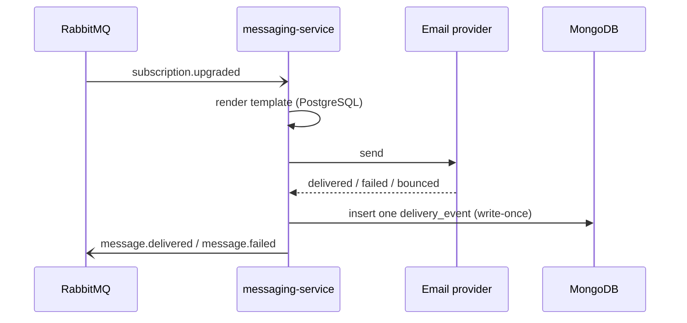

# MongoDB

> The high-volume, append-only store for the delivery-event log.

MongoDB is the home of one thing in Beacon: the record of what happened to every
message [messaging-service](../services/messaging-service.md) sends. Each time a
message goes out and the provider tells us it landed (or didn't), messaging-service
writes a single [delivery event](../models/delivery-event.md) here. That's it —
no templates, no schedules, no accounts, no billing. Those live elsewhere
([PostgreSQL](postgresql.md) for messaging-service's relational data,
[MySQL](mysql.md) for accounts and billing).

The shape of the data drives the choice of store. Delivery events arrive in the
millions per day, are written once and never updated, and the set of useful fields
has grown over the years. A document store that appends cheaply and lets the schema
drift without migrations fits that better than a high-churn append-only table in a
relational database. The full reasoning is in
[ADR 0001](../decisions/0001-delivery-events-in-mongodb.md) (and its follow-up,
[ADR 0002](../decisions/0002-delivery-event-schema-validator.md)).

## What lives here

| Holds | Owned by | Notes |
|-------|----------|-------|
| `messaging.delivery_events` | messaging-service | schemaless; see [Delivery event](../models/delivery-event.md) and [ADR 0001](../decisions/0001-delivery-events-in-mongodb.md) |

<!-- "Used by" (which services depend on this store) is generated automatically
     from each service's `depends_on` — you don't maintain it here. -->

One database (`messaging`), one collection (`delivery_events`).
[messaging-service](../services/messaging-service.md) is the sole writer and the
only service that connects to MongoDB at all — it declares the dependency in its
`depends_on`, which is what populates the auto-generated "Used by" list. No other
Beacon service reads or writes here; cross-domain readers that want delivery
outcomes consume the `message.delivered` / `message.failed` events off
[RabbitMQ](rabbitmq.md) instead of querying this store directly.

## Where it sits in the send flow

The write to MongoDB is the second-to-last step of a send: render, send, **record**,
then announce the outcome on the broker.



Two properties of this flow matter for anyone operating the store:

- **The insert is the system of record for "what happened."** The broker events are
  notifications; the durable truth lives in `delivery_events`. If the Mongo write
  fails, the outcome is effectively unrecorded even if the event was emitted.
- **Writes are one-way.** A document is inserted once and never touched again. There
  is no update path in normal operation, which is why the collection grows
  monotonically and why retention (below) is the main lever on its size.

## What a document looks like

The collection is **schemaless**, so "the schema" is really the union of every shape
that has existed over time. A recent document looks like this:

```json
{
  "_id": ObjectId("6630f1a2c3d4e5f6a7b8c9d0"),
  "message_id": "msg_01HX...",
  "org_id": "org_8f3a",
  "status": "delivered",
  "channel": "email",
  "provider_id": "sg_7c1e...",
  "region": "us-east-1",
  "attempts": 1
}
```

Older documents are missing the newer fields entirely — that's expected, not
corruption. The full field-by-field reference, including the dates each field
appeared and how to read older rows, lives on the
[Delivery event model page](../models/delivery-event.md). The short version every
reader needs:

| Field | Present on |
|-------|-----------|
| `message_id`, `org_id`, `status`, `channel` | all documents |
| `provider_id` | documents from 2024-03 onward |
| `region` | documents from 2024-07 onward |
| `attempts` | most documents — treat absent as `1` |

!!! warning "Code defensively — field presence drifts by record age"
    There is **no schema validator on the historical data**, so any query that scans
    across a wide date range will hit documents that lack fields added later. Filter
    on existence (`{ region: { $exists: true } }`) or default in code; never assume a
    field is universally present. This is the single most important fact about the
    store, and it's the cost ADR 0001 knowingly accepted.

??? info "A validator now guards new writes (ADR 0002)"
    [ADR 0002](../decisions/0002-delivery-event-schema-validator.md) adds a MongoDB
    **JSON-schema validator** on `messaging.delivery_events` that constrains *new*
    inserts so they're uniform going forward. It is **not retroactive** — existing
    documents are grandfathered — so the drift caveat above still holds for historical
    data, and will keep holding until (or unless) a backfill runs. The validator
    stops the bleeding; it doesn't heal the old wounds.

## Indexing & query patterns

Reads fall into two buckets, and the indexing is shaped around them:

- **Recent-window lookups** — "what happened to this message / this org lately."
  These filter by `message_id` or `org_id` and a recent time bound (time is carried
  by the `ObjectId`, which is monotonic by creation). They're the hot path.
- **Aggregate reporting** — per-org delivery and failure rates over a period.
  These scan more documents and lean on `org_id` + `status`.

!!! tip "Range queries are date-shaped, and so is the drift"
    Because `_id` encodes creation time, a date range is naturally an `_id` range.
    That's convenient — but it also means a "last 90 days" query stays inside uniform
    recent documents, while a "since 2023" report crosses the drift boundaries above.
    The wider the window, the more you must defend against missing fields.

## Notes & operations

??? info "Operational notes"
    - **Engine:** MongoDB 7.
    - **Footprint:** one database (`messaging`), one collection (`delivery_events`),
      growing monotonically at millions of inserts/day. It is by far the largest data
      store in Beacon by row count, though each document is small.
    - **Write pattern:** insert-only, no updates, no deletes in normal operation.
      That makes it friendly to replication and backup (no in-place churn) but means
      size is governed entirely by insert rate and retention.
    - **Schema enforcement:** historically none — hence the field-presence drift
      documented on the [delivery-event page](../models/delivery-event.md). A
      validator on *new* writes is being introduced per
      [ADR 0002](../decisions/0002-delivery-event-schema-validator.md); it does not
      touch existing documents.
    - **Retention:** the collection only grows, so a TTL or archival policy is the
      practical ceiling on its size. Confirm the current policy with the messaging
      team before assuming old events are still queryable — long-range reports depend
      on it.
    - **Backups:** standard snapshot/restore is sufficient given the write-once
      pattern; there's no transactional coupling to the relational stores to
      coordinate, since every cross-store relationship here is logical only.

!!! danger "Suspected dead"
    `debug_payload` appears on only a handful of 2023 documents — it looks like a
    temporary debugging field left in by accident and is not written by current code.
    Flagged on the [delivery-event model](../models/delivery-event.md); recorded here
    as the physical store that carries those stray rows.
