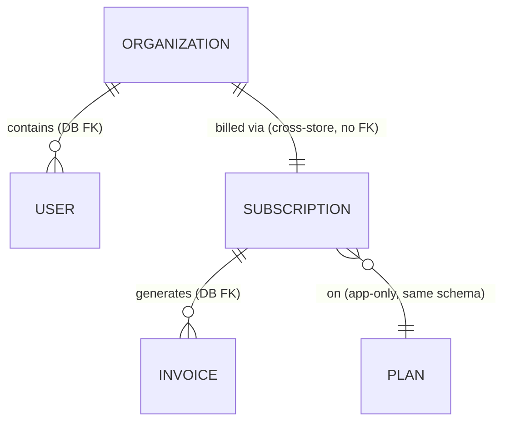

# MySQL

> The relational store for accounts and billing — the canonical org, user, plan,
> subscription, and invoice data. Two services share the same engine but live in
> separate schemas and never reach across the line between them.

This is Beacon's system of record for the slow-moving, money-and-identity side of
the product: who the customers are, what they're paying for, and what they owe.
If a fact needs to be correct, consistent, and durable — an org's status, a
subscription's renewal date, an invoice — it lives here. The fast, high-volume,
"this message was delivered at 14:03" data does **not**; that's MongoDB's job (see
[Delivery event](../models/delivery-event.md) and
[ADR 0001](../decisions/0001-delivery-events-in-mongodb.md)).

## What lives here

Two schemas, each owned by exactly one service. The schema name is the ownership
boundary — `accounts.*` is accounts-service's, `billing.*` is billing-service's,
and neither service writes the other's tables.

| Holds | Owned by | Notes |
|-------|----------|-------|
| `accounts.organizations` | [accounts-service](../services/accounts-service.md) | tenant + status + seat limit; see [Organization](../models/organization.md) |
| `accounts.users` | [accounts-service](../services/accounts-service.md) | the people inside an org (one org → many users, DB FK); model page not yet written — see the accounts-service stub |
| `billing.subscriptions` (+ `active_subscriptions_v` view) | [billing-service](../services/billing-service.md) | what an org pays for; see [Subscription](../models/subscription.md) |
| `billing.plans` | [billing-service](../services/billing-service.md) | the packages a subscription references via `plan_id`; see [Plan](../models/plan.md) |
| `billing.invoices` | [billing-service](../services/billing-service.md) | one subscription → many invoices (DB FK) |

<!-- "Used by" (which services depend on this store) is generated automatically
     from each service's `depends_on` — you don't maintain it here. As of this
     review that's accounts-service and billing-service. -->

## One engine, two worlds

The thing worth understanding before you query anything here: **a single MySQL
instance does not mean a single integrated database.** accounts-service
(Java/Spring) and billing-service (Ruby/Rails) happen to share an engine, but
they treat their schemas as if they were on different machines. That's a
deliberate design choice, and it shapes how data hangs together.

Inside one schema, relationships are real and enforced. An invoice points at a
subscription with a foreign key; a user points at its organization with a foreign
key. Delete the parent without handling the children and the database stops you.

Across the schema line, there are **no foreign keys at all.** A subscription's
`org_id` points at a row in `accounts.organizations`, but nothing in MySQL
guarantees that row exists. billing-service learns about an org by calling
accounts-service's `GET /orgs/{id}` over HTTP — not by joining across schemas.
We model these as *cross-store* relationships even though the two schemas sit in
the same engine, because the trust boundary, not the storage boundary, is what
matters. (See the enforcement column on [Subscription](../models/subscription.md)
and [Organization](../models/organization.md): same engine, but the link between
them is marked **cross-store (none)**.)

Three flavours of relationship, three levels of guarantee:

- **DB FK** — within a schema (`users → organizations`, `invoices →
  subscriptions`). The database enforces it; you can rely on referential
  integrity.
- **app-only** — within a schema but *not* declared as a constraint
  (`subscriptions.plan_id → plans.id`). The link is real and the join works, but
  nothing stops a bad `plan_id` from being written. Enforcement lives in
  billing-service.
- **cross-store** — across the schema line (`subscriptions.org_id →
  organizations.id`). No FK, no join in practice, no write-time validation.
  Reads must tolerate the referent being missing.

!!! warning "Don't join across `accounts.*` and `billing.*`"
    It's physically possible — same engine, the grants might even allow it — but
    it's an architecture violation. It couples two services through their storage,
    bypasses accounts-service as the authority on org data, and will break the day
    either schema moves to its own instance. Go through `GET /orgs/{id}` instead.

## A few things the schema won't tell you

The two highest-value gotchas here are both cases where the *database is not the
enforcer* — read the column and you'll draw the wrong conclusion.

- **`billing.subscriptions.status` is a free-form string.** The legal values
  ({`trialing`, `active`, `past_due`, `canceled`}) and the transitions between
  them live in `Billing::Subscription::StateMachine`, not in a DB `CHECK` or
  `ENUM`. MySQL will happily store `status = 'banana'`. Contrast this with
  `accounts.organizations.status`, which **is** a real DB-enforced
  `enum('active','suspended')` — so identical-looking "status" columns in the two
  schemas have completely different guarantees.
- **`seats_in_use` is not a stored column.** It's derived by the
  `active_subscriptions_v` view, which joins seat assignments. Query
  `billing.subscriptions` directly and the number isn't there; you have to read
  through the view. See [Subscription → How it maps to storage](../models/subscription.md#how-it-maps-to-storage).

There's also a cross-schema *data*-sync worth knowing about, separate from any
foreign key: `accounts.organizations.seat_limit` is written by **billing-service**
(over the accounts API) whenever a plan changes, even though the column lives in
accounts-service's schema. So the seat ceiling and the subscription that drives it
are kept consistent by application code and an HTTP call, not by the database.

## Notes & operations

??? info "Operational notes"
    - **Engine:** MySQL 8.
    - **Topology:** single primary with read replicas. Writes go to the primary;
      reporting and read-heavy paths can target a replica, so expect normal
      replica lag — don't read your own write off a replica.
    - **Schemas:** `accounts` and `billing` on the same instance, one owner each
      (see ownership table above). Treat them as independent; the shared instance
      is an operational convenience, not a data-modelling one.
    - **Backups:** daily, 30-day retention.
    - **Migrations:** each service migrates its own schema with its own toolchain
      (Rails migrations for `billing`, the accounts-service stack for `accounts`).
      There is no coordinated cross-schema migration, by design.

??? note "Deprecated / historical"
    `billing.subscriptions.tier` (`bronze`/`silver`/`gold`) predates `plan_id` and
    survives only for subscriptions created before 2023-04; reporting still reads
    it for those rows. Details and the planned backfill-then-drop live on the
    [Subscription](../models/subscription.md) page.

!!! danger "Suspected dead"
    `billing.subscriptions.promo_ref` is never written by any code path we can
    find — likely a remnant of an old promotions feature. Flagged here because it's
    a column on this store; full context and the "confirm before removing" note are
    on the [Subscription](../models/subscription.md) page.
