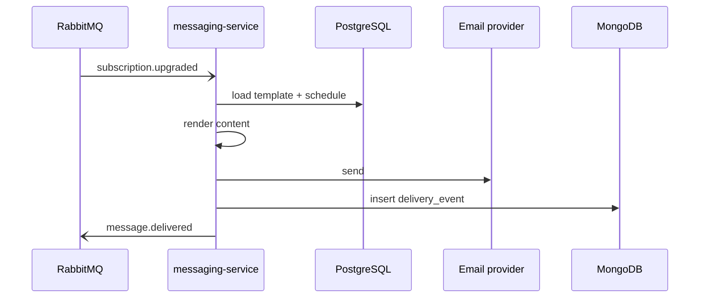

# PostgreSQL

> The relational store for messaging-service's templates and send schedules.

This is the "what to send" and "when to send it" side of messaging. When a
customer of one of Beacon's organizations gets a message, two questions had to be
answered first: *which template renders the content*, and *was this scheduled for
now*. PostgreSQL holds both. It is the one store [messaging-service](../services/messaging-service.md)
treats as its own relational source of truth.

It is deliberately **not** where the outcome of a send lands. Once a message goes
out, the per-send record — delivered, failed, bounced — is appended to the
[delivery-event](../models/delivery-event.md) log in [MongoDB](mongodb.md). Keep
that split in mind as you read: PostgreSQL is small, structured, and read often;
MongoDB is large, schemaless, and write-once. The reasoning behind keeping them
apart is in [ADR 0001](../decisions/0001-delivery-events-in-mongodb.md).

## What lives here

| Holds | Owned by | Notes |
|-------|----------|-------|
| message templates, send schedules | messaging-service | the delivery *log* lives in MongoDB, not here |

[messaging-service](../services/messaging-service.md) is the sole reader and writer.
No other Beacon service connects to this database; everything cross-service flows
through [RabbitMQ](rabbitmq.md) events or the owning service's HTTP API, never a
shared connection string. If you find another service holding credentials to this
store, that is a finding worth chasing down.

## Where it sits in the send flow

PostgreSQL is consulted twice on the way to a send — once to decide *whether* a
scheduled send is due, and once to *render* the content before it leaves for the
provider.

The event that kicks this off (`subscription.upgraded`) is emitted by
[billing-service](../services/billing-service.md) when an org changes plan; the
confirmation message it triggers is rendered from a template that lives *here*. So
while billing never touches this database, a billing action is what most often
warms it. See [Plan upgrade](../features/plan-upgrade.md) for the end-to-end story.

## What the two halves hold

The store has two jobs, and it helps to think of them separately.

**Templates** are the reusable content blueprints — subject lines, bodies, the
placeholders that get filled in per recipient at render time. They are edited by
humans (through the product) far more often than they are deleted, so expect a
template's history to matter: a message sent last week may have rendered from a
version of the template that has since changed. Templates are keyed by `org_id`,
so one organization never sees or renders another's content. That isolation is
enforced in application code, not by a row-level-security policy in the database —
worth knowing before you write an ad-hoc query that forgets the `org_id` filter.

**Send schedules** are the "when" — the rows that say a given send should fire at
a particular time, or on a recurring cadence for a campaign. messaging-service
polls or wakes on these to decide what is due. A schedule references the template
it should render; that reference is an application-level join, the same way most
of Beacon's cross-concern links work — present in the code, not necessarily a
hard foreign key you can lean on at the database layer.

Both halves are modest in size and change rate compared to the delivery log. That
asymmetry is the whole reason for the two-store design: relational integrity and
easy editing for the small, structured stuff; a schemaless, high-throughput
collection for the firehose of outcomes.

## Why relational, and why only this part

It is fair to ask why messaging — an event-driven Elixir service — keeps a
relational database at all. Templates and schedules are exactly the kind of data a
relational store is good at: a bounded set of well-shaped records, edited
in place, queried by clear keys (`org_id`, template id, "due before now"), and
benefiting from constraints and transactions when an operator edits a template or
reschedules a campaign.

The delivery log is the opposite shape — append-only, very high volume, and
tolerant of a schema that has drifted over the years (fields like `provider_id`,
`region`, and `attempts` only appear on events past certain dates). Forcing that
into a relational table would mean either a punishing write path or a column set
full of nulls. So it lives in MongoDB instead, and PostgreSQL is left to do the
job it is genuinely good at. [ADR 0001](../decisions/0001-delivery-events-in-mongodb.md)
records that decision in full, and [ADR 0002](../decisions/0002-delivery-event-schema-validator.md)
covers a related follow-up on the MongoDB side.

## Notes & operations

??? info "Operational notes"
    PostgreSQL 16. Owned and reached only by messaging-service — there is no
    shared access from other services.

    Because the relational data here is small and slow-changing relative to the
    delivery log, this store is not the capacity concern in messaging; MongoDB is.
    Standard relational care applies: regular backups, point-in-time recovery if
    enabled, and the usual replica-for-reads pattern if read load on templates
    grows. Sizing, retention, and replica topology are operator decisions that
    are not pinned down in the source we reviewed — confirm against the deployment
    config before relying on specifics.

??? note "Two stores, on purpose"
    Templates and schedules are relational and live here; the high-volume,
    write-once delivery log is in [MongoDB](mongodb.md). The split is intentional —
    see [ADR 0001](../decisions/0001-delivery-events-in-mongodb.md) and the
    [messaging-service](../services/messaging-service.md) page, which both lean on
    this same boundary.

??? info "Tenant isolation lives in app code"
    Templates and schedules are scoped per organization by `org_id`, but that
    scoping is enforced by messaging-service, not by a database policy. Any direct
    query against this store must filter by `org_id` itself; the database will not
    do it for you.
