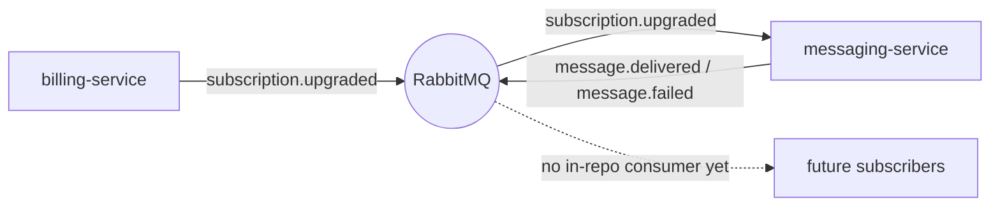

# RabbitMQ

> The message broker that carries domain events between Beacon's services. It's how
> billing-service tells the rest of the product "this org just upgraded," and how
> messaging-service announces "that message went out." Nothing is *stored* here for
> the long term — RabbitMQ is the pipe, not the record.

It helps to hold one distinction in mind before reading on: RabbitMQ is the only
datastore in Beacon that doesn't own any data. MySQL, PostgreSQL, and MongoDB are
*systems of record* — the truth lives there. RabbitMQ is a **transport**. An event
sits in a queue only until a consumer acknowledges it, then it's gone. If you want
to know what *happened*, you look at the [Subscription](../models/subscription.md)
row or the [Delivery event](../models/delivery-event.md) document the event led to —
not at the broker.

That's why this page is shaped a little differently from the other datastore pages.
There are no tables, columns, or documents to map. Instead, the thing worth
documenting is the **wiring**: which events flow, who publishes and who consumes
them, what each carries, and how the broker behaves when something goes wrong.

## Why an event broker at all

Beacon could have had billing-service call messaging-service directly over HTTP when
an org upgrades. It doesn't, and the reason is worth stating because it explains
everything else on this page.

- **Decoupling.** billing-service's job ends at "the subscription is updated and the
  fact has been announced." It shouldn't know or care that a confirmation email is
  the result — and it shouldn't fail or slow down if messaging-service is briefly
  down. Publishing an event and moving on gives billing-service that independence.
- **Fan-out.** One `subscription.upgraded` event can grow more than one consumer
  over time (today it's just the confirmation message; tomorrow it might also feed
  analytics) without billing-service changing at all.
- **Buffering.** If messaging-service is restarting or backed up, events queue up and
  are processed when it recovers, rather than being lost or erroring back to the
  caller.

The trade-off you accept in return is *eventual* consistency: there's a small,
usually sub-second gap between the upgrade completing and the confirmation being
sent. For a confirmation message that's exactly the right trade. See
[Plan upgrade](../features/plan-upgrade.md) for the end-to-end flow this enables.

## What flows through here

The data this broker carries, and the services on each end. (Unlike the database
pages, the rows below are *events in flight*, not stored records.)

| Carries | Producer | Consumer | Payload contract |
|---------|----------|----------|------------------|
| `subscription.upgraded` | [billing-service](../services/billing-service.md) | [messaging-service](../services/messaging-service.md) | `subscriptionId`, `orgId`, `planId` |
| `message.delivered` | [messaging-service](../services/messaging-service.md) | (subscribers) | `messageId`, `orgId`, `status` |
| `message.failed` | [messaging-service](../services/messaging-service.md) | (subscribers) | see discrepancy below |

The shapes above are the source of truth in
`contracts/messaging/asyncapi.yaml` (AsyncAPI 3.0). The broker server is declared
there as `rabbitmq:5672` over AMQP. When you change what an event carries, change it
in that contract first — service pages link to it and the compatibility check
(`asyncapi diff`) consumes it.

<!-- "Used by" (which services depend on this store) is generated automatically
     from each service's `depends_on` — you don't maintain it here. Today that's
     messaging-service (consumer + producer) and billing-service (producer). -->

### The two directions of traffic

It's easiest to reason about the broker as two independent flows that happen to share
the same RabbitMQ instance:

1. **Inbound to messaging** — billing-service publishes `subscription.upgraded`;
   messaging-service receives it and renders + sends a confirmation. This is the
   event that drives the [Plan upgrade](../features/plan-upgrade.md) feature's
   confirmation step.
2. **Outbound from messaging** — after a send attempt, messaging-service publishes
   the outcome (`message.delivered` / `message.failed`) for anyone interested.
   Today there's no documented downstream consumer of these in-repo — they're
   produced for future fan-out and for operational visibility.

For the full request-to-confirmation sequence (including the synchronous
billing → accounts call that precedes the publish), see the sequence diagram on
[Plan upgrade](../features/plan-upgrade.md) or
[messaging-service](../services/messaging-service.md).

## Delivery semantics

A few facts about *how* the broker hands events over — the things that bite you if
you assume the broker behaves like a function call.

- **At-least-once, not exactly-once.** A consumer acknowledges a message only after
  it has finished handling it. If messaging-service crashes mid-handle (after
  sending but before ack), RabbitMQ re-delivers the event on restart. The practical
  consequence: **consumers must be idempotent.** Sending the same confirmation twice
  for one upgrade is the failure mode to design against, not a theoretical edge.
- **Ordering is per-queue, not global.** Events on a single queue arrive in order,
  but there's no ordering guarantee *across* event types. Don't write logic that
  assumes, say, a `message.delivered` can't arrive before some unrelated event.
- **No long-term retention.** Once acknowledged, an event is gone. The durable
  record of what happened lives downstream — the updated
  [Subscription](../models/subscription.md) for the upgrade, the
  [Delivery event](../models/delivery-event.md) for the send. If you need history,
  query those, never the broker.
- **Defensive payloads.** Treat event payloads the same way you treat the
  schemaless [delivery-event](../models/delivery-event.md) documents: validate what
  you receive, and don't assume a field is present just because the current producer
  sets it. The AsyncAPI contract lists the *required* fields; everything else is
  best-effort.

## Notes & operations

??? info "Operational notes"
    - **Engine:** RabbitMQ 3.13, reached at `rabbitmq:5672` over AMQP (per the
      AsyncAPI `servers` block).
    - **Durability:** event queues are durable so they survive a broker restart;
      individual events are published persistent so an in-flight upgrade
      confirmation isn't lost if the broker bounces. Verify against deployment
      config before relying on this for a new high-stakes consumer — it's the
      reviewer's understanding, not a guarantee read out of code (hence the
      page's moderate confidence).
    - **Backups:** there's intentionally nothing to back up — the broker holds no
      system-of-record data. Recovery means draining/replaying in-flight events,
      not restoring a snapshot.
    - **Failure handling:** because delivery is at-least-once, the operational
      concern is *poison messages* — an event a consumer can never process, which
      gets redelivered forever. Confirm whether a dead-letter queue is configured
      before assuming bad events drain away on their own.

!!! warning "Discrepancy"
    Canon and [messaging-service](../services/messaging-service.md) describe
    `message.failed` as a distinct produced event. The current AsyncAPI contract
    (`contracts/messaging/asyncapi.yaml`) declares only `subscription.upgraded` and
    `message.delivered`, and the `MessageDelivered` payload's `status` enum already
    includes `failed` and `bounced`. So a failed outcome may travel as a
    `message.delivered` event with `status: failed` rather than on a separate
    channel. Code/contract wins; the contract should either add a `message.failed`
    channel or the prose should stop describing one. Needs confirmation.

!!! danger "Suspected dead"
    The `legacy.sms_gateway` binding has no producers since SMS was retired. The
    matching consumer is still wired up in messaging-service (also flagged there),
    so this is a dead queue with a live-but-idle consumer attached — a cleanup
    candidate on both ends.

## Sources & confidence

Derived from the messaging AsyncAPI contract (`contracts/messaging/asyncapi.yaml`),
the producer/consumer roles on [billing-service](../services/billing-service.md) and
[messaging-service](../services/messaging-service.md), and the
[Plan upgrade](../features/plan-upgrade.md) flow. Confidence is moderate (72): the
event wiring and payloads are well-grounded in the contract, but the broker's
operational behavior (durability, dead-lettering, retention) is inferred from
convention and the AsyncAPI server block rather than verified against deployment
configuration.
