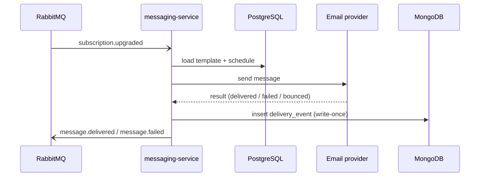

# 0001 — Delivery events in MongoDB

> **Superseded by [0002](0002-delivery-event-schema-validator.md).** The storage
> choice stands; its no-validation consequence was revised.

**In one line:** every message Beacon sends produces a small write-once record of
what happened, those records pile up by the millions per day, and we keep them in
MongoDB — separate from the relational PostgreSQL data the same service uses for
templates and schedules.

If you only remember one thing from this page: the records here are append-only and
schemaless *by design*. That's what makes the writes cheap and the model easy to
evolve, and it's also the single trade-off that ripples through everything
downstream — see [Consequences](#consequences) and the
[delivery-event model](../models/delivery-event.md).

!!! note "Why this ADR still matters even though it's superseded"
    [ADR 0002](0002-delivery-event-schema-validator.md) revisited *one* consequence
    of this decision (the lack of schema validation), not the decision itself. The
    "delivery events live in MongoDB" choice is still in force. Read this page for
    the storage rationale; read 0002 for what we did about the drift it caused.

## Context

[messaging-service](../services/messaging-service.md) writes one
[delivery event](../models/delivery-event.md) per send attempt: a small document
recording the message, the org it belongs to, the outcome (`delivered`, `failed`,
or `bounced`), and a few channel/provider details. It writes one as soon as the
provider hands back a result, right after rendering the template and sending the
message.

The shape of that workload is what drove this decision. Four forces were in play:

- **Volume is high — millions of records a day.** Beacon is a messaging product, so
  the delivery log grows roughly as fast as customers send. This is the busiest
  write path in the service by a wide margin.
- **Writes are append-only.** A delivery event records *what already happened*.
  Once written it is never updated — there is no "the message became delivered
  later" edit, just a new event. (See the write-once note on the
  [model page](../models/delivery-event.md#constraints-validation): nothing
  enforces this at the storage layer; it's a convention the writer upholds.)
- **Reads are narrow and predictable.** Two patterns dominate: recent-window
  lookups ("what happened to this org's sends in the last few days?") and aggregate
  reporting (delivery/bounce rates over a period). Neither needs to join across the
  log, and neither touches old rows often.
- **The useful set of fields keeps growing.** The record has accreted fields over
  time — `provider_id` arrived in 2024-03, `region` in 2024-07, `attempts` later
  still. Each addition under a rigid relational schema would mean a migration on a
  very large table.

Meanwhile the service's *relational* data — message templates and send schedules —
already lives in PostgreSQL, where it belongs: it's modest in size, mutable, and
genuinely relational. The question was never "PostgreSQL or MongoDB for the whole
service." It was narrower: **where does the high-churn delivery log go?**

??? info "Why not just add a table to the PostgreSQL we already run?"
    It was the obvious default, and we considered it. The objection wasn't that
    PostgreSQL *can't* do high-volume append-only — it can. It's that doing it well
    on a table growing by millions of rows a day pulls in real operational work
    (partitioning or time-based table rotation, vacuum/bloat management, index
    upkeep, an archival story) and couples the delivery log's hot, ever-growing
    workload to the same database that serves templates and schedules. Splitting the
    log into its own store keeps that churn off the relational database and lets each
    store be tuned for its own job. The cost of *not* having a fixed schema (below)
    was judged acceptable for an append-only log; the same cost would be much harder
    to live with for the relational data, which is exactly why that data stayed in
    PostgreSQL.

## Decision

Store delivery events in **MongoDB**, in the `messaging.delivery_events`
collection, separate from the relational PostgreSQL data — rather than adding a
high-churn append-only table to PostgreSQL.

This is why [messaging-service](../services/messaging-service.md) runs **two**
datastores on purpose:

| Store | Holds | Shape | Why it fits |
|-------|-------|-------|-------------|
| [PostgreSQL](../datastores/postgresql.md) | templates, send schedules | relational, mutable, modest | genuinely relational, needs constraints and joins |
| [MongoDB](../datastores/mongodb.md) | `messaging.delivery_events` | schemaless, append-only, huge | cheap high-volume inserts; field set can evolve freely |

The flow that produces the write is short and one-directional:

The MongoDB write is a fire-once insert at the end of the send. There is no
follow-up update, which is what lets us treat the collection as an immutable log.

## Consequences

Choosing a schemaless append-only store buys real advantages and imposes one
genuine, ongoing cost. Both are worth naming precisely.

**Positive — what this makes easier.**

- **Cheap, high-volume appends.** Inserts are the dominant operation and MongoDB
  handles them at the volume Beacon needs without the table-maintenance burden a
  relational equivalent would carry.
- **The schema can evolve without migrations.** New fields (`provider_id`,
  `region`, `attempts`) were added simply by having the writer start including them.
  No `ALTER TABLE`, no backfill required at write time, no downtime on a multi-
  million-row table.
- **Isolation from the relational workload.** The delivery log's churn stays off the
  PostgreSQL instance that serves templates and schedules, so neither store's
  performance profile drags on the other.

**Negative — the cost we live with.**

- **No schema enforcement, so older records lack fields added later.** This is *the*
  central caveat, documented in full on the
  [delivery-event model page](../models/delivery-event.md#document-shape).
  Because nothing validates writes, the collection is really the *union of every
  shape the writer has ever produced*. Concretely:

    | Field | Present on | A reader must… |
    |-------|-----------|----------------|
    | `provider_id` | records from **≥ 2024-03** | treat as absent on older docs |
    | `region` | records from **≥ 2024-07** | treat as absent on older docs |
    | `attempts` | most records | **default a missing value to `1`** |

- **Consumers must code defensively.** Every reader has to check for field presence
  or apply a default rather than assume a field exists — including aggregate reports
  that span date ranges where the shape changes mid-window. This brittleness is what
  later motivated [ADR 0002](0002-delivery-event-schema-validator.md).
- **No write-once enforcement.** The append-only, never-updated property is a
  convention in the writer, not something the store guarantees. Nothing stops an
  update; we rely on the code not to issue one.
- **Cross-store joins are application-side only.** `org_id` and `message_id` are
  soft references — there are no foreign keys to an
  [Organization](../models/organization.md) (in MySQL) or to a message. Linking a
  delivery event to, say, the org's subscription happens in application code, never
  in the database. See the
  [model's relationships](../models/delivery-event.md#relationships), all marked
  *cross-store (none)*.

??? info "What changed in ADR 0002, and what didn't"
    [ADR 0002](0002-delivery-event-schema-validator.md) accepted the brittleness
    above and added a MongoDB **JSON-schema validator** on
    `messaging.delivery_events` to keep *new* writes uniform. It is deliberately
    **not retroactive**: existing documents are grandfathered, so the
    "field presence drifts by record age" caveat still holds for historical data —
    and the [model page](../models/delivery-event.md) still says so. The storage
    choice on this page is untouched; only its no-validation consequence was revised.
    That's why this ADR is `superseded` rather than `rejected`: the *what* (MongoDB)
    stands, one *consequence* moved on.

## Where this shows up in the docs

This decision is the "why" behind several pages — when the storage rationale comes
up, they point back here:

- [Delivery event](../models/delivery-event.md) — the model whose schemaless,
  drift-prone shape is a direct result of this choice.
- [messaging-service](../services/messaging-service.md) — runs PostgreSQL **and**
  MongoDB on purpose; its "Two stores, on purpose" note links here.
- [MongoDB datastore](../datastores/mongodb.md) — holds the one collection this
  decision created.
- [ADR 0002](0002-delivery-event-schema-validator.md) — the follow-on that revised
  the no-validation consequence.
