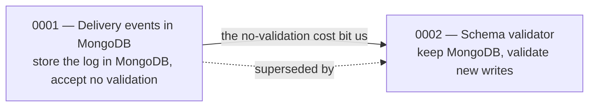

# Decisions

This is the **why** layer. Where the [feature](../features/index.md),
[service](../services/index.md), and [model](../models/index.md) pages tell you
how Beacon behaves *today*, the pages here record the choices behind that
behaviour — what we decided, what was true at the time, and what we traded away to
get it. When a model page warns you that delivery events drift by record age, or a
service page notes that subscription status is enforced in app code rather than the
database, the reasoning lives in an Architecture Decision Record (ADR) here.

Read an ADR when you want to **understand or challenge** a constraint, not just
work around it. The model and service pages are the place for "what do I code
against"; the decision pages are the place for "why is it like this, and is it
still the right call."

## The log

Each entry is a numbered ADR. The number is permanent and assigned in order;
**we never renumber or delete one**, even after it's been reversed — a superseded
decision is part of the record, because the reasoning it captured (and the cost we
chose to accept) explains the shape of the system you see today.

| # | Decision | Status | Touches |
|---|----------|--------|---------|
| [0001](0001-delivery-events-in-mongodb.md) | Delivery events in MongoDB | superseded by [0002](0002-delivery-event-schema-validator.md) | [messaging-service](../services/messaging-service.md) · [delivery-event](../models/delivery-event.md) |
| [0002](0002-delivery-event-schema-validator.md) | Add a schema validator to `delivery_events` | accepted | [messaging-service](../services/messaging-service.md) · [delivery-event](../models/delivery-event.md) |

Both records so far concern one corner of the product — how
[messaging-service](../services/messaging-service.md) stores its
[delivery-event](../models/delivery-event.md) log — and together they tell a
single story across time, which is exactly what this layer is for.

## The story these two tell

**0001** picked MongoDB for the delivery-event log over adding a high-churn,
append-only table to the PostgreSQL that already holds messaging-service's
templates and schedules. Volume is in the millions of writes a day, writes are
append-only, and the useful field set keeps growing — so a schemaless store that
lets fields evolve without migrations was the natural fit. The price we knowingly
paid was **no schema enforcement**: older records simply lack fields added later,
and every consumer has to read defensively.

**0002** didn't reverse that storage choice — MongoDB stays. It revised the *cost*.
The field-presence drift turned out to make consumers genuinely brittle, so 0002
adds a MongoDB JSON-schema validator that constrains **new** writes. Existing
documents are grandfathered, so historical rows still vary — which is why the
[delivery-event](../models/delivery-event.md) page still warns you to treat older
records as possibly missing `provider_id`, `region`, or `attempts`.

That nuance is the reason 0001 stays in the log marked *superseded* rather than
being deleted: a reader who only saw 0002 would assume the collection is uniform,
when in fact it's "uniform going forward, ragged for old data." The pair is the
canonical Beacon example of a decision that was **partly** reversed — the *what*
(MongoDB) survived; the *consequence* (no validation) was replaced.

## Reading an ADR

Every page here follows the same small shape, so you can scan to the part you need:

- **Context** — the situation and forces at the time: volume, access patterns,
  what already existed. When a decision is reconstructed from code rather than
  written up front, this section also notes *what in the codebase points to it*.
- **Decision** — what we're doing, stated plainly.
- **Consequences** — the trade-offs: what it makes easier, what it makes harder,
  and the costs we chose to live with.

Status moves **proposed → accepted**, and later **superseded** if a newer ADR
revises it. A superseded page keeps a banner linking forward to its replacement,
and the replacement carries a `supersedes:` field pointing back — so you can walk
the chain in either direction. Each ADR also lists its `related_services` and
`related_models` in frontmatter, which is how the constraint on a model or service
page traces back to the reasoning here.

## When to add one

Write an ADR when a choice is **consequential and not obvious from the code** —
something a future reader (or a future you) would otherwise have to reverse-engineer
or, worse, "fix" without realising it was deliberate. Good candidates:

- choosing a datastore or technology with a non-obvious trade-off (0001);
- accepting a known cost or limitation on purpose (the "no validation" in 0001);
- changing your mind about that cost later (0002);
- enforcing a rule in an unexpected place — for example, subscription status
  transitions living in `Billing::Subscription::StateMachine` rather than as a
  database constraint.

You don't need an ADR for routine, self-evident work. The bar is: *would someone
later mistake this for an accident, or undo it for good-sounding reasons?* If yes,
record the reasoning here. Start from `templates/decision.md`, take the next number
in sequence, and link it both ways to the service and model pages it affects so the
change ripples instead of stranding the new reasoning on a page nobody finds.
