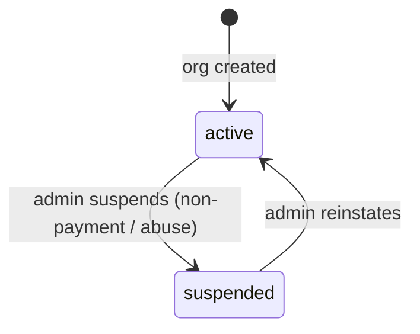

# Accounts

> Organizations and the users inside them — the tenant and identity layer every other
> domain reads from.

Accounts answers two questions for the whole product: **who is this customer, and are
they allowed to do this right now?** Every org that signs up for Beacon gets an
[Organization](../models/organization.md) record — the top-level tenant — and the
people who log in are users that belong to it. When [Billing](billing.md) decides what
a customer is entitled to, or [Messaging](messaging.md) decides whether a send is
allowed, both start from a fact that lives here: an org's identity, its `status`, and
how many seats it has.

That makes Accounts the quiet foundation. It does the least glamorous work in Beacon —
it sends nothing, charges nothing — but if it's wrong, every other domain is wrong with
it. A suspended org that still sends, or a seat count that drifts from reality, are
Accounts failures that surface as Billing or Messaging bugs.

## Capabilities

What this domain lets you do, in plain terms. Each links to where it's documented in
depth.

- **Manage an organization** — its profile (name), seat allotment, and `status`. The org
  is the unit everything else hangs off; see [Organization](../models/organization.md).
- **Suspend / reinstate an organization** — cut off a customer's ability to send (for
  non-payment or abuse) and restore it later, without deleting anything. See
  [Suspend an organization](../features/suspend-organization.md).
- **Be the seat-count authority** — track how many paid user slots an org has and,
  together with seat assignments, how many are actually in use. Billing reads this to
  enforce plan limits; see the [Seat](../glossary.md#seat) glossary entry.
- **Answer "who and what status?" for other services** — expose org identity and
  `status` over a small HTTP read API (`GET /orgs/{id}`) that
  [billing-service](../services/billing-service.md) and
  [messaging-service](../services/messaging-service.md) call before they act.

??? note "Users are real, but lightly documented today"
    accounts-service owns **users** as well as organizations, and an org has many users
    (a DB foreign key, see [Organization](../models/organization.md#relationships)). The
    `User` model isn't written up yet — the owning service is still a stub. Treat "users
    belong to an org, and an assigned user consumes a seat" as the canonical shape until
    the model page lands.

## How it fits together

One service owns this domain end to end. [accounts-service](../services/accounts-service.md)
(Java/Spring on MySQL) is the **sole writer** of org and user data; everyone else is a
reader.

```mermaid
flowchart LR
  web[Web UI / internal console] -->|create, suspend, edit| acct[accounts-service]
  acct --> db[(MySQL: accounts.organizations)]
  billing[billing-service] -->|GET /orgs/&#123;id&#125;| acct
  messaging[messaging-service] -->|GET /orgs/&#123;id&#125; before each send| acct
  billing -.->|syncs seat_limit on plan change| acct
```

The shape to remember:

- **accounts-service writes; everyone else reads over the API.** Org data has exactly one
  source of truth. Other services fetch `GET /orgs/{id}` (which returns seat count and
  `status`) when they need it, and **must not cache it as long-term truth** — a
  cached-stale `status` is how a suspended org slips a message out.
- **Billing reaches back in.** When a plan changes, [billing-service](../services/billing-service.md)
  pushes the new seat allowance to Accounts — it sets the org's `seat_limit` so the two
  stores agree on how many seats the org is entitled to. This is the one write to org data
  that doesn't originate inside the domain, and it's a deliberate, narrow exception.
- **Messaging only reads, and only to gate.** Before every send, messaging-service checks
  the org's `status` via `GET /orgs/{id}` and rejects when it's `suspended`. Accounts has
  no idea messages exist; it just answers the question.

### The models in this domain

| Model | What it is | Owner | Store |
|-------|-----------|-------|-------|
| [Organization](../models/organization.md) | The top-level tenant — name, `status`, `seat_limit` | accounts-service | MySQL `accounts.organizations` |
| User *(stub)* | A person who logs in and belongs to one org; an assigned user consumes a seat | accounts-service | MySQL |

The [Subscription](../models/subscription.md) and [Plan](../models/plan.md) that an org
pays under live in [Billing](billing.md), not here — Accounts holds the *tenant*, Billing
holds *what the tenant bought*. They're linked only logically: one org has one active
subscription, joined by `org_id` across two separate MySQL databases with **no foreign
key** between them (a [cross-store relationship](../models/organization.md#relationships)).

<!-- Pages that declare `domain: accounts` are listed automatically below. -->

## Seats: the number two domains have to agree on

Seats are where Accounts and Billing meet, so it's worth being precise about who owns
what. A [seat](../glossary.md#seat) is one paid user slot. Two numbers track it, and they
live on different sides of the boundary:

- **`seat_limit`** (on the [Organization](../models/organization.md), in Accounts) — how
  many users the org is *allowed* to have. This is set by Billing when the plan changes
  and synced into the org record, so Accounts can enforce it locally when assigning users.
- **`seats` / `seats_in_use`** (on the [Subscription](../models/subscription.md), in
  Billing) — how many seats the plan grants, and how many are *actually assigned*.
  `seats_in_use` is **view-derived** (computed by `active_subscriptions_v` from accounts
  seat assignments), not a stored column.

The same real-world quantity — "how many people can this org have, and how many does it
actually have?" — is therefore reflected on both sides by design. Keep the ownership straight: Accounts owns
the *assignment* of users to seats; Billing owns the *entitlement* (how many seats the plan
includes) and the rule that `seats >= seats_in_use`, which is checked **in app code, not in
the database**. When those drift, look first at the `seat_limit` sync from Billing.

## Status and the suspend lifecycle

An org's `status` is a small, DB-enforced enum — `active` or `suspended`, defaulting to
`active`. That single field is the lever the whole product reads to decide whether a
customer can operate.

A suspended org isn't deleted or locked out of the app — users can still sign in. What
changes is that **sends are blocked**: messaging-service checks `status` before each send
and rejects when it's `suspended`. Reinstating flips it back to `active` and nothing is
lost. Walk the full path, including the admin console and the cross-service check, in
[Suspend an organization](../features/suspend-organization.md).

??? info "Suspension is an Accounts decision, enforced in Messaging"
    Note the split: the *state* (`status = suspended`) lives in Accounts and is set
    through accounts-service. The *enforcement* (refusing the send) happens in Messaging,
    which reads that state per send. Accounts doesn't reach into Messaging to stop
    anything — it just tells the truth when asked. This is the domain's whole philosophy in
    miniature: own the fact, let others act on it.

## Notes & nuances

??? info "Boundaries — what's Accounts, what isn't"
    **In Accounts:** organizations, users, seat assignment, org `status`, and the read API
    that exposes identity/status/seat-count to other services.

    **Not in Accounts:** what an org *pays for* — plans, subscriptions, invoices,
    proration, and the `seats` entitlement — all belong to [Billing](billing.md). Anything
    about *sending* — templates, channels, schedules, delivery — belongs to
    [Messaging](messaging.md). The line is clean: Accounts is *who exists and may they
    operate*; Billing is *what they bought*; Messaging is *what they sent*.

??? note "Read-only for everyone but accounts-service"
    The single-writer rule is the most important invariant here. If you find another
    service writing org data directly (rather than calling accounts-service, or going
    through Billing's narrow `seat_limit` sync), that's a bug to flag — it breaks the
    "one source of truth" guarantee the rest of the docs rely on.

??? info "The stack, stated once"
    accounts-service is **Java/Spring on MySQL** — and every source agrees: the service's
    `language: java` frontmatter, its prose, the [services index](../services/index.md)
    diagram, and the org chart all line up. Worth stating because the two MySQL-backed
    services run different languages — [billing-service](../services/billing-service.md) is
    Ruby/Rails — so they share one engine but not a toolchain.

??? info "Why this domain is only ~75% confident"
    [accounts-service](../services/accounts-service.md) is still a **stub** (its own page is
    ~20% confident) and the `User` model isn't documented yet. The org-level facts on this
    page are solid — they're verified against [Organization](../models/organization.md) and
    the [suspend flow](../features/suspend-organization.md) — but the full HTTP surface and
    the user/seat-assignment mechanics need confirmation against the source repo before
    this domain can claim more.
