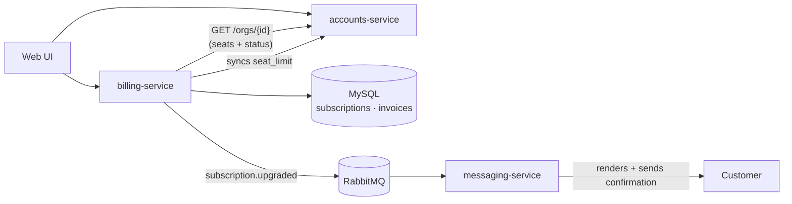
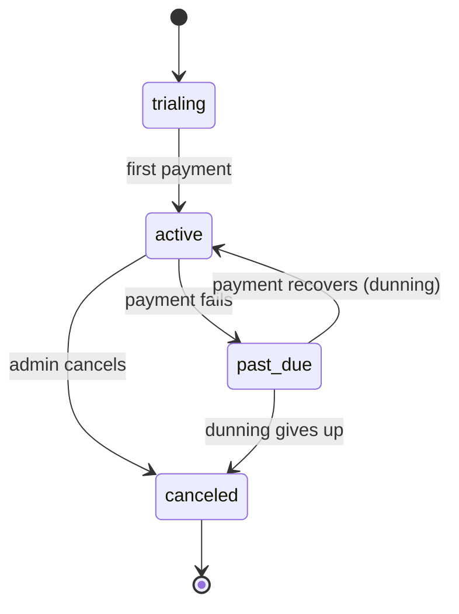

# Billing

> Plans, subscriptions, and invoicing — what an organization pays for and how it's
> charged.

Billing is the part of Beacon that answers one question for the rest of the
product: *what is this organization entitled to, and is it paid up?* An org picks a
[Plan](../models/plan.md), that becomes a [Subscription](../models/subscription.md)
with a price, a billing cycle, and a number of seats, and from then on Billing is
the single source of truth on the money side — what they bought, how many people
they can have, whether their last payment went through, and what their next invoice
will look like.

Everything money-adjacent lives here and nowhere else. Other domains *read* Billing
to decide what a customer can do; they never write to it. If you want to know
whether an org can still send messages because their card was declined, the answer
comes from a Subscription `status` of `past_due` or `canceled` — and that value is
owned, computed, and transitioned right here.

## Capabilities

What this domain lets users (and the rest of the system) do, in plain terms. Each
links to where it's documented in depth.

- **Subscribe & change plan** — an org admin picks a plan, and can move up or down
  later. The new plan takes effect immediately and the next invoice is prorated.
  See [Plan upgrade](../features/plan-upgrade.md).
- **Track entitlement** — Billing is the authority the rest of Beacon reads for what
  a customer has: which plan, how many seats, and whether the account is in good
  standing. [accounts-service](../services/accounts-service.md) keeps a
  `seat_limit` mirror in sync, but the *reason* it has that limit lives here.
- **Bill and invoice** — turn a subscription and its usage into a charge each
  cycle, including a [prorated](../glossary.md#proration) adjustment when the plan
  changes mid-cycle (computed in
  [billing-service](../services/billing-service.md), not by the payment provider).
- **Handle failed payments gracefully** — when a charge fails, the subscription goes
  [past due](../glossary.md#past-due) and enters
  [dunning](../glossary.md#dunning): retry, notify, and only cancel if it never
  recovers.

## How it fits together

billing-service owns subscriptions and plans; it reads org/seat data from Accounts
and emits events the rest of the system reacts to.

One service implements this entire domain —
[billing-service](../services/billing-service.md) (Ruby/Rails on MySQL). It is the
sole writer of subscription, plan, and invoice data, and it exposes that state two
ways: a synchronous HTTP/OpenAPI surface (authored in TypeSpec) for the web UI and
for other services, and an asynchronous event stream over RabbitMQ for anything
that needs to *react* to a change rather than ask for it.

Read that diagram as a story:

1. An org admin changes their plan in the **Web UI**, which calls billing-service.
2. billing-service **reads accounts-service** (`GET /orgs/{id}`) to check the org's
   status and current seat usage before it commits the change — it never trusts its
   own copy of seat counts as long-term truth.
3. It validates the transition, computes proration, and **persists** the new
   subscription state to MySQL.
4. It **pushes the new seat limit back** to accounts-service, so the tenant layer's
   `seat_limit` stays consistent with the plan.
5. It **emits `subscription.upgraded`** to RabbitMQ and returns to the UI.
6. [messaging-service](../services/messaging-service.md) consumes that event and
   sends the customer a confirmation message — Billing itself never sends anything.

### The three domains, side by side

Beacon is three domains that lean on each other. Knowing where the lines are is the
fastest way to find the right page:

| Domain | Owns | Billing's relationship to it |
|--------|------|------------------------------|
| [Accounts](accounts.md) | Organizations and the users inside them; the tenant/identity layer | Billing **reads** org status and seat usage from it, and **pushes** `seat_limit` back on plan change. Accounts is the only writer of org data. |
| **Billing** *(this page)* | Plans, subscriptions, invoices, proration | — |
| [Messaging](messaging.md) | Sending messages and recording delivery | Billing **emits** events Messaging reacts to (e.g. `subscription.upgraded` → confirmation). Billing never sends messages itself. |

## What lives in this domain

The deeper pages, grouped by layer (see CONVENTIONS.md
for the layer model — features → services → models → decisions).

**Features (what users do)**

- [Plan upgrade](../features/plan-upgrade.md) — the read-validate-prorate-emit path
  an admin walks when moving to a higher plan.

**Service (the black box)**

- [billing-service](../services/billing-service.md) — responsibilities, the
  HTTP + event contract, and the key flows.

**Models (the data)**

- [Subscription](../models/subscription.md) — the core entity: plan, cycle, seats,
  and a lifecycle `status` enforced in app code, not the database.
- [Plan](../models/plan.md) — *stub.* The package an org pays for: price, interval,
  seat limit, feature set.
- [Organization](../models/organization.md) — owned by Accounts, but central here:
  a subscription hangs off an `org_id`, and its `seat_limit` is kept in sync by
  Billing.

<!-- Pages that declare `domain: billing` are listed automatically below. -->

## A subscription's life

The shape of this domain is really the shape of one object moving through its
states. A subscription starts in a trial, becomes `active` on first payment, and
from there either keeps renewing, stumbles into `past_due` when a charge fails, or
ends in `canceled`. The transitions — not the table — are what make Billing
interesting, and they are enforced in `Billing::Subscription::StateMachine`, **not**
by a database constraint.

A few things worth internalizing about this lifecycle:

- **`past_due` is a holding state, not a death sentence.** A failed payment kicks off
  [dunning](../glossary.md#dunning) — automated retry-and-notify. If a retry
  succeeds the subscription snaps back to `active`; only if dunning exhausts its
  attempts does it move to `canceled`.
- **The status string is unguarded at the storage layer.** The MySQL column is a
  plain `varchar`; an invalid value would be stored without complaint. Always trust
  the app's state machine over the raw column, and see the
  [Subscription model](../models/subscription.md#constraints-validation) for the
  full enforcement table.
- **Plan *direction* matters more than the endpoint shape.** Upgrades and downgrades
  both change `plan_id`, but they differ in *when* the change applies and how the
  proration math runs. Today the live path is
  `POST /subscriptions/{id}/upgrade`; a `downgrade` endpoint exists but is
  [suspected dead](#suspected-dead) — see below.

## Entitlement: how the rest of Beacon reads Billing

The most common way other code touches this domain isn't to change a subscription —
it's to ask *"is this org allowed to do X?"* That makes the read path worth calling
out on its own.

- **Seats.** A [Plan](../models/plan.md) defines a seat limit; the subscription
  records `seats` (paid) and a view-derived `seats_in_use` (actually assigned). The
  authoritative seat *assignments* live in Accounts, which is why `seats_in_use` is
  computed through the `active_subscriptions_v` view rather than stored. When the
  plan changes, Billing writes the new `seat_limit` over to
  [Organization](../models/organization.md) so the tenant layer can enforce it
  directly.
- **Standing.** "Can this org still send?" is answered by the subscription `status`.
  An org whose subscription is `canceled` (or whose Accounts `status` is
  `suspended`) loses access; `past_due` is a grace window while dunning runs.
- **Don't cache it as truth.** Other services may hold org/subscription data briefly
  for a request, but Billing (for entitlement) and Accounts (for org identity)
  remain the authorities. A stale cache is how an org keeps sending after they've
  been cut off.

## Notes & nuances

??? info "Boundaries — what's in Billing, and what isn't"
    **In Billing:** plans, subscriptions, invoices, proration, and the rules that
    govern a subscription's lifecycle (`trialing → active → past_due ↔ active →
    canceled`).

    **Not in Billing, even though it's close by:**

    - *Who the users are, and how many seats are assigned* — that's
      [Accounts](accounts.md). Billing knows how many seats an org *paid for*; it
      reads Accounts (and the `active_subscriptions_v` view) for how many are
      actually *in use*.
    - *Sending the confirmation message* after an upgrade — that's
      [Messaging](messaging.md). Billing emits `subscription.upgraded` and stops
      there.
    - *Taking the actual payment* — proration and invoicing are computed here, but
      the charge itself is the payment provider's job; Billing records the outcome
      as a `status` change.

??? note "Seat limit lives in two places, on purpose"
    `seat_limit` is both a property of the [Plan](../models/plan.md) (the source of
    the number) and a column on [Organization](../models/organization.md) (a synced
    mirror Accounts enforces directly). Billing owns the *why* and writes the mirror
    on every plan change; Accounts owns the *enforcement*. If the two ever disagree,
    Billing is right and the Organization copy is stale — treat a mismatch as a sync
    bug, not a business rule.

!!! danger "Suspected dead — the downgrade path"
    `POST /subscriptions/{id}/downgrade` exists in billing-service's routes, but every
    caller we can find moves to a lower plan through the `upgrade` endpoint instead.
    It may be dead. Confirm against `beacon-billing` before relying on it — and see
    [billing-service](../services/billing-service.md#notes-nuances) where the same
    finding is recorded.

??? note "Deprecated / historical"
    Two legacy bits hang off the [Subscription](../models/subscription.md) model:
    `tier` (`bronze`/`silver`/`gold`), which predates `plan_id` and survives only for
    pre-2023 rows, and `promo_ref`, which is
    [suspected dead](../models/subscription.md#notes-nuances) — a remnant of an old
    promotions feature with no current writer. Neither should inform new work.
