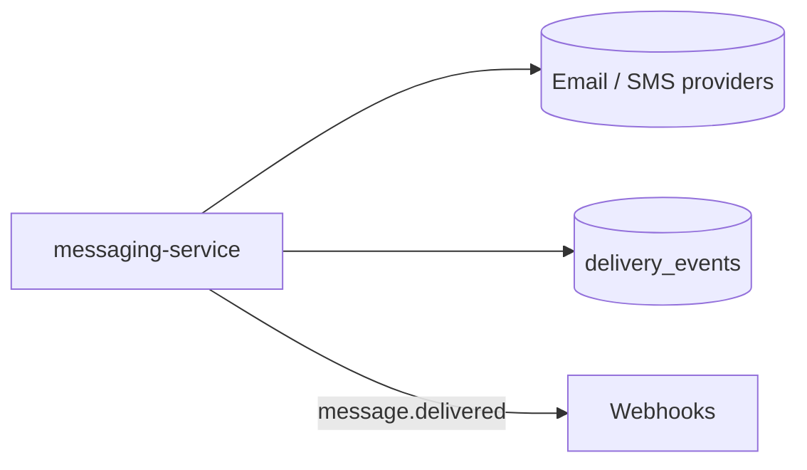

# Messaging

> Sending transactional and campaign messages to an organization's customers, across
> channels, and recording what happened. The hub for the send flow, the public API,
> and the delivery webhooks.

## Capabilities

- **Send a message** — via the [API](../interfaces/api/index.md) or the
  [dashboard](../surfaces/dashboard.md); see [Send a message](../flows/send-message.md).
- **Choose a channel** — email, SMS, or push.
- **Schedule & throttle** — now, later, or rate-limited
  ([message settings](../options/message-settings.md)).
- **Track delivery** — [delivery webhooks](../interfaces/webhooks/index.md).

## How it fits together

<!-- Pages that declare `domain: messaging` are listed automatically below. -->

## Notes & nuances

??? info "Boundaries"
    Who the customers are (orgs, users) is the Accounts domain; what the org pays for
    is Billing. This domain starts at "send" and ends at "delivered/failed".
