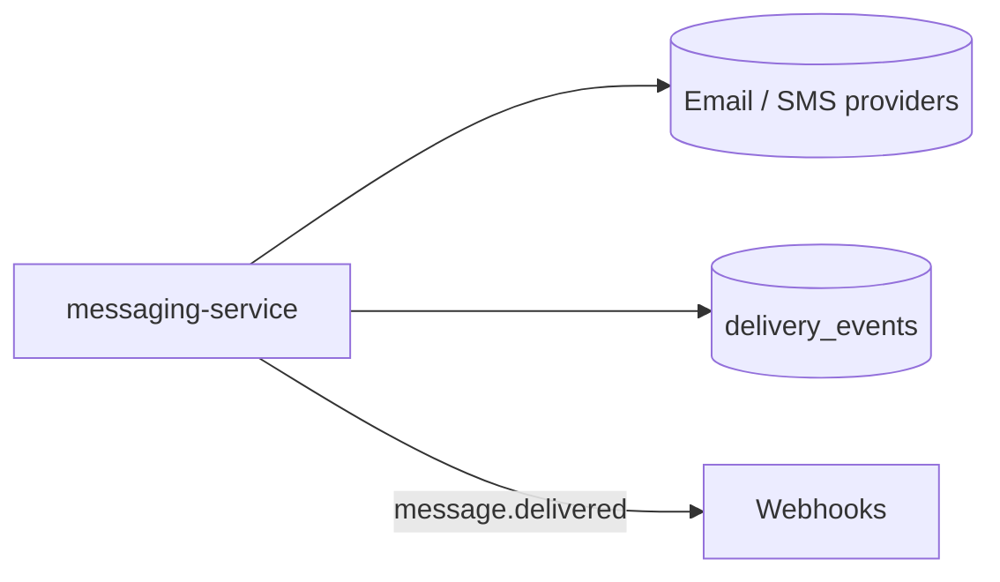
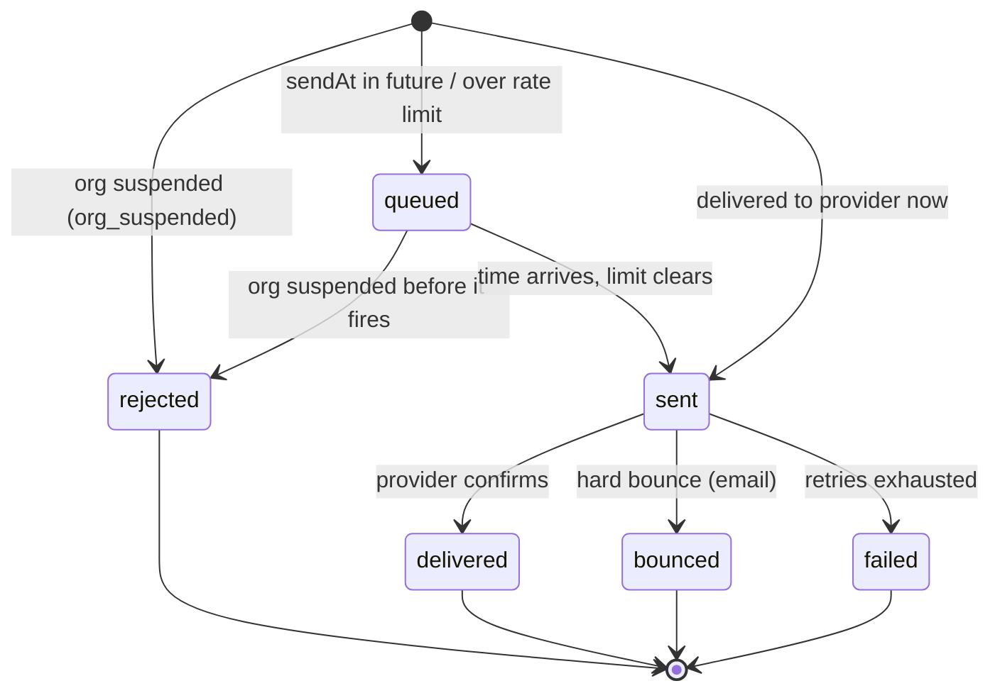

# Messaging

> Sending transactional and campaign messages to an organization's customers, across
> channels, and recording what happened. The hub for the send flow, the public API,
> and the delivery webhooks.

Messaging is where Beacon does the thing customers actually pay for: it takes a
message an organization wants to send — an order receipt, a password reset, a
weekly campaign — turns a template into a finished message, hands it to a delivery
provider, and keeps an honest record of what happened to it. Everything in this
domain hangs off two verbs: **send** and **track**.

The domain has a deliberately tight scope. It begins at "send" — the moment
something (a dashboard click, an API call, or an internal event) asks for a message
to go out — and ends at "delivered" or "failed". It does not decide *who* the
customers are, and it does not decide *what an org is allowed to do*. Those are the
neighbouring domains, and Messaging treats their answers as inputs:

- **[Accounts](accounts.md)** owns organizations and users — the tenants Messaging
  sends *on behalf of*, and whose `active` / `suspended` status gates every send.
- **[Billing](billing.md)** owns plans and subscriptions — the entitlement that
  decides what an org may send and at what volume. When a subscription changes,
  Billing emits an event that Messaging reacts to.

So a useful mental model: Accounts and Billing describe the *world*; Messaging
*acts* in it and writes down the consequences.

## Capabilities

What this domain lets users do — the breadth, in plain terms. Each links to where
it's documented in depth.

- **Send a message** — via the [API](../interfaces/api/index.md) or the
  [dashboard](../surfaces/dashboard.md). The path isn't a single straight line: it
  branches by channel, by *when* you want it sent, and by the org's status. See
  [Send a message](../flows/send-message.md) for the full matrix and worked
  scenarios.
- **Choose a channel** — email, SMS, or push. Email is the live, first-class
  channel; push rides the same send path but is exempt from rate limiting; SMS
  exists in the model and on historical records but is effectively retired (see
  *Notes & nuances*).
- **Schedule & throttle** — send now, hold until a future `sendAt`, or queue and
  drain at a per-minute rate limit. The knobs live in
  [message settings](../options/message-settings.md), and the scheduler re-checks
  org status at fire time, not just at enqueue.
- **Track delivery** — every attempt writes a
  [delivery event](../models/delivery-event.md), and outcomes are pushed to your
  endpoint as [delivery webhooks](../interfaces/webhooks/index.md)
  (`message.sent`, `message.delivered`, `message.failed`, `message.bounced`).

## How it fits together

One service owns this whole domain: **[messaging-service](../services/messaging-service.md)**
(Elixir/Phoenix). It is unusual in the system for spanning three datastores plus a
message bus, because the job genuinely has three different shapes of data:

- **PostgreSQL** — message *templates* and *schedules*. Relational, edited, queried
  by humans — a natural fit for a SQL store.
- **MongoDB** — the **delivery event** log. High volume, write-once, and
  *schemaless on purpose* so the record shape can evolve without migrations.
- **RabbitMQ** — how Messaging hears about the rest of the world (it consumes
  `subscription.upgraded`) and announces outcomes back to it (`message.delivered`,
  `message.failed`).

The service is fundamentally **event-reacting**: it owns no subscription or org
state, reads what it needs from events and from the Accounts/Billing APIs, and
keeps only what's truly its own — templates, schedules, and the delivery log.



A wider view of how a send actually travels — from the trigger, through rendering,
out to a provider, and back as a recorded outcome:

```mermaid
flowchart LR
  ui[Web UI / API] -->|send| svc[messaging-service]
  bill[billing-service] -. subscription.upgraded .-> mq[(RabbitMQ)]
  mq -. consume .-> svc
  acc[accounts-service] -->|GET /orgs/id status| svc
  pg[(PostgreSQL: templates / schedules)] --> svc
  svc -->|render + deliver| prov[(Email / SMS / Push provider)]
  svc -->|write event| mongo[(MongoDB: delivery_events)]
  svc -- message.delivered / message.failed --> mq
  svc -- message.* --> hook[Customer webhook endpoint]
```

The pieces of this domain, and where each is documented in depth:

| Piece | What it is | Page |
|-------|-----------|------|
| messaging-service | The single service that owns the domain | [messaging-service](../services/messaging-service.md) |
| Send a message | The send flow, as a channel × timing × status matrix | [Send a message](../flows/send-message.md) |
| Delivery event | The write-once outcome record (MongoDB) | [Delivery event](../models/delivery-event.md) |
| Public API | How customers trigger sends | [API](../interfaces/api/index.md) |
| Webhooks | How customers hear outcomes | [Webhooks](../interfaces/webhooks/index.md) |
| Message settings | Scheduling, rate limits, retry policy | [Message settings](../options/message-settings.md) |

<!-- Pages that declare `domain: messaging` are listed automatically below. -->

## The send lifecycle

A message moves through a small set of states, and knowing them makes the webhooks
and the delivery log read clearly. Org status is the first gate — a `suspended` org
never gets past the door — and after that, scheduling and provider behaviour decide
the rest:



Two things worth internalising:

- **`sent` is not `delivered`.** Handing a message to a provider is the start of the
  story, not the end. Confirmation (`message.delivered`) can arrive much later, and
  sometimes never — which is why the webhook layer is
  [at-least-once and out of order](../interfaces/webhooks/index.md#delivery-semantics).
- **Status is re-checked at fire time.** A message scheduled while an org is active
  is still dropped if the org is suspended before `sendAt` arrives. The decision is
  made when the send actually happens, not when it was requested.

## Where the data lives

Each kind of data in this domain has a home that matches its shape. The summary:

| Data | Store | Shape & why |
|------|-------|-------------|
| Templates, schedules | PostgreSQL | Relational, edited, queried — wants a schema |
| [Delivery events](../models/delivery-event.md) | MongoDB | High-volume, write-once, schemaless so it can evolve |
| Internal events | RabbitMQ | Decouples Messaging from Billing/Accounts |

The choice to keep delivery events in MongoDB rather than a relational table was a
deliberate one — the rationale (volume, append-only access, tolerance for an
evolving record shape) is captured in
[ADR 0001](../decisions/0001-delivery-events-in-mongodb.md). The practical
consequence shows up constantly: because the collection is schemaless, **fields
were added over time and older documents simply lack them.** `provider_id` only
exists on documents from 2024-03 onward, `region` from 2024-07, and `attempts` is
absent on the oldest rows (treat it as `1`). Any code reading the log must default
defensively rather than assume a field is present; the
[delivery-event model page](../models/delivery-event.md) lists every cutoff.

## Two kinds of events (don't conflate them)

The name `message.delivered` appears in two different places, and they are *not* the
same surface:

- **Internal events** travel over RabbitMQ *between Beacon's own services*. This is
  how billing-service tells messaging-service that a subscription was upgraded, and
  how messaging-service announces an outcome back into the system.
- **Webhooks** are the customer-facing notifications Beacon `POST`s to *your*
  endpoint. They share names and rough shapes with the internal events but are a
  separate, signed, retried public contract — see
  [Webhooks](../interfaces/webhooks/index.md).

When someone says "the delivered event," it's worth confirming which side of that
line they mean. The internal one is an implementation detail of the system; the
webhook is a promise to customers.

## A worked example: the upgrade confirmation

The clearest way to see the domain end-to-end is the confirmation message that goes
out when an org upgrades its plan. Nobody in Messaging triggers this directly — it
falls out of a Billing event:

1. A user upgrades in the Web UI; **[billing-service](../services/billing-service.md)**
   applies the change (with [proration](../glossary.md#proration)) and emits
   `subscription.upgraded` to RabbitMQ.
2. **messaging-service** consumes the event, looks up the matching template in
   PostgreSQL, and renders it.
3. It checks the org's status against
   [accounts-service](../services/accounts-service.md) — a `suspended` org's message
   is dropped before it ever reaches a provider.
4. For an `active` org, it hands the rendered message to the email provider and
   writes a [delivery event](../models/delivery-event.md) to MongoDB.
5. On provider confirmation it emits `message.delivered` internally and fires the
   public `message.delivered` webhook to any subscribed endpoint.

This is the canonical path that ties Billing → Messaging together. Notice that
Messaging never reads or writes subscription state — it learns *that* an upgrade
happened from one event, and gets *what it needs about the org* from the Accounts
API. It contributes the one thing it owns: a recorded, delivered message.

## Edge cases & gotchas

A few situations that trip people up — surfaced here so you meet them before they
bite:

- **Suspended mid-flight.** A message can be accepted while an org is active, sit
  `queued` for two hours, and then be dropped because the org was suspended in the
  meantime. Status is re-evaluated at fire time. See the
  [scheduled-SMS scenario](../flows/send-message.md#worked-scenarios).
- **Provider outage on a throttled send.** Throttled email queues, the provider
  returns a `503`, retries follow the
  [message-settings retry policy](../options/message-settings.md), and exhausted
  retries land a `failed` delivery event plus a `message.failed` webhook. A failure
  is still a recorded outcome, not a silent drop.
- **Late or missing delivery confirmation.** `sent` does not imply `delivered`.
  Build downstream logic against the current state of a message, not the arrival
  order of webhooks — they are at-least-once and unordered.
- **Reading old delivery events.** Don't assume `provider_id`, `region`, or
  `attempts` exist on a given document; default in code. This is the single biggest
  source of surprises when querying the log.

## Notes & nuances

??? info "Boundaries"
    Who the customers are (orgs, users) is the Accounts domain; what the org pays for
    is Billing. This domain starts at "send" and ends at "delivered/failed".
    Messaging owns templates, schedules, and the delivery log — and nothing about
    subscriptions or org identity. It *reads* org status from
    [accounts-service](../services/accounts-service.md) and *reacts to* Billing
    events, but it is never the writer of either.

??? note "SMS is effectively retired"
    `channel: "sms"` still appears in the model and on historical delivery events,
    but the SMS feature has been retired — no new SMS rows are written, and the live
    channels are email (first-class) and push. Treat SMS as read-only history. The
    [send flow](../flows/send-message.md) and
    [messaging-service](../services/messaging-service.md) both carry suspected-dead
    flags for the leftover SMS-gateway code paths.

??? info "Why one service, three stores"
    It looks like a lot of moving parts for one domain, but each store earns its
    place: PostgreSQL for relational templates/schedules, MongoDB for the
    high-volume append-only delivery log, and RabbitMQ to keep Messaging decoupled
    from Billing and Accounts. The trade-off is documented in
    [ADR 0001](../decisions/0001-delivery-events-in-mongodb.md).
