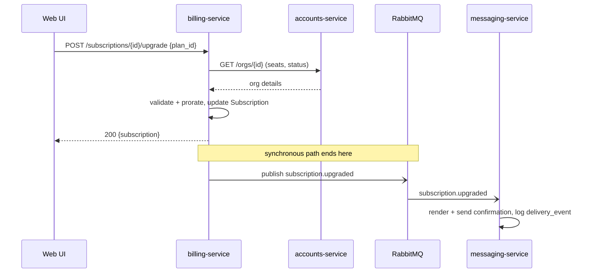
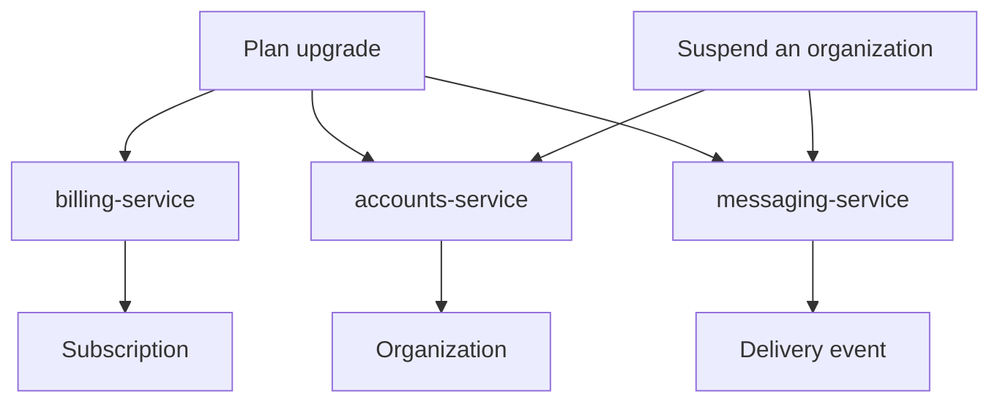

# Features

> **Features are the "what" and "why."** Each page here describes a capability the
> way a person experiences it — what someone is trying to do, what they see, and
> what happens behind the scenes — before handing off to the [services](../services/index.md)
> and [models](../models/index.md) that make it real.

This is the top of the depth ladder: start here when you
want to understand *a thing Beacon does*, then follow the links down into the
services that own the behaviour and the data models they read and write. If you
instead want the system map, start at the [Overview](../index.md); if you want a
single service as a black box, jump to [Services](../services/index.md).

## The features, at a glance

Each row is one user-facing capability. "Who" is the person triggering it; the
services and models columns are where you go for depth.

| Feature | Who triggers it | Domain | Touches services | Touches models |
|---------|-----------------|--------|------------------|----------------|
| [Plan upgrade](plan-upgrade.md) | Organization admin | Billing | billing-service, accounts-service, messaging-service | Subscription, Organization |
| [Suspend an organization](suspend-organization.md) | Internal admin | Accounts | accounts-service, messaging-service | Organization |

Two features today, and they were chosen deliberately as a reference set: one
spans every domain and both kinds of inter-service call (synchronous HTTP *and*
asynchronous events); the other is a small, near-self-contained admin action. Read
both and you've seen the two shapes most Beacon features take.

## Plan upgrade — the full-stack example

[Plan upgrade](plan-upgrade.md) is the feature to read first. An organization admin
opens **Settings → Billing**, picks a higher [Plan](../models/plan.md), and
confirms the prorated charge. The new plan is active immediately and a confirmation
email lands shortly after.

It's the example we point people at because it exercises the whole system in one
go:

- The web UI calls **billing-service** (`POST /subscriptions/{id}/upgrade`), which
  reads org state from **accounts-service** (`GET /orgs/{id}`) before it commits.
- billing-service applies the change to the [Subscription](../models/subscription.md),
  computes [proration](../glossary.md) in application code, and emits a
  `subscription.upgraded` event onto RabbitMQ.
- **messaging-service** consumes that event, renders a confirmation, sends it, and
  records a [delivery event](../models/delivery-event.md).

So a single click fans out across a synchronous HTTP path (the upgrade itself, which
must succeed before the admin sees a result) and an asynchronous event path (the
confirmation, which happens eventually and independently). That split is the single
most important idea to take from this feature: **the upgrade is transactional and
blocking; the message is eventual and decoupled.** If RabbitMQ or messaging-service
is down, the upgrade still succeeds — the admin just gets their email late.

The page itself goes deeper still — into the proration-in-app-code nuance, a
Discrepancy where the help center disagrees with the
code, and a suspected-dead `coupon_code` field the UI still sends. Those callouts
are good models for how we record gotchas in place rather than dropping them.

## Suspend an organization — the small admin example

[Suspend an organization](suspend-organization.md) is the counterweight: a tight,
mostly self-contained action with no event fan-out. An internal admin flips an org
to `suspended` (for non-payment or abuse); the org can still sign in, but
messaging-service refuses new sends until it's reinstated.

It's worth reading precisely because it's *not* glamorous. It shows a feature that
lives almost entirely in one service (**accounts-service**, the sole writer of org
state) plus one downstream consumer that simply *reads* that state at the right
moment. There's no shared database and no event — messaging-service asks
accounts-service "is this org still active?" right before each send. That read-the-
authority-don't-cache-it pattern recurs all over Beacon, and this is the smallest
place to see it.

## How a feature is shaped

Every feature page on this site follows the same business → technical arc, so you
can skim the top of any of them and stop when you have what you need:

1. **A one-line summary** (the blockquote) — what the feature does, for whom.
2. **User journey** — the numbered steps a person actually takes.
3. **How it works** — the prose-plus-`sequenceDiagram` explanation of what happens
   behind the click.
4. **Services & data involved** — the links down into [services](../services/index.md)
   and [models](../models/index.md).
5. **Notes & nuances** — collapsible detail, discrepancies
   with secondary sources, and "suspected dead" flags for paths that look
   unreachable.

If you're adding a feature, copy an existing page and keep that arc; lead with the
human story, then earn trust with the specific service calls, event names, and
status values further down.

## How features map to the rest of Beacon

Features don't own services or data — they *use* them. The same service shows up in
several features, and that's the point: the feature pages tell the journeys, the
service pages own the contracts, and the model pages own the data shapes.

- **[billing-service](../services/billing-service.md)** — Ruby/Rails on MySQL. The
  authority on plans, subscriptions, invoices, and proration. Owns the upgrade.
- **[accounts-service](../services/accounts-service.md)** — the tenant/identity
  layer; sole writer of [Organization](../models/organization.md) state. Both
  features above read it; only the suspend feature writes it. *(Stub — see below.)*
- **[messaging-service](../services/messaging-service.md)** — Elixir/Phoenix on
  PostgreSQL + MongoDB + RabbitMQ. Renders and sends messages and records
  [delivery events](../models/delivery-event.md). It reacts to both features rather
  than driving either.

Reading order, if you're new: skim this page, read [Plan upgrade](plan-upgrade.md)
top to bottom, then dip into [billing-service](../services/billing-service.md) and
[Subscription](../models/subscription.md) when the feature page links you there.

??? info "What's not here yet"
    These are the two reference features we've deepened so far — they aren't Beacon's
    whole surface area. Sending a campaign, dunning a [past-due](../glossary.md)
    subscription, and provisioning a new org are all real journeys that don't have
    feature pages yet. When they're added, they belong here with the same shape.

!!! note "accounts-service is a stub"
    Both features above lean on [accounts-service](../services/accounts-service.md),
    but its service page is still a [stub](../services/accounts-service.md) (known
    shape only, low confidence). Treat its HTTP surface — `GET /orgs/{id}` and the
    suspend endpoint — as confirmed-by-use here but not yet fully documented there.

!!! note "accounts-service language — a structured-field gap, not a conflict"
    Every source agrees the service is **Java/Spring on MySQL**: the
    [accounts-service](../services/accounts-service.md) page prose, the
    [Organization](../models/organization.md) model, and the
    [Accounts domain](../domains/accounts.md) page all say so. The service's
    frontmatter, however, records only `language: java` — consistent on the
    language, but it drops the *framework* the prose carries. Nothing here
    contradicts; the structured field is just coarser than the prose. Worth
    normalising in a convergence pass rather than treating as drift.
