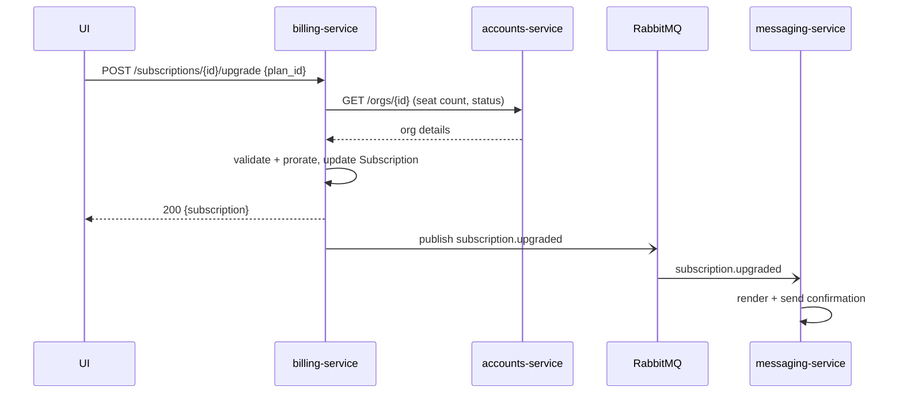

# Plan upgrade

> An organization admin upgrades their subscription to a higher plan. The new plan
> takes effect immediately, the next invoice is prorated, and the admin receives a
> confirmation message.

Upgrading is the most common self-serve change an admin makes to what they pay
Beacon, and it's the path a growing customer takes to unlock more seats and
higher-tier features. Three of Beacon's services touch it: the admin drives it from
the web UI, [billing-service](../services/billing-service.md) is the authority that
validates and applies the change, and [messaging-service](../services/messaging-service.md)
sends the confirmation. Because the change is *immediate* and *prorated*, the
interesting parts of this feature are mostly about timing and money — when the new
entitlements switch on, and what the customer is charged for the remainder of the
current cycle.

This page runs from the admin's experience down to the wire-level flow. If you only
need the product behaviour, the first two sections are enough; keep reading for the
service contract, edge cases, and the gotchas worth knowing before you touch this
path.

## User journey

1. Admin opens **Settings → Billing** and picks a higher plan.
2. They confirm the prorated charge shown in the dialog.
3. The UI shows the new plan as active, and a confirmation email arrives shortly
   after.

What the admin actually sees, in a little more detail:

- **Only an admin gets here.** The upgrade entry point lives in the org's billing
  settings, which non-admin users can't open. There's no per-user upgrade — a
  subscription belongs to the whole [Organization](../models/organization.md), so
  one admin's change applies to everyone in the org.
- **The dialog shows the prorated amount before they commit.** When the admin
  selects a higher plan, `UpgradeDialog.tsx` asks billing-service for the prorated
  difference and renders it ("you'll be charged $X today"). This is a real charge
  for the remainder of the current cycle, not a preview of the next invoice — see
  the Discrepancy note below, because the help center disagrees
  with the code here.
- **The switch is instant.** As soon as the confirm call returns `200`, the org is
  on the new plan: higher [seat](../glossary.md#seat) limit, new feature set, new
  price. The admin doesn't wait for the next billing cycle and doesn't need to do
  anything else.
- **Confirmation arrives out-of-band.** The email isn't part of the upgrade
  response — it's sent asynchronously by messaging-service after the fact, so a
  brief delay between "plan active" and "email received" is normal and expected.

??? note "What counts as an *upgrade* vs. a downgrade"
    An upgrade is a plan change to a plan the customer pays *more* for, and it
    applies immediately with a prorated charge. Moving to a cheaper plan is a
    downgrade, which Beacon applies at period end rather than immediately (so the
    customer keeps what they paid for through the cycle). Note the implementation
    wrinkle: there is a `POST /subscriptions/{id}/downgrade` route, but it's
    [suspected dead](../services/billing-service.md) — current callers appear to run
    downgrades through the *upgrade* endpoint with a lower `plan_id`. If you're
    tracing the downgrade path, start from that finding rather than the route name.

## How it works

The UI calls **billing-service**, which validates the change against the
organization's state in **accounts-service**, updates the [Subscription](../models/subscription.md),
and emits a `subscription.upgraded` event. **messaging-service** consumes that
event and sends the confirmation.

Walking the path the way the data actually flows:

**1. The UI submits the change.** `UpgradeDialog.tsx` posts to
`POST /subscriptions/{id}/upgrade` with the target `plan_id`. The request is keyed
on the *subscription* id, not the org — billing-service resolves the org from the
subscription's `org_id`.

**2. billing-service reads the org from accounts-service.** Before applying
anything, it calls `GET /orgs/{id}` on accounts-service to fetch the org's current
`status` and seat count. This is a synchronous, read-only HTTP call across a service
boundary — billing-service never writes org data, and per the
[Organization](../models/organization.md) authority boundary it must not treat a
cached copy as long-term truth. This is the step that makes a *suspended* org's
upgrade fail (see edge cases).

**3. It validates and prorates, then persists.** With the org details in hand,
billing-service checks the change is legal (org is usable, the subscription is in a
state that can be upgraded), computes the [proration](../glossary.md#proration) for
the rest of the cycle in `Billing::Proration`, and updates the
[Subscription](../models/subscription.md) row in MySQL — `plan_id`, the new
`seats`/limit, and so on. Status transitions are governed by
`Billing::Subscription::StateMachine` in application code, not the database. The new
seat limit is also propagated to accounts-service so the org's `seat_limit` stays in
sync with what the plan now allows.

**4. It returns `200` with the updated subscription.** At this point the change is
durable and the customer is on the new plan; the UI re-renders from the returned
subscription.

**5. It emits `subscription.upgraded` to RabbitMQ.** This happens *after* the
response — the confirmation message is a downstream side effect, deliberately
decoupled so a slow or failing message provider never blocks the upgrade itself.

**6. messaging-service sends the confirmation.** It consumes the event, renders the
confirmation template (templates live in PostgreSQL), sends via the email provider,
and logs a [delivery event](../models/delivery-event.md) to MongoDB. It then emits
`message.delivered` (or `message.failed`). messaging-service owns no subscription or
org state — it reacts to the event and nothing more.

??? info "Why the event comes after the response"
    Beacon splits the *commit* (apply the plan change, charge proration) from the
    *notify* (send confirmation). The commit is synchronous so the admin sees an
    immediate, trustworthy result; the notify is asynchronous over RabbitMQ so
    provider latency or outages can't fail or slow an upgrade. The trade-off is the
    one the journey calls out: the email lags the UI confirmation slightly, and is
    only *eventually* guaranteed. A dropped event means a missing confirmation, not
    a missing upgrade.

## Services & data involved

- **Services:** [billing-service](../services/billing-service.md) (owns the change),
  [accounts-service](../services/accounts-service.md) (org state),
  [messaging-service](../services/messaging-service.md) (confirmation).
- **Models:** [Subscription](../models/subscription.md),
  [Organization](../models/organization.md).

The three services map cleanly onto the three steps — drive, decide, notify:

| Service | Stack | Role in an upgrade |
|---------|-------|--------------------|
| beacon-web (UI) | TypeScript / React | Renders the dialog, shows the prorated amount, posts the upgrade |
| [billing-service](../services/billing-service.md) | Ruby/Rails on MySQL | Validates, prorates, updates the subscription, emits the event — the authority |
| [accounts-service](../services/accounts-service.md) | Java/Spring on MySQL | Read for org status + seats; receives the synced seat limit |
| [messaging-service](../services/messaging-service.md) | Elixir/Phoenix on PostgreSQL + MongoDB | Consumes the event, sends + logs the confirmation |

??? note "A note on accounts-service's stack"
    The [services index](../services/index.md), the architecture diagram, and
    [`organization.md`](../models/organization.md) all describe accounts-service as
    **Java/Spring on MySQL**, and its own [service page](../services/accounts-service.md)
    — frontmatter (`language: java`) and prose alike — agrees. That page is still a
    stub, though, so for the *data* it touches in an upgrade (org `status`, seat
    count, `seat_limit`) the [Organization model](../models/organization.md) is the
    deeper authority.

### Endpoints and the event, at a glance

| Interface | Direction | What it carries |
|-----------|-----------|-----------------|
| `POST /subscriptions/{id}/upgrade` | UI → billing-service | `{ plan_id }`; returns the updated subscription |
| `GET /orgs/{id}` | billing-service → accounts-service | Org `status` + seat count, read before applying |
| `subscription.upgraded` | billing-service → RabbitMQ → messaging-service | Triggers the confirmation message |
| `message.delivered` / `message.failed` | messaging-service → RabbitMQ | Records the confirmation's outcome |

The HTTP endpoints are part of billing-service's OpenAPI contract (authored in
TypeSpec); `subscription.upgraded` is on the messaging side's AsyncAPI. See each
service page for the formal contract links.

## Notes & nuances

??? note "Proration lives in application code"
    The prorated amount is computed in `billing-service` (`Billing::Proration`), not
    by the database or the payment provider. The contract exposes the result but not
    the formula.

??? note "Edge cases & permutations"
    A few situations change the outcome:

    - **Suspended org.** If accounts-service reports the org `status` as
      `suspended`, billing-service rejects the upgrade — a suspended org can't send
      and shouldn't be taking on new entitlements. The fix is to resolve the
      suspension first, then retry.
    - **Subscription not in an upgradeable state.** Upgrades assume a live
      subscription. A `canceled` subscription has no plan to upgrade *from*; a
      `past_due` one is mid-[dunning](../glossary.md#dunning) and the sensible action
      is to recover payment rather than change plans. The legal transitions are
      enforced by `Billing::Subscription::StateMachine` (see the
      [Subscription model](../models/subscription.md)), not the database.
    - **Same or lower plan.** Posting the current `plan_id` is a no-op upgrade;
      posting a *lower*-priced plan is really a downgrade and is expected to apply at
      period end — but note the downgrade path's [suspected-dead](../services/billing-service.md)
      status above.
    - **Seats already over the new limit.** Seats in use are derived from
      accounts-service, so an upgrade that *raises* the limit is always safe;
      the constraint matters in the downgrade direction, not here.
    - **Confirmation never arrives.** Because the email is a decoupled side effect,
      a lost `subscription.upgraded` event or a provider failure means no
      confirmation even though the upgrade succeeded. The
      [delivery event](../models/delivery-event.md) log and `message.failed` are
      where you'd look to tell "never sent" from "sent but bounced."

!!! warning "Discrepancy"
    The [help center](https://help.beacon.example/upgrading) says an upgrade is free
    until the next billing cycle; the code charges the prorated difference
    **immediately** (`Billing::Proration`). Code wins — the help article is stale
    (BILL-1423).

!!! danger "Suspected dead"
    The UI still sends a `coupon_code` field on upgrade, but `billing-service` ignores
    it — coupon handling appears to have moved to the checkout flow. Needs
    confirmation; if dead, remove from the contract and the UI.
