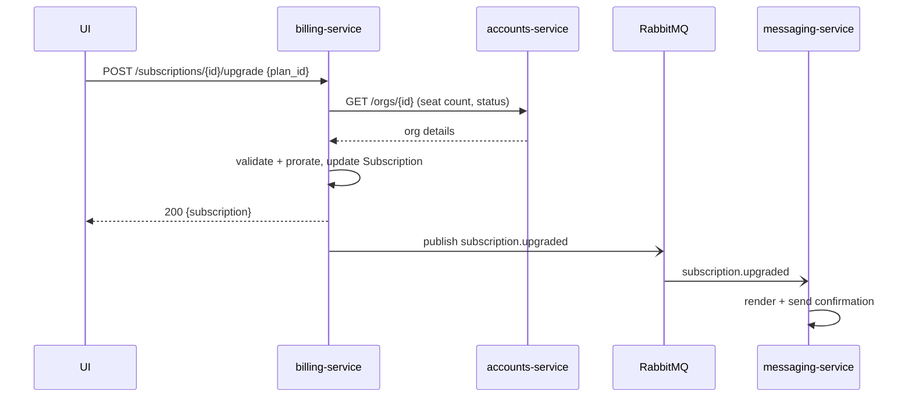

# Plan upgrade

> An organization admin upgrades their subscription to a higher plan. The new plan
> takes effect immediately, the next invoice is prorated, and the admin receives a
> confirmation message.

## User journey

1. Admin opens **Settings → Billing** and picks a higher plan.
2. They confirm the prorated charge shown in the dialog.
3. The UI shows the new plan as active, and a confirmation email arrives shortly
   after.

## How it works

The UI calls **billing-service**, which validates the change against the
organization's state in **accounts-service**, updates the [Subscription](../models/subscription.md),
and emits a `subscription.upgraded` event. **messaging-service** consumes that
event and sends the confirmation.

## Services & data involved

- **Services:** [billing-service](../services/billing-service.md) (owns the change),
  accounts-service (org state — not yet documented),
  [messaging-service](../services/messaging-service.md) (confirmation).
- **Models:** [Subscription](../models/subscription.md),
  [Organization](../models/organization.md).

## Notes & nuances

??? note "Proration lives in application code"
    The prorated amount is computed in `billing-service` (`Billing::Proration`), not
    by the database or the payment provider. The contract exposes the result but not
    the formula.

!!! danger "Suspected dead"
    The UI still sends a `coupon_code` field on upgrade, but `billing-service` ignores
    it — coupon handling appears to have moved to the checkout flow. Needs
    confirmation; if dead, remove from the contract and the UI.
