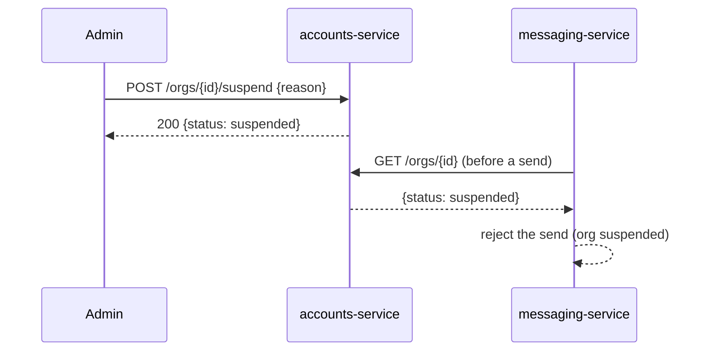
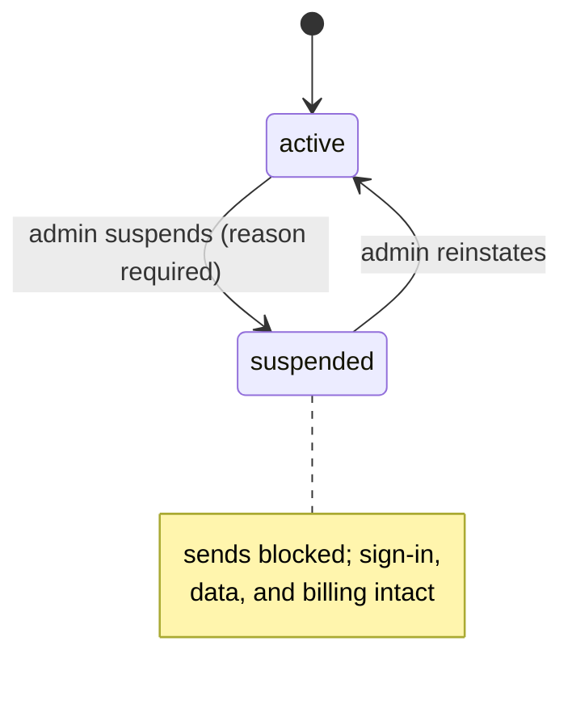

# Suspend an organization

> An internal admin suspends a customer org (for non-payment or abuse). A suspended
> org can still sign in, but can't send messages until it's reinstated.

Suspension is Beacon's "pause the account" lever. It's deliberately blunt and
deliberately reversible: it stops the one thing that costs us and the customer money
or reputation — sending messages — while leaving everything else intact. The org's
users keep their logins, their templates, their delivery history, and their billing
relationship. Nothing is deleted, archived, or recalculated. When the reason for the
suspension is resolved, an admin flips it back and sends resume.

That narrow blast radius is the whole point. Suspension is **not** cancellation
(which lives in [billing-service](../services/billing-service.md) and ends the
[Subscription](../models/subscription.md)), and it is **not** dunning (the automated
retry-and-notify after a failed payment — see [Past due](../glossary.md#past-due)). It's an
operational override that an internal operator reaches for in two situations:

- **Non-payment that dunning didn't recover.** Billing has exhausted its retries and
  someone decides to stop the bleeding before formally canceling.
- **Abuse or a trust-and-safety problem.** A customer is sending spam, phishing, or
  content that puts our sender reputation at risk, and we need sends to stop *now*,
  not at the next billing event.

In both cases the operator wants the same outcome: outbound messages halt
immediately, but the account stays whole so the situation can be reviewed and undone.

## User journey

1. Admin opens the org in the internal console and clicks **Suspend**.
2. Confirms, with a reason.
3. The org's status flips to `suspended`; new sends are blocked right away.

The reason is required — there's no "suspend without saying why." It's an internal
audit note, not customer-facing copy: it explains to the *next* operator why the
account is in this state, which matters because anyone on the team can reinstate.
Typical reasons read like "non-payment, dunning exhausted (BILL-…)" or "T&S: phishing
report #…".

From the customer's side, nothing announces the suspension up front. Their users can
still sign in and move around the app. The wall only appears when they try to send:
the send is refused, and any scheduled or campaign sends that fire while suspended
fail the same way. There is no partial mode — suspension is all-or-nothing for
sending across every channel.

To undo it, an admin opens the same org and chooses **Unsuspend** (Reinstate). The
status flips back to `active` and sending resumes on the next send attempt. Because
status is read fresh on each send (see below), there's no cache to wait out and no
re-enablement job to run — the next message just goes through.

## How it works

The console calls accounts-service to set the [Organization](../models/organization.md)
`status` to `suspended`. messaging-service checks org status before each send and
rejects when the org is suspended.

The design rests on one principle from the [Accounts authority
boundary](../models/organization.md): **accounts-service is the sole writer of org
state, and everyone else reads it over the API rather than caching it as long-term
truth.** Suspension is the textbook case for why that rule exists.

### Two halves: the write, and the read

The feature is really two independent pieces that meet at a single field —
`organizations.status`.

**The write half** lives entirely in accounts-service. The console's suspend action
is a single call that sets the status column on the org row. Because `status` is a
**DB-enforced enum** (`active` / `suspended`, default `active`) on
`accounts.organizations`, the database itself guarantees the value is legal — there's
no separate state machine to satisfy, unlike billing's
[Subscription](../models/subscription.md) whose transitions are enforced in app code
(`Billing::Subscription::StateMachine`). Suspend sets `suspended`; unsuspend sets
`active`. The reason is recorded alongside the change; the status field carries only
the two values.

**The read half** lives in messaging-service. Before it sends, messaging-service
asks accounts-service for the org via `GET /orgs/{id}` — the same endpoint
[billing-service](../services/billing-service.md) uses for seat counts — and refuses
the send if the status comes back `suspended`. This check-before-each-send is what
makes suspension take effect "right away" without messaging holding any org state of
its own: messaging owns templates, schedules, and the
[delivery-event](../models/delivery-event.md) log, and nothing about subscriptions or
orgs. It reads the truth at the last possible moment.

### Why check at send time, not at suspend time

Beacon could have pushed suspension *out* — broadcast an event when an org is
suspended and have messaging flip a local flag. It doesn't, and the read-on-send
model is a better fit here for a few reasons:

- **Immediacy with no race.** A pull at send time can't be stale relative to the
  decision to suspend. There's no window where a message slips out between "admin
  clicked suspend" and "the event reached messaging."
- **No drift to reconcile.** Messaging never stores org status, so it can never
  disagree with accounts-service. The authority boundary stays clean — exactly the
  "don't cache org data as truth" rule the [Organization
  model](../models/organization.md) calls out.
- **Symmetry on reinstate.** The same mechanism un-suspends for free. Flip the column
  back to `active` and the very next send reads `active`. No re-enable event, no
  catch-up job.

The cost is a synchronous dependency on accounts-service in the send path. If
accounts-service is unreachable, the send can't confirm the org is allowed to send —
behaviour in that failure mode (fail open vs. fail closed) is worth confirming
against `beacon-messaging`; see the note below.

### What a blocked send looks like

A suspended send is **rejected, not silently dropped and not queued for later.**
The reader-facing takeaway: when a customer is suspended, their attempts don't
disappear into a void and they don't pile up to flood out on reinstate. Each send is
turned away as it's attempted.

How that surfaces depends on where the send came from:

- **API-driven sends** get a refusal back on the call, so the customer's integration
  sees the failure rather than a false success.
- **Scheduled and campaign sends** that fire while suspended fail at send time the
  same way; they are not held and replayed when the org is reinstated.

Whether a `delivery_event` with `status: failed` is written for a
suspension-rejected send (versus the send being refused before it ever reaches the
provider) is not yet confirmed from source — see the open question below. It matters
for anyone reconciling delivery reports against suspension windows.

## Services & data involved

- **Services:** [accounts-service](../services/accounts-service.md) (owns the write —
  flips `status`), [messaging-service](../services/messaging-service.md) (owns the
  read — enforces the block at send time).
- **Models:** [Organization](../models/organization.md) (`status` is the single
  field this whole feature turns on).

Note that this feature touches **no billing state at all.** Suspending an org does
not cancel, pause, or re-price its [Subscription](../models/subscription.md), and it
doesn't change `seat_limit` or seat usage. A suspended org keeps accruing its normal
billing relationship; suspension and the billing lifecycle are orthogonal. If you
need to stop charging a customer, that's cancellation in billing-service, a different
operation with different consequences.

## Notes & nuances

??? note "Reversible"
    Unsuspend flips the status back to `active`; no data is deleted.

??? note "Suspension vs. cancellation vs. dunning"
    Three different ways an account can stop functioning, easy to conflate:

    - **Suspension** (this page) — an internal admin override on the
      [Organization](../models/organization.md). Blocks sending; leaves billing,
      users, and data untouched; instantly reversible.
    - **Cancellation** — ends the [Subscription](../models/subscription.md)
      (`status: canceled`) in [billing-service](../services/billing-service.md). A
      billing lifecycle change, not an operator override.
    - **Dunning / past due** — automated retry-and-notify after a failed payment
      (`past_due`), handled entirely by billing before any human decides to suspend
      or cancel. See [Past due](../glossary.md#past-due).

    They can co-occur — an org can be `past_due` in billing *and* `suspended` in
    accounts at the same time — because the two statuses live in different stores and
    mean different things.

??? note "Who can suspend, and the reason trail"
    Suspension is internal-only: it's driven from the admin console, not from the
    customer-facing app, and a reason is mandatory. Treat the reason as an operator-
    to-operator note — it's how the next person to look at the account understands why
    it's suspended and whether it's safe to reinstate. The exact roles allowed to
    suspend/reinstate, and where the reason and actor are persisted, should be
    confirmed against `beacon-accounts` when this page is next deepened.

!!! danger "Suspected dead"
    The console still shows a "suspend for N days" auto-reinstate option, but the
    backend ignores the duration. Confirm whether timed suspension was ever wired.

!!! question "Open: failure mode and the delivery log"
    Two things aren't yet pinned to source and affect anyone debugging a suspension:

    - **Send-path failure mode** — if accounts-service is unreachable when
      messaging-service checks status, does the send fail open or fail closed?
    - **Delivery log** — does a suspension-rejected send produce a
      [delivery-event](../models/delivery-event.md) (`status: failed`), or is it
      refused before any event is written?

    Resolve both against `beacon-messaging` and fold the answers in (this is part of
    why the page's confidence sits at 65).
