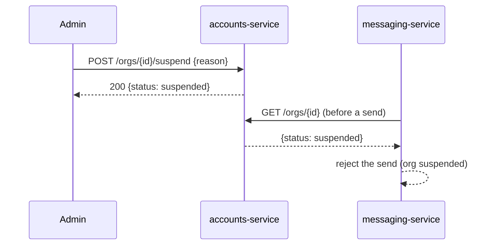

# Suspend an organization

> An internal admin suspends a customer org (for non-payment or abuse). A suspended
> org can still sign in, but can't send messages until it's reinstated.

## User journey

1. Admin opens the org in the internal console and clicks **Suspend**.
2. Confirms, with a reason.
3. The org's status flips to `suspended`; new sends are blocked right away.

## How it works

The console calls accounts-service to set the [Organization](../models/organization.md)
`status` to `suspended`. messaging-service checks org status before each send and
rejects when the org is suspended.

## Services & data involved

- **Services:** [accounts-service](../services/accounts-service.md),
  [messaging-service](../services/messaging-service.md)
- **Models:** [Organization](../models/organization.md)

## Notes & nuances

??? note "Reversible"
    Unsuspend flips the status back to `active`; no data is deleted.

!!! danger "Suspected dead"
    The console still shows a "suspend for N days" auto-reinstate option, but the
    backend ignores the duration. Confirm whether timed suspension was ever wired.
