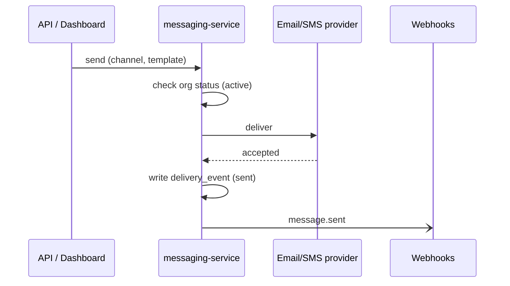

# Send a message

> Delivering a message to a customer. The path **varies** along three axes: the
> **channel** (email / SMS / push), **when** it's sent (immediately / scheduled /
> throttled by rate limit), and the **org's status** (active / suspended). Some
> combinations don't apply — hence a matrix, not one journey.

## Which variant applies (selector)

Org status is the first gate; then channel and scheduling pick the path:

| Org status | Result |
|------------|--------|
| `suspended` | rejected immediately (`org_suspended`); nothing queues — see [Suspend an organization](../features/suspend-organization.md) |
| `active` | proceeds to the channel/scheduling matrix below |

| Channel | Immediate | Scheduled (`sendAt`) | Throttled (rate limit hit) |
|---------|-----------|----------------------|----------------------------|
| **Email** | send now | hold until `sendAt` | queue, drain at the limit |
| **SMS** | send now | hold until `sendAt` | queue, drain at the limit |
| **Push** | send now | hold until `sendAt` | **n/a** — push isn't rate-limited |

## Variants

### Immediate (active org)

`POST /messages {channel, template}`. Rendered and handed to the provider now.

### Scheduled

`sendAt` in the future → `queued` until the time arrives, then it follows the
immediate path. Cancellable until it fires.

### Throttled

When the org is over its per-minute limit (see
[Message settings](../options/message-settings.md)), email/SMS queue and drain at the
configured rate; push is exempt.

## Worked scenarios

??? example "Scheduled SMS to an org that gets suspended before it fires"
    1. `send(sms, sendAt=+2h)` → `queued`.
    2. The org is suspended at +1h.
    3. At +2h the scheduler re-checks status and **drops** the message
       (`org_suspended`) rather than sending — status is re-evaluated at fire time,
       not just at enqueue.

??? example "Email over the rate limit with a provider outage"
    Throttled email queues; the provider then 503s. Retries follow the
    [message settings](../options/message-settings.md) retry policy; exhausted
    retries land a `failed` delivery_event and a `message.failed` webhook.

## Notes & nuances

!!! danger "Suspected dead"
    The send path still branches on `channel: "sms"` legacy gateway selection, but
    SMS now goes through the unified provider. Confirm the legacy branch is dead.
