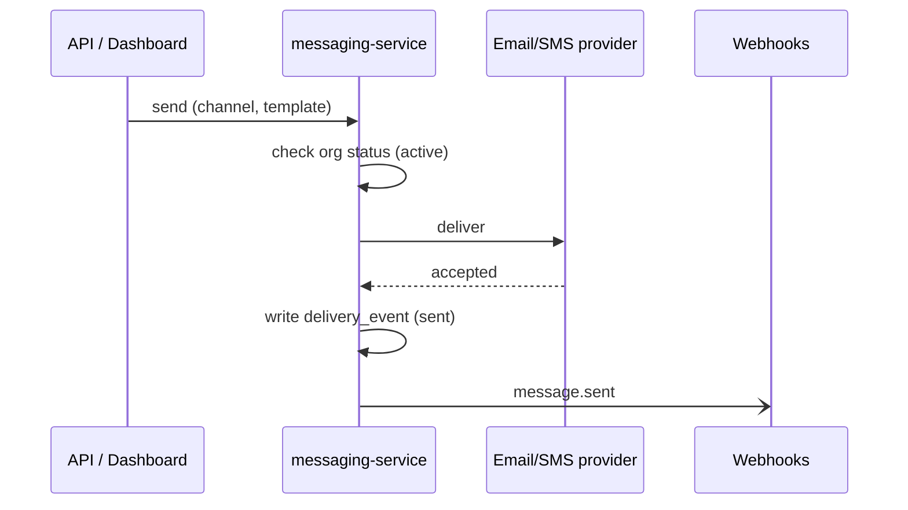
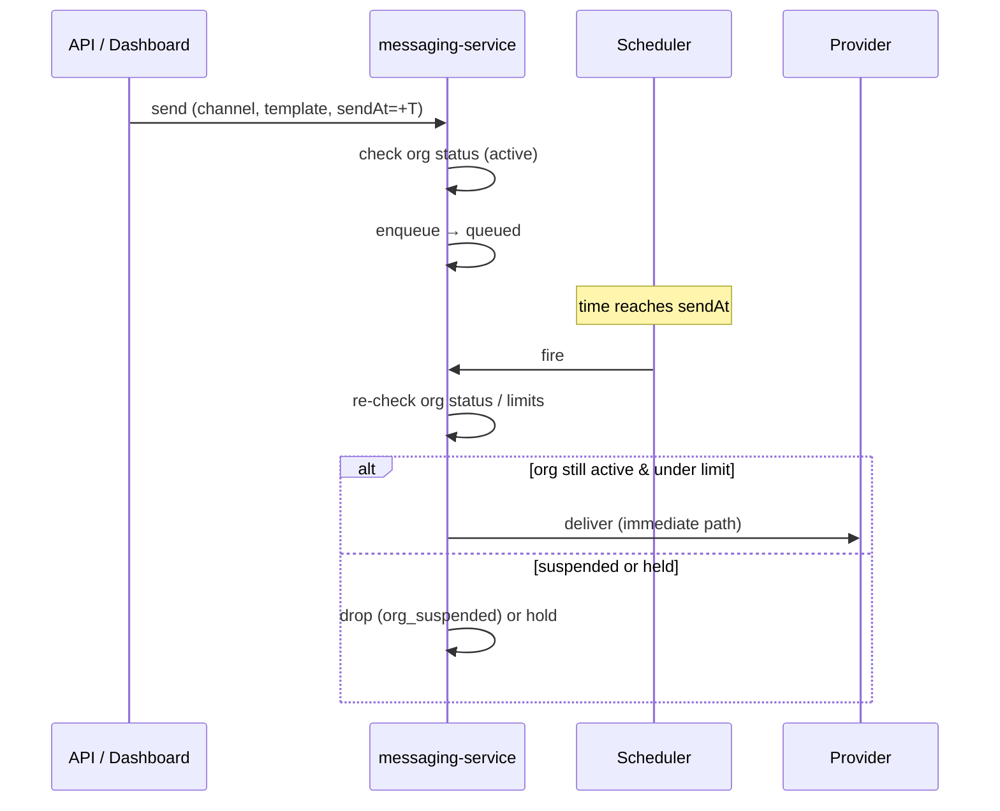

# Send a message

> Delivering a message to a customer. The path **varies** along three axes: the
> **channel** (email / SMS / push), **when** it's sent (immediately / scheduled /
> throttled by rate limit), and the **org's status** (active / suspended). Some
> combinations don't apply — hence a matrix, not one journey.

This is the heart of what Beacon does: an organization asks us to deliver a message
to one of its customers, and we either hand it to a provider and record the outcome,
or we refuse with a reason you can act on. Everything here runs inside
[messaging-service](../services/messaging-service.md) — it owns the templates, the
schedule, and the [delivery-event](../models/delivery-event.md) log that proves what
happened. It does *not* own the org or the subscription; it reads org status from
[accounts-service](../services/accounts-service.md) and reacts to billing events
rather than deciding entitlement itself.

Two send *origins* funnel into the same machinery, and it's worth keeping them
straight because people debug them differently:

- **Explicit sends** — your app calls the [API](../interfaces/api/index.md) or a
  user triggers a send from the [dashboard](../surfaces/dashboard.md). This is the
  common case and the one the matrix below is about.
- **Reactive sends** — messaging-service consumes `subscription.upgraded` from
  RabbitMQ (see [Upgrade a plan](../features/plan-upgrade.md)) and sends a
  confirmation message on its own. There's no `sendAt` and no caller waiting on a
  response, but once the template is chosen it joins the **immediate** path below
  and is subject to the same org-status gate, rate limit, and retry policy.

Read this page top-down: the selector tells you *which* path runs, the variants
describe each path, and the worked scenarios walk the combinations that actually
trip people up.

## Which variant applies (selector)

Org status is the first gate; then channel and scheduling pick the path. The gate
matters because it's the cheapest possible rejection — nothing renders, nothing
queues, nothing reaches a provider. A suspended org is a hard stop, not a delay.

| Org status | Result |
|------------|--------|
| `suspended` | rejected immediately (`org_suspended`); nothing queues — see [Suspend an organization](../features/suspend-organization.md) |
| `active` | proceeds to the channel/scheduling matrix below |

Once the org is `active`, the **channel** and **scheduling** decide the path. Read
this matrix as "given a channel, what happens under each timing":

| Channel | Immediate | Scheduled (`sendAt`) | Throttled (rate limit hit) |
|---------|-----------|----------------------|----------------------------|
| **Email** | send now | hold until `sendAt` | queue, drain at the limit |
| **SMS** | send now | hold until `sendAt` | queue, drain at the limit |
| **Push** | send now | hold until `sendAt` | **n/a** — push isn't rate-limited |

A few things this table is quietly telling you:

- **The channel rarely changes the *shape* of the flow** — email, SMS, and push all
  render a template, hand it to a provider, and write a delivery event. The one
  real divergence is rate limiting: **push is exempt**, so the "throttled" column
  has no push variant. That asymmetry is deliberate and is mirrored in
  [Message settings](../options/message-settings.md), where the `rate_limit`
  interaction row explicitly notes push is ignored.
- **Timing and throttling can stack.** A scheduled send that comes due while the org
  is over its rate limit still gets throttled at fire time — it doesn't skip the
  limit just because it waited. Likewise `quiet_hours` can hold a message that was
  otherwise ready (see the scenarios below).
- **The gate is re-checked, not cached.** Org status is read again at the moment a
  message actually fires, not just when it's accepted. A message can pass the gate
  at enqueue and still be dropped at fire time — the "scheduled SMS that gets
  suspended" scenario below is exactly this.

## Variants

A short section per distinct path: its trigger conditions and its flow. All three
converge on the same tail — render, deliver, write a
[delivery-event](../models/delivery-event.md), emit a webhook — so the differences
are entirely in *when* and *whether* the send happens.

### Immediate (active org)

When: an `active` org sends with no `sendAt` and it's under its rate limit. This is
the default and the simplest path.

`POST /messages {channel, template}`. Rendered and handed to the provider now.

What happens, in words:

1. **Gate.** messaging-service checks org status (`GET /orgs/{id}` against
   accounts-service). `suspended` ends it here with `org_suspended`.
2. **Render.** The named template is fetched from PostgreSQL and rendered with the
   call's variables. A template that fails to render is a send-time error, not a
   provider error — it never reaches the provider and produces no delivery event.
3. **Deliver.** The rendered message goes to the channel's provider. "Accepted" here
   means *the provider took it*, not that the customer received it — final delivery
   is asynchronous and arrives later via the provider's own callback.
4. **Record.** A [delivery-event](../models/delivery-event.md) is written to MongoDB.
   It's **write-once**: one row per attempt, never updated. This is your audit trail
   and the source for per-org delivery reporting.
5. **Notify.** A webhook fires so your systems can react. See
   [Webhooks](../interfaces/webhooks/index.md) for the payloads and the canonical
   event names below.

!!! note "Event names: `message.delivered` / `message.failed`"
    The diagram above shows `message.sent` (and a `delivery_event (sent)` write),
    matching the current `send.ex` source. The canonical produced events are
    **`message.delivered`** and **`message.failed`**, and a delivery event's
    `status` is one of `delivered` / `failed` / `bounced` (see
    [delivery-event](../models/delivery-event.md)). Treat the diagram's `sent` as the
    "handed to provider, accepted" moment; the terminal outcome is `delivered`,
    `failed`, or `bounced`, surfaced later. The naming gap is worth confirming.

### Scheduled

When: an `active` org sends with `sendAt` in the future.

The message goes to `queued` until the time arrives, then it follows the immediate
path. It's **cancellable until it fires** — once it's been handed to the provider,
there's nothing left to cancel.

The critical subtlety: **the org-status gate runs again at fire time.** A scheduled
message is not "blessed" at enqueue. If the org is suspended between scheduling and
firing, the scheduler drops the message (`org_suspended`) rather than sending a
message the org is no longer entitled to send. The same re-check applies to the
rate limit and to `quiet_hours` — the world can change while a message waits.

### Throttled

When: an `active` org is over its per-minute `rate_limit` (see
[Message settings](../options/message-settings.md)) and the channel is email or SMS.

The send doesn't fail — it **queues and drains at the configured rate**, smoothing a
burst into a steady stream the provider will accept. From the caller's side the
message was accepted; it just lands slightly later. **Push is exempt**, so a push
send never enters this path even during a burst.

Two interactions are easy to miss:

- **Scheduled + throttled.** A message that comes due during a burst is still
  subject to the limit at fire time — scheduling doesn't buy a bypass.
- **Throttling vs. retries.** Throttling is about *pacing* sends you're allowed to
  make; the [retry policy](../options/message-settings.md) is about *re-attempting*
  sends a provider refused. They're separate stages — a throttled message that
  later 503s falls back to the retry policy.

## Worked scenarios

The genuinely tricky permutations, walked end to end — this is where the value is.

??? example "Scheduled SMS to an org that gets suspended before it fires"
    1. `send(sms, sendAt=+2h)` → `queued`.
    2. The org is suspended at +1h.
    3. At +2h the scheduler re-checks status and **drops** the message
       (`org_suspended`) rather than sending — status is re-evaluated at fire time,
       not just at enqueue.

    The lesson: a queued message is a *promise to re-evaluate*, not a committed send.
    There is no partial state where a suspended org sneaks one out because it was
    scheduled earlier.

??? example "Email over the rate limit with a provider outage"
    Throttled email queues; the provider then 503s. Retries follow the
    [message settings](../options/message-settings.md) retry policy; exhausted
    retries land a `failed` delivery_event and a `message.failed` webhook.

    Note the two stages stack cleanly: the rate limiter decides *when* the attempt
    is made, and only then does the retry policy decide *how many times* to re-attempt
    a refusal. A `none` retry policy means the first 503 is terminal.

??? example "Scheduled send that lands inside quiet hours"
    `send(email, sendAt=03:00)` while the org has `quiet_hours` covering 22:00–06:00.
    At fire time the message is **held until quiet hours end (06:00), not dropped** —
    `quiet_hours` defers, suspension rejects. The two gates look similar but have
    opposite outcomes; see the interactions table in
    [Message settings](../options/message-settings.md). Remember `quiet_hours` uses
    the **org's** timezone, not the recipient's.

??? example "Fallback channel after the primary's retries are exhausted"
    An org has `fallback_channel` set and a non-`none` `retry_policy`. A primary
    email send exhausts its retries; only *then* does the fallback channel fire — the
    fallback re-enters the send flow as a fresh attempt on the new channel (its own
    gate, its own delivery event). With `retry_policy: none` the fallback **never**
    triggers, because there's no "exhausted retries" moment to trigger on.

??? example "Reactive confirmation send for an upgrade"
    A `subscription.upgraded` event arrives from billing-service. messaging-service
    picks the confirmation template and runs the **immediate** path — same gate,
    same delivery event, same webhook. If the org happens to be `suspended` at that
    instant, even this system-initiated message is rejected with `org_suspended`;
    the gate doesn't make exceptions for internal triggers.

## How this connects

- **Upstream:** explicit sends come from the [API](../interfaces/api/index.md) and
  the [dashboard](../surfaces/dashboard.md); reactive sends come from billing's
  `subscription.upgraded` (see [Upgrade a plan](../features/plan-upgrade.md)).
- **Gate:** org status is read live from
  [accounts-service](../services/accounts-service.md); see
  [Suspend an organization](../features/suspend-organization.md) for how that status
  gets set.
- **Controls:** rate limit, quiet hours, retry policy, and fallback live in
  [Message settings](../options/message-settings.md).
- **Outcome:** every attempt becomes a [delivery-event](../models/delivery-event.md)
  in MongoDB (write-once, schema drifts by record age — code defensively), and a
  webhook is emitted ([Webhooks](../interfaces/webhooks/index.md)).
- **Owning service:** [messaging-service](../services/messaging-service.md) ties it
  all together.

## Notes & nuances

??? note "Accepted ≠ delivered"
    A provider "accepting" a message means it took responsibility for delivery, not
    that the customer received it. Bounces and late failures arrive asynchronously
    and show up as `bounced` / `failed` delivery events after the initial send. Don't
    treat an accepted send as a confirmed delivery.

??? info "Why re-check at fire time"
    Holding state (status, limits, quiet hours) and re-reading it when a message
    actually fires is what keeps a long-scheduled message honest. The alternative —
    trusting the snapshot taken at enqueue — would let a suspended org send messages
    it scheduled while still active. The cost is an extra status read per fire; the
    payoff is that entitlement is always current.

!!! danger "Suspected dead"
    The send path still branches on `channel: "sms"` legacy gateway selection, but
    SMS now goes through the unified provider. Confirm the legacy branch is dead.
    (This lines up with the retired SMS feature noted on
    [messaging-service](../services/messaging-service.md) and the legacy `sms` rows
    on [delivery-event](../models/delivery-event.md).)
