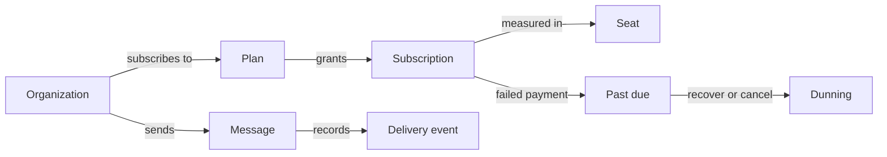

# Glossary

Beacon's shared vocabulary — its *ubiquitous language*. This is the one place we
agree on what a word means, so the same concept doesn't end up named three ways
across passes. Define each term **once** here, keep the definition to a sentence or
two, and link to the page that *owns* the concept; the depth lives there, not here.

If you're new to Beacon, read it as a story rather than an A–Z list. An
**[Organization](#organization)** (a customer) buys a **[Plan](#plan)**, which gives
it a **[Subscription](#subscription)** with some number of **[Seats](#seat)**. When
the org changes plan mid-cycle it's charged a **[prorated](#proration)** difference.
When a payment fails, the subscription goes **[past due](#past-due)** and
**[dunning](#dunning)** tries to recover it before it's canceled. Separately, the org
sends **[messages](#message)** to *its* customers; each send produces a write-once
**[delivery event](#delivery-event)** recording whether it arrived.

The terms below run **business → technical**: the first line is the plain-language
meaning anyone can use; anything deeper is for engineers and links to the canonical
page. Two distinctions show up again and again, so keep them straight:

- **Accounts vs. Billing.** Who exists and how many seats they have is *accounts*
  truth ([accounts-service](services/accounts-service.md)); what they pay for and are
  entitled to is *billing* truth ([billing-service](services/billing-service.md)).
  Each domain owns its own facts and reads the other's over an API — neither caches
  the other as long-term truth.
- **Beacon's customer vs. *their* customers.** An [Organization](#organization) is
  *Beacon's* customer. The people that org sends [messages](#message) to are *its*
  customers — Beacon never models them as accounts. "Customer-messaging SaaS" is
  exactly this two-level relationship.

For a hover **tooltip** on a term anywhere in the docs, also add a one-line
`*[term]: short def` to `includes/abbreviations.md` (auto-appended to every page).

<!-- One entry per term, alphabetical. Each `### Term` gets a #term anchor you can
     link to. End with the canonical page that owns the concept. -->

### Campaign message

A [message](#message) sent to many recipients as a batch — a newsletter or
announcement — as opposed to a one-off [transactional message](#transactional-message)
triggered by a single event. Both flow through the same send pipeline in
[messaging-service](services/messaging-service.md) and both produce
[delivery events](#delivery-event); the distinction is *why* the send happened, not
*how*. See: [messaging-service](services/messaging-service.md).

### Channel

How a [message](#message) physically leaves Beacon — the transport. Email is the live
channel today; **SMS** and **push** are part of the messaging domain's remit but, in
practice, only legacy `sms` [delivery events](#delivery-event) exist and no new ones
are written. Recorded as the `channel` field on each delivery event. See:
[Delivery event](models/delivery-event.md).

??? note "SMS is legacy-only"
    `channel: "sms"` rows survive from the retired SMS feature; treat `email` as the
    only channel current code produces. Details on
    [Delivery event](models/delivery-event.md).

### Delivery event

A **write-once** record of one [message](#message) send attempt and its outcome —
delivered, failed, or bounced — owned by
[messaging-service](services/messaging-service.md) and stored in MongoDB
(`messaging.delivery_events`). High-volume and append-only: there's one document per
attempt and it's never updated. Because the collection is schemaless, older documents
lack fields that were added later (`provider_id`, `region`, `attempts`), so every
consumer must code defensively. See: [Delivery event](models/delivery-event.md).

### Dunning

The automated **retry-and-notify** process that runs after a payment fails, while a
[subscription](#subscription) sits in [past due](#past-due), trying to recover the
charge *before* the subscription is canceled. It's the grace period between "your card
was declined" and "your account is off." Driven by
[billing-service](services/billing-service.md). See:
[Subscription](models/subscription.md) (the `past_due` state).

### Event

An asynchronous message published to **RabbitMQ** that one service emits and another
reacts to — Beacon's way of decoupling domains. The canonical example:
[billing-service](services/billing-service.md) emits **`subscription.upgraded`**, and
[messaging-service](services/messaging-service.md) consumes it to send a confirmation,
then emits **`message.delivered`** / **`message.failed`** of its own. Events carry the
*what-happened*, not commands; a consumer chooses how (or whether) to react. Billing's
HTTP surface is specified in OpenAPI; the event surface is specified in AsyncAPI. See:
[messaging-service](services/messaging-service.md),
[billing-service](services/billing-service.md).

### Invoice

A bill generated for a [subscription](#subscription) — what the org owes for a billing
period, including any [prorated](#proration) adjustments from a mid-cycle plan change.
Invoices are owned by [billing-service](services/billing-service.md) and are the one
relationship in the [Subscription](models/subscription.md) model backed by a real
database foreign key (one subscription → many invoices). A failed invoice payment is
what pushes a subscription to [past due](#past-due) and into [dunning](#dunning). See:
[Subscription](models/subscription.md).

### Message

Something an [organization](#organization) sends to *its own* customers through
Beacon — the product's whole reason to exist. A message is either
[transactional](#transactional-message) (triggered by one event) or a
[campaign](#campaign-message) (sent to many at once), goes out over a
[channel](#channel), and leaves behind a [delivery event](#delivery-event) recording
what happened. Templates and scheduling for messages live in
[messaging-service](services/messaging-service.md) (PostgreSQL); the send itself goes
through an external provider. The messaging flow *starts* at "send" and *ends* at
"delivered/failed." See: [messaging-service](services/messaging-service.md).

### Organization

A **customer account** — the top-level **tenant** that [users](#user) belong to and
that holds a [subscription](#subscription). It's the identity boundary every other
domain keys off: a subscription, a seat, and a delivery event all carry an `org_id`.
Owned by [accounts-service](services/accounts-service.md) (Java/Spring on MySQL,
`accounts.organizations`), which is the **sole writer** — billing and messaging read
org data over the API and must not cache it as long-term truth. An org's `status`
(`active` / `suspended`) is a DB-enforced enum; a suspended org can still sign in but
can't send. See: [Organization](models/organization.md).

### Past due

The state a [subscription](#subscription) enters when its latest payment fails
(`status = past_due`). It's not yet canceled: it kicks off [dunning](#dunning), and
from there it either reverts to `active` if payment recovers or is canceled if dunning
gives up. The legal states and transitions are enforced in application code
(`Billing::Subscription::StateMachine`), **not** by the database. See:
[Subscription](models/subscription.md).

### Plan

The package an [organization](#organization) pays for — its **price**, **billing
interval**, **seat limit**, and **feature set**. A [subscription](#subscription)
references exactly one plan via `plan_id`, and a plan's seat limit is what flows over
to the org's `seat_limit` when the plan changes. Owned by
[billing-service](services/billing-service.md). See: [Plan](models/plan.md).

### Proration

Charging the **prorated difference** when a [plan](#plan) changes mid-cycle, so the
org pays only for what it actually used at each price — the credit-and-recharge that
makes a [plan upgrade](features/plan-upgrade.md) fair within a billing period. The
amount is computed in [billing-service](services/billing-service.md)
(`Billing::Proration`), not by the database or the payment provider; the contract
exposes the result but not the formula. See: [Plan upgrade](features/plan-upgrade.md).

??? warning "Customers sometimes expect upgrades to be free until renewal"
    The help center has said an upgrade is free until the next cycle, but the code
    charges the prorated difference **immediately**. Code wins. Tracked on
    [Plan upgrade](features/plan-upgrade.md).

### Seat

One **paid-for user slot** on a [subscription](#subscription). A subscription buys
some number of seats; changing that count is billed [prorated](#proration). Keep two
counts apart:

- **Seats** — how many the org has *paid for* (`seats`, a plain column).
- **Seats in use** — how many are *actually assigned* to [users](#user)
  (`seats_in_use`, **view-derived** from `active_subscriptions_v`, not a stored
  column).

The rule that seats in use can't exceed seats is enforced in application code, not the
database. "Seats in use" is what drives the near-the-limit warnings admins see. See:
[Subscription](models/subscription.md).

### Subscription

What an [organization](#organization) is **currently paying for**: a [plan](#plan), a
billing cycle, and a lifecycle status. It's the authority on what a customer is
entitled to — owned by [billing-service](services/billing-service.md)
(`billing.subscriptions`, partly view-backed) and read by other services as the source
of truth for entitlement. Its status moves through
`trialing → active → past_due ↔ active → canceled`, with transitions enforced in app
code rather than the database. Each subscription links to one org (`org_id`,
cross-store, no foreign key), one plan (`plan_id`, app-only), and many
[invoices](#invoice) (a real DB foreign key). See: [Subscription](models/subscription.md).

### Suspended

An [organization](#organization) `status` (the other being `active`) set by an admin
for non-payment or abuse. A suspended org can still sign in but **can't send**
[messages](#message): [messaging-service](services/messaging-service.md) checks org
status before each send and rejects when it's suspended. It's reversible — unsuspend
flips the status back to `active` and deletes nothing. Distinct from a
[canceled](#subscription) subscription, which is a *billing* state.
See: [Suspend an organization](features/suspend-organization.md).

### Tenant

The isolation boundary that keeps one customer's data separate from another's — in
Beacon, the [Organization](#organization). When you see `org_id` threaded through a
subscription, a seat, or a delivery event, that's the tenant key tying a row back to
the customer it belongs to. [accounts-service](services/accounts-service.md) is the
tenant/identity layer every other domain reads from. See:
[Organization](models/organization.md).

### Transactional message

A [message](#message) triggered by a single event for a single recipient — a receipt,
a confirmation, a password reset — as opposed to a bulk [campaign](#campaign-message).
The plan-upgrade confirmation is the canonical example: billing emits
`subscription.upgraded`, and [messaging-service](services/messaging-service.md) renders
and sends the transactional confirmation. See:
[messaging-service](services/messaging-service.md).

### User

A person inside an [organization](#organization) — part of the accounts/identity
layer, owned by [accounts-service](services/accounts-service.md) (one org → many users,
a real DB foreign key). Assigning a user consumes a [seat](#seat); a user is *not* a
customer the org sends [messages](#message) to. The dedicated `User` page isn't written
yet. See: [accounts-service](services/accounts-service.md).
