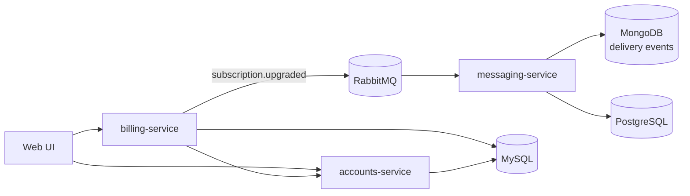
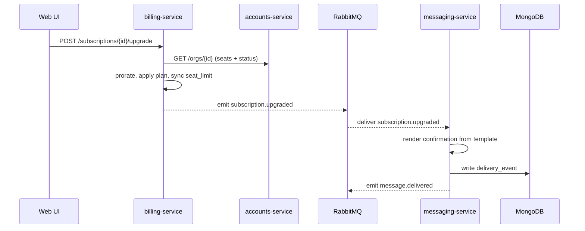
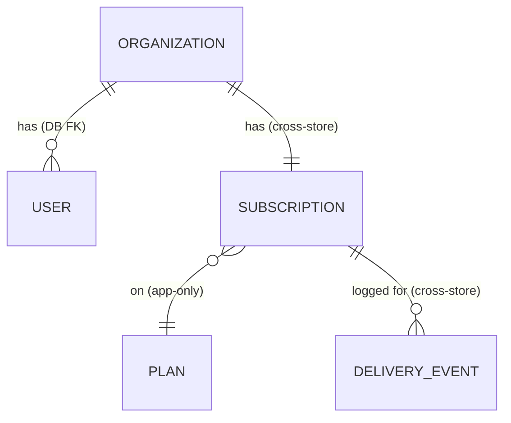

# Beacon

> **Fictional reference product.** Beacon is a customer-messaging SaaS: organizations
> subscribe to a plan, then send their customers transactional and campaign messages.
> Use these pages as a style reference — none of it is real.

Beacon sells one promise: **let a company talk to its customers reliably, at scale,
without running messaging infrastructure itself.** A company signs up as an
*organization*, picks a *plan*, and from then on sends two kinds of messages — the
*transactional* ones a customer expects right now (a receipt, a password reset, a
shipping update) and the *campaign* ones the company chooses to send (a product
announcement, a seasonal offer). Beacon renders those messages from templates, hands
them to the right provider for the channel, and records what happened to each one.

That's the whole product, and almost everything in these docs is a detail hanging off
it. If you remember one sentence, make it this: **organizations subscribe (Billing),
made of users (Accounts), so they can send messages and see what was delivered
(Messaging).** The three words in parentheses are Beacon's three domains, and they
are the spine of the entire knowledge base.

This page is **L0 — the map.** It tells you what Beacon is, how the pieces fit, and
where to go next. It deliberately stays shallow: every claim here is explained in
depth one or two clicks down. If you're new, read this top to bottom once, then jump
to whichever domain or service you actually need.

## Start here, by who you are

Different readers need different first clicks. Pick the row that fits.

| If you're… | Start with | Then |
|------------|-----------|------|
| New to Beacon | This page, top to bottom | A [domain](#the-three-domains) that interests you |
| A product/PM reader | [Features](features/index.md) and the [Glossary](glossary.md) | The [domains](#the-three-domains) behind them |
| Integrating against the API | The [public API](interfaces/api/index.md) and [webhooks](interfaces/webhooks/index.md) | [auth](interfaces/auth.md) |
| Working in a service | The [service](services/index.md) you own | Its [models](models/index.md) and [datastores](#where-data-lives) |
| Hunting *why* a thing is the way it is | The [decisions](decisions/index.md) (ADRs) | The model or service the ADR touches |

## The three domains

Beacon is organized around three business domains. Each one owns a clear question,
and the rest of the system reads from it rather than re-deriving its answers. Keeping
these boundaries crisp is what stops Beacon turning into a tangle where everyone
caches everyone else's data.

### Accounts — *who is the customer?*

[Accounts](domains/accounts.md) is the tenant and identity layer: **organizations**
and the **users** inside them. It is the layer every other domain reads from to learn
who exists, who belongs to whom, and whether an org is allowed to operate at all (an
org can be `suspended`). Accounts is the **sole writer** of organization and user
data — other domains read it over the API and must not treat a cached copy as
long-term truth.

### Billing — *what is the customer paying for?*

[Billing](domains/billing.md) is the authority on money and entitlement: **plans**,
**subscriptions**, **invoices**, and the proration math when a plan changes
mid-cycle. When you need to know whether an org is entitled to a feature, how many
seats it bought, or whether its last payment failed, Billing is the source of truth.
It does **not** own users or seats (it reads those from Accounts) and it does **not**
send messages — it only emits the events that *cause* messages to be sent.

### Messaging — *did the message get there?*

[Messaging](domains/messaging.md) owns the send flow end to end: message
**templates**, send **scheduling**, the dispatch across channels (email, SMS, push),
and the **delivery-event log** that records the outcome. Its scope is bounded
precisely — it starts at "send" and ends at "delivered / failed." It reacts to
events from Billing (for example, sending a confirmation when a subscription is
upgraded) and owns no subscription or org state of its own.

A useful way to hold the three together: **Accounts says who, Billing says what
they're owed, Messaging does the actual talking.** Each owns its truth; none reaches
into another's database.

## How Beacon fits together

The diagram below is the canonical picture of the runtime. The Web UI talks to the
two HTTP services directly; Billing reads Accounts for org status and seat counts;
and the only path into Messaging is **asynchronous, over RabbitMQ.** That last point
is deliberate and worth internalizing — Messaging is event-driven, so a slow or
down messaging-service never blocks a billing operation.



## The same flow as a D2 "hero" diagram

```d2
ui: Web UI
billing: billing-service
accounts: accounts-service
mq: RabbitMQ {shape: queue}
messaging: messaging-service
ui -> billing
ui -> accounts
billing -> accounts
billing -> mq: subscription.upgraded
mq -> messaging
```

## A flow end to end: a plan upgrade

Diagrams show structure; a worked example shows behavior. Here's the canonical
"happy path" that ties all three domains together — an org upgrades its plan and its
admin gets a confirmation message. This is the [Plan upgrade](features/plan-upgrade.md)
feature, traced through the system.



What to notice, because each step is a decision documented elsewhere:

1. **Billing reads Accounts, not its own copy.** Before changing anything, Billing
   asks Accounts for the org's current seats and status via `GET /orgs/{id}`. Accounts
   is the sole writer; Billing reads live rather than trusting stale data.
2. **The upgrade is synchronous; the message is not.** The customer's HTTP request
   returns as soon as the subscription is updated. Emitting `subscription.upgraded`
   to RabbitMQ is fire-and-forget — the confirmation message rides an async path so a
   messaging hiccup can't fail the billing call.
3. **Proration happens here, once.** Charging the prorated difference for a mid-cycle
   change is Billing's job and lives in billing-service — no other service computes
   money. See [Proration](glossary.md#proration).
4. **Delivery is recorded, not assumed.** Messaging writes a
   [delivery event](models/delivery-event.md) for the send attempt and emits
   `message.delivered` (or `message.failed`). "We tried" and "it arrived" are
   different facts, and Beacon keeps both.

Two related behaviors are worth knowing even though they're not on this diagram:

- **Downgrades** are not the mirror image of upgrades. `POST .../downgrade` exists in
  the code but is **suspected dead** — see the callout below. Treat upgrade as the
  live path.
- **Failed payments** don't cancel a subscription outright. A failed charge moves the
  subscription to [`past_due`](glossary.md#past-due) and starts
  [dunning](glossary.md#dunning) — automated retry-and-notify — before anything is
  canceled.

## The services

Three deployable services map onto the three domains. Each is documented as a black
box: its responsibilities and its formal contract, not its internals. Note that the
three services intentionally run **different stacks** — Beacon doesn't pretend to be a
monorepo monolith, and the stack differences are real and load-bearing (Messaging is
Elixir specifically because it fans out high-volume async work).

| Service | Domain | Stack | Interface | Owns |
|---------|--------|-------|-----------|------|
| [accounts-service](services/accounts-service.md) | Accounts | Java/Spring · MySQL | HTTP | Organizations, users |
| [billing-service](services/billing-service.md) | Billing | Ruby/Rails · MySQL | HTTP / OpenAPI (TypeSpec) | Plans, subscriptions, invoices, proration |
| [messaging-service](services/messaging-service.md) | Messaging | Elixir/Phoenix · PostgreSQL + MongoDB + RabbitMQ | Event-driven (AsyncAPI) | Templates, scheduling, delivery log |

How they actually talk to each other:

- **accounts-service** exposes `GET /orgs/{id}` (seat count + status, consumed by
  billing-service) and a suspend endpoint. It is the **sole writer** of org data.
- **billing-service** provides `GET /subscriptions/{id}` and
  `POST /subscriptions/{id}/upgrade`, emits `subscription.upgraded`, and consumes
  accounts-service's `GET /orgs/{id}`. It owns the [Subscription](models/subscription.md)
  and [Plan](models/plan.md) models.
- **messaging-service** consumes `subscription.upgraded` (→ sends a confirmation) and
  produces `message.delivered` and `message.failed`. It owns the
  [Delivery event](models/delivery-event.md) model.

!!! note "accounts-service is a stub page"
    The accounts-service page is still a **stub** (low confidence) — its contract and
    internals aren't fully traced yet. Its language frontmatter reads `java` and its
    prose says **Java/Spring**, consistent with the architecture diagram and the
    [Accounts domain](domains/accounts.md) page.

!!! danger "Suspected dead"
    `POST /subscriptions/{id}/downgrade` exists in billing-service but no live path
    appears to exercise it. Flagged while tracing the plan-change flow; needs
    confirmation before anyone relies on or removes it. (See
    [Subscription](models/subscription.md) for other suspected-dead remnants like
    `promo_ref`.)

## The core models

Four data models carry Beacon's state. Each lives in exactly one store, owned by
exactly one service; the relationships *between* them frequently cross service and
store boundaries, which is the single most important thing to understand before you
write code that reads more than one of them.

| Model | Owner | Store | Why it's interesting |
|-------|-------|-------|----------------------|
| [Subscription](models/subscription.md) | billing-service | MySQL (`billing.subscriptions`, partly view-backed) | Status + transitions enforced in **app code**, not the DB |
| [Organization](models/organization.md) | accounts-service | MySQL (`accounts.organizations`) | `status` is a real DB enum; `seat_limit` is synced *in* by billing |
| [Delivery event](models/delivery-event.md) | messaging-service | MongoDB (`messaging.delivery_events`) | Schemaless, write-once, high-volume; fields appear over time |
| [Plan](models/plan.md) | billing-service | MySQL | The package an org pays for; a subscription references exactly one |

The relationships are mostly **logical, not foreign keys** — and the docs are
emphatic about marking *where* each rule is enforced (`DB` · `app` · `none`) because
that's the highest-value thing a reader can learn:



The dangerous edges here are the cross-store ones. A Subscription's `org_id` points
at an Organization in a *different service's database* with no foreign key behind it,
so a deleted org can briefly leave a dangling subscription — readers must tolerate a
missing org. Likewise, a delivery event's `org_id` is purely logical. When in doubt,
read the model page: it spells out exactly which relationships are `DB FK`,
`app-only`, or `cross-store`.

## Where data lives

Beacon spreads its state across four stores, each chosen for the shape of the data it
holds. The [datastore pages](datastores/mysql.md) document what each store *holds*;
services declare what they `depend_on` and the "used by" lists are generated from
that.

| Store | Holds | Used by |
|-------|-------|---------|
| [MySQL](datastores/mysql.md) | Relational truth — orgs, users, plans, subscriptions, invoices | accounts-service, billing-service |
| [PostgreSQL](datastores/postgresql.md) | Message templates and send schedules | messaging-service |
| [MongoDB](datastores/mongodb.md) | The delivery-event log — high-volume, schemaless, write-once | messaging-service |
| [RabbitMQ](datastores/rabbitmq.md) | The event bus between services (`subscription.upgraded`, `message.*`) | billing-service, messaging-service |

The split inside Messaging is itself a decision: relational template/schedule data in
PostgreSQL, but the firehose of delivery outcomes in MongoDB, where a schemaless,
append-only collection suits write-once events that arrive at high volume and whose
shape has changed over the years. That choice — and how consumers cope with fields
that only exist on newer events — is written up in
[ADR-0001](decisions/0001-delivery-events-in-mongodb.md) and
[ADR-0002](decisions/0002-delivery-event-schema-validator.md).

## The documentation layers

These docs are organized in layers, from product-facing down to engineering detail —
the same **business → technical depth ladder** each individual page follows. Navigate
down for more depth, up for more context.

| Layer | Where | What you'll find |
|-------|-------|------------------|
| **Domains** | [domains/](domains/accounts.md) | The three business areas and their capabilities |
| **Features** | [features/](features/index.md) | Product capabilities as end-to-end journeys, e.g. [Plan upgrade](features/plan-upgrade.md) |
| **Flows** | [flows/](flows/send-message.md) | Behaviour that varies — e.g. [Send message](flows/send-message.md) |
| **Surfaces** | [surfaces/](surfaces/dashboard.md) | The frontends: [dashboard](surfaces/dashboard.md), [admin console](surfaces/admin-console.md) |
| **Interfaces** | [interfaces/](interfaces/api/index.md) | The programmatic surface: [API](interfaces/api/index.md), [webhooks](interfaces/webhooks/index.md), [auth](interfaces/auth.md) |
| **Integrations** | [integrations/](integrations/email-provider.md) | Third parties Beacon calls: [email](integrations/email-provider.md), [SMS](integrations/sms-provider.md) |
| **Services** | [services/](services/index.md) | Each service as a black box + its contract |
| **Models** | [models/](models/index.md) | Data models and how they map to storage |
| **Datastores** | [datastores/](datastores/mysql.md) | The databases and queues themselves |
| **Decisions** | [decisions/](decisions/index.md) | ADRs — *why* things are the way they are |
| **Glossary** | [glossary.md](glossary.md) | Shared vocabulary — start here when a term is unfamiliar |

## A few terms worth knowing up front

You'll meet these everywhere; the [Glossary](glossary.md) is the full list, but these
four unlock most of the system:

- **[Seat](glossary.md#seat)** — one paid user slot. "Seats in use" counts the ones
  actually assigned to users, which can be lower than the number paid for.
- **[Past due](glossary.md#past-due)** — a subscription whose latest payment failed.
  It enters dunning rather than cancelling immediately.
- **[Dunning](glossary.md#dunning)** — the automated retry-and-notify process that
  runs after a failed payment, before a subscription is canceled.
- **[Proration](glossary.md#proration)** — the prorated charge applied when a plan
  changes mid-cycle, computed in billing-service.

## Where to go next

- Curious *what users can do*? → [Features](features/index.md)
- Building against Beacon? → [Public API](interfaces/api/index.md) and
  [Webhooks](interfaces/webhooks/index.md)
- Working in the code? → [Services](services/index.md) and [Models](models/index.md)
- Want the *why*? → [Decisions](decisions/index.md)
- Lost on a word? → [Glossary](glossary.md)
