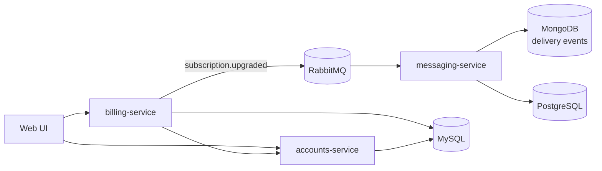

# Beacon

> **Fictional reference product.** Beacon is a customer-messaging SaaS: organizations
> subscribe to a plan, then send their customers transactional and campaign messages.
> Use these pages as a style reference — none of it is real.

## The layers

- **[Features](features/index.md)** — e.g. [Plan upgrade](features/plan-upgrade.md).
- **[Services](services/index.md)** — [billing-service](services/billing-service.md)
  (HTTP), [messaging-service](services/messaging-service.md) (async/RabbitMQ).
- **[Models](models/index.md)** — [Subscription](models/subscription.md),
  [Delivery event](models/delivery-event.md), [Organization](models/organization.md).
- **[Decisions](decisions/index.md)** — ADRs.

## How Beacon fits together

