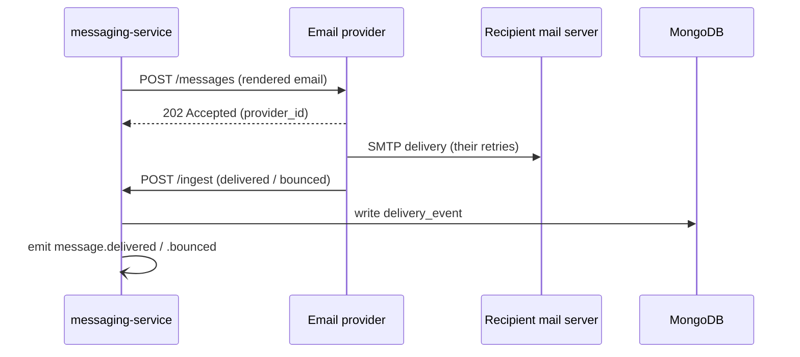

# Email provider

> The third-party email delivery service Beacon sends through. (Services that list it
> in `depends_on` show up under "Depended on by".)

Email is Beacon's primary channel — it's the default for every org
([`default_channel`](../options/message-settings.md) is `email`), and unlike SMS it is
not retired or legacy. So when you trace almost any send, you end up here: the
external system that actually puts mail in an inbox, and then tells us whether it
landed. This page is the contract between [messaging-service](../services/messaging-service.md)
and that provider — what we send, what we get back, how it fails, and the bits of
history still hanging around the codebase.

If you only remember one thing: **we are not the mail server.** We render the
message, hand it off, and record the outcome the provider reports. Everything on
this page is about that hand-off and the callbacks that follow it.

## What we use it for

Two jobs, one outbound and one inbound:

- **Delivery.** [messaging-service](../services/messaging-service.md) renders a
  template, then POSTs the finished message to the provider's send API. The provider
  does the hard part — connecting to the recipient's mail server, handling greylisting
  and reputation, retrying at the SMTP layer — and returns a provider-side message ID
  we hang onto.
- **Outcome callbacks.** Minutes to days later, the provider POSTs delivery and bounce
  events back to our ingest endpoint. Those callbacks are what turn a "we sent it" into
  a `delivered`, `failed`, or `bounced`
  [delivery event](../models/delivery-event.md), and are the source of the
  customer-facing [webhooks](../interfaces/webhooks/index.md) and the dashboard's
  delivery reporting.

Concretely, this integration sits in the middle of the
[send-a-message flow](../flows/send-message.md):

The send and the outcome are **decoupled in time**. A `202` from the send API means
"we've accepted it for delivery," not "it arrived." The real outcome shows up later on
the ingest endpoint, which is why delivery state lives in the append-only
[delivery-event](../models/delivery-event.md) log rather than on the message itself.

## Interface

### Direction

- **Outbound (we → provider).** We POST one rendered message per request to the
  provider's send API. The request carries the recipient, the subject/body produced
  from a [messaging-service](../services/messaging-service.md) template, and our own
  `message_id` so we can correlate the callback later. The provider replies
  synchronously with an accept/reject and, on accept, a provider-side ID we persist as
  `provider_id` on the [delivery event](../models/delivery-event.md) (present on
  records from 2024-03 onward).
- **Inbound (provider → us).** The provider POSTs delivery and bounce notifications to
  our ingest endpoint as they happen. Each callback references the provider's own ID;
  messaging-service maps it back to our `message_id` and writes the outcome. One send
  can generate several callbacks over its life (accepted → delivered, or accepted →
  bounced), so the ingest handler is built to be idempotent and to tolerate
  out-of-order arrival — the same at-least-once, unordered contract we expose downstream
  on our [webhooks](../interfaces/webhooks/index.md).

### Auth & secrets

- **Outbound** auth is a provider API key, stored in the secrets manager and referenced
  by name only — **never a literal value in these docs or in config committed to the
  repo.** If you need the actual key, pull it from the secrets manager for the
  environment you're in.
- **Inbound** callbacks are verified before we trust them. Treat any unauthenticated
  POST to the ingest endpoint as hostile: a delivery outcome is something other systems
  and customers act on, so a forged `delivered`/`bounced` is a real abuse vector.
  Verify provenance, then process.

!!! warning "Don't trust an inbound callback until you've verified it"
    The ingest endpoint is public by necessity — the provider has to reach it. Verify
    the callback's authenticity first, and only then map it to a `message_id` and write
    a [delivery event](../models/delivery-event.md). This mirrors the signing discipline
    we ask of our own [webhook](../interfaces/webhooks/index.md) consumers.

### Environments

- **Sandbox.** A sandbox API key that **black-holes real delivery** — messages are
  accepted and you get realistic callbacks, but nothing is actually emailed. This is
  what the dashboard's "test send" uses, and it's how you exercise the full
  send-and-ingest path without spamming a real inbox. (The SMS provider has an analogous
  facility — [magic test numbers](sms-provider.md#interface) — if you're testing both
  channels.)
- **Production.** The production key delivers for real. The boundary between the two is
  the key, so the single most important environment rule is **never let a production key
  leak into a non-prod environment** — it's the difference between a harmless test and an
  email actually reaching a customer.

## Failure modes

Email can fail at two distinct points, and Beacon treats them very differently. Knowing
which is which is the key to reading the delivery log.

### Send-side failures (transient)

A provider `5xx` or a timeout on the **send** call means we never got a clean accept.
These are treated as transient and **retried per the org's
[retry policy](../options/message-settings.md)** (`none` / `standard` / `aggressive`).
When retries are exhausted, the send becomes a `failed`
[delivery event](../models/delivery-event.md) — there's no successful hand-off to wait
on.

A provider-wide outage is the headline risk here: if the send API is down, retries pile
up and **email throughput drops across all orgs at once**, since email is the default
channel. There's no second email provider to fail over to (see the suspected-dead note
below), so during an outage the realistic levers are the retry policy and, for orgs that
have configured it, a [`fallback_channel`](../options/message-settings.md).

!!! note "Fallback only fires after retries are exhausted"
    An org's [`fallback_channel`](../options/message-settings.md) (say, SMS) is **not**
    an instant failover. It triggers only once the primary channel's retries run out —
    and never at all if `retry_policy` is `none`. So a brief provider blip usually just
    delays the email; it doesn't switch channels.

### Outcome-side failures (terminal)

A **bounce** is different: the send succeeded, but the recipient's mail server rejected
the message. The provider reports this on the ingest endpoint and we record a `bounced`
[delivery event](../models/delivery-event.md). Bounces are **terminal — we do not
retry them**, because retrying a hard bounce (bad address, mailbox gone) just wastes
attempts and hurts sender reputation. This surfaces to customers as the
[`message.bounced`](../interfaces/webhooks/index.md) webhook, which is email-specific —
SMS has no bounce concept.

### What the customer sees

| Situation | We record | Customer-facing signal |
|-----------|-----------|------------------------|
| Provider `5xx` / timeout, retries left | nothing yet (retrying) | message still in flight |
| Retries exhausted | `failed` delivery event | [`message.failed`](../interfaces/webhooks/index.md) |
| Accepted, then delivered | `delivered` delivery event | [`message.delivered`](../interfaces/webhooks/index.md) |
| Accepted, then hard bounce | `bounced` delivery event | [`message.bounced`](../interfaces/webhooks/index.md) |

Because outcomes arrive asynchronously and can be reordered, downstream consumers should
reconcile against current message state rather than event order — the same advice we give
on the [webhooks](../interfaces/webhooks/index.md) page.

## Notes & nuances

??? info "Why the provider ID and region only exist on newer records"
    The [delivery-event](../models/delivery-event.md) collection is schemaless, and the
    fields this integration populates were added over time: `provider_id` lands on
    records from 2024-03, `region` from 2024-07. Older documents simply don't have them.
    When you read the delivery log, code defensively — don't assume `provider_id` is
    present on every row.

??? note "One provider per channel"
    Email and SMS are separate integrations with separate providers, secrets, and
    failure semantics ([SMS provider](sms-provider.md)). They share the
    [delivery-event](../models/delivery-event.md) shape and the
    [webhook](../interfaces/webhooks/index.md) catalog, but nothing else. Email is the
    live default; SMS is effectively retired (no new `sms` delivery events are written).

!!! danger "Suspected dead"
    A second, older email provider's client is still in the tree behind a config flag
    that's been **off in all environments for months**. We send through exactly one email
    provider today; the old client looks like leftover failover scaffolding that was never
    removed. Flagged for confirmation — if it's genuinely unused, it (and its flag) are
    cleanup candidates.
