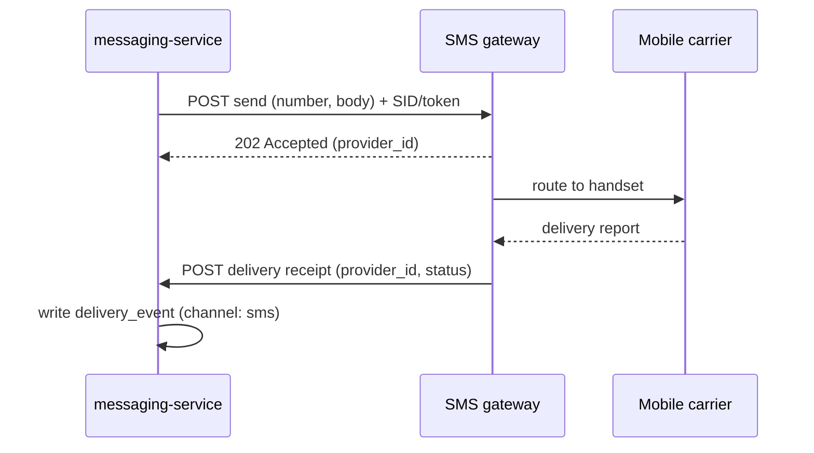

# SMS provider

> The third-party SMS gateway Beacon once sent text messages through. The SMS
> channel is **effectively retired** — no new SMS is sent today — but the gateway
> client and its delivery-receipt ingest still exist in the tree, and historical
> `channel: "sms"` [delivery events](../models/delivery-event.md) survive. Treat
> this page as the record of a deprecated dependency, not a live one. (Services
> that list it in `depends_on` show up under "Depended on by" —
> [messaging-service](../services/messaging-service.md) still does.)

!!! warning "Read this first: SMS is retired"
    Across the docs, SMS is consistently described as a **retired channel** — see
    the [messaging domain](../domains/messaging.md#notes-nuances), the
    [send flow](../flows/send-message.md), the
    [delivery-event model](../models/delivery-event.md), and the
    [glossary](../glossary.md). Email is the live, first-class channel; push rides
    the same path. SMS exists in the data model and on old records only. Everything
    below documents what the integration *was* and what's left of it, so that
    anyone touching the leftover code knows what they're looking at.

## What we use it for

Historically: delivering SMS (text) messages on behalf of an organization, and
receiving **delivery receipts** (the carrier's confirmation that a message
reached, or failed to reach, a handset) back into Beacon's ingest. Those receipts
became [delivery events](../models/delivery-event.md) with `channel: "sms"`, the
same way email delivery/bounce callbacks do today — see the
[email provider](email-provider.md) for the channel that's still live.

In the send flow, SMS was just another value of the `channel` knob in
[message settings](../options/message-settings.md): an org could pick `sms` as its
`default_channel` or `fallback_channel`, and the
[send path](../flows/send-message.md) branched to this gateway instead of the
email provider. The *shape* of the flow was identical to email — render a
template, hand it to the provider, write a delivery event, emit the outcome — only
the provider on the far end differed.

Today that path is dormant. The model, the settings, and the historical events all
still mention SMS, but no live send reaches this gateway. If you're reading this to
understand a `channel: "sms"` row in the delivery log, the short answer is: it's a
historical record from when this integration was live.

## Interface

The integration was a symmetric request/response-plus-callback shape, the same
pattern Beacon uses for [email](email-provider.md):

- **Direction (outbound)** — Beacon `POST`s a message (destination number +
  rendered body) to the gateway's send API. The gateway responds synchronously
  with an accept/reject and a provider-side message identifier.
- **Direction (inbound)** — the gateway `POST`s **delivery receipts** back to
  Beacon's ingest endpoint asynchronously, often seconds to minutes later once the
  carrier reports back. A receipt carries the provider message id and a terminal
  status, which Beacon mapped onto a [delivery event](../models/delivery-event.md)
  (`delivered` / `failed`).
- **Auth & secrets** — an account **SID** plus an **auth token**, held in the
  secrets manager and referenced by name only — never the values, and never in
  these docs. The same credential authenticated outbound sends and was used to
  verify inbound receipts.
- **Environments** — the gateway provides **magic test numbers**: special
  destination numbers that deterministically simulate a `delivered` or a `failed`
  receipt *without* actually sending an SMS or incurring carrier cost. This is the
  SMS analogue of the email provider's sandbox key that black-holes real delivery,
  and it's how integration tests exercised the receipt path safely.

## Failure modes

How the gateway failed, and how Beacon handled each kind — the distinction that
matters is **terminal** versus **transient**:

| Failure | Example | Beacon's handling |
|---------|---------|-------------------|
| Carrier rejection (terminal) | invalid number, recipient opted out (STOP) | recorded as a terminal `failed` delivery event — **not** retried |
| Transient gateway error | gateway `5xx`, timeout, rate-limit | retried per the org's [retry policy](../options/message-settings.md); exhausted retries become a `failed` event |
| Receipt never arrives | carrier silent | the send stays at `sent` — confirmation can lag or never come, exactly as with email |

Two points worth holding onto:

- **A rejection is a real, recorded outcome, not a silent drop.** An invalid
  number or an opt-out lands a terminal `failed` [delivery event](../models/delivery-event.md)
  and, for live sends, a `message.failed` [webhook](../interfaces/webhooks/index.md).
  Don't retry these — the recipient genuinely cannot or will not receive the
  message, and re-sending to an opted-out number is a compliance problem, not a
  transient blip.
- **Transient errors follow the same retry machinery as email.** The
  [`retry_policy`](../options/message-settings.md) option (`none` / `standard` /
  `aggressive`) governed SMS retries identically; `fallback_channel` only fired
  *after* the primary's retries were exhausted, so an SMS-primary org with a retry
  policy of `none` never fell back at all.

## How a send reached this gateway

For context, the SMS path slotted into the standard messaging
[send flow](../flows/send-message.md):

1. A send is triggered (API, dashboard, or an internal event) with `channel: sms`
   either explicitly or via the org's `default_channel`.
2. [messaging-service](../services/messaging-service.md) checks the org's status
   against [accounts-service](../services/accounts-service.md) — a `suspended` org
   is dropped before any provider is touched — then renders the template from
   PostgreSQL.
3. The service branches on channel and hands the rendered message to this gateway.
4. The gateway's response, then later its delivery receipt, are written as
   [delivery events](../models/delivery-event.md) in MongoDB and surfaced as
   `message.*` [webhooks](../interfaces/webhooks/index.md).

The only step unique to SMS was step 3's branch to this gateway instead of the
[email provider](email-provider.md). That branch is the code most likely to be
dead now — see below.

## Notes & nuances

??? note "Number pooling (historical)"
    Outbound numbers were **pooled per region**: Beacon sent from a rotating set of
    sender numbers chosen by the destination's region rather than a single fixed
    number. Deliverability therefore varied by destination country — some carriers
    and countries are far stricter about pooled / shared numbers — which made SMS
    inherently less predictable than email. This is one of the reasons SMS was a
    harder channel to operate, and useful background if you're interpreting the
    spread of outcomes in old `channel: "sms"` delivery events.

??? info "Relationship to the delivery-event model"
    Every SMS attempt wrote a [delivery event](../models/delivery-event.md) just
    like email does. Because that collection is **schemaless and write-once**, old
    SMS rows carry only the fields that existed when they were written — many
    predate `provider_id` (≥ 2024-03), `region` (≥ 2024-07), and an explicit
    `attempts` (treat absent as `1`). If you query historical SMS, default these
    defensively; the [model page](../models/delivery-event.md) lists every cutoff.

!!! warning "Discrepancy: page status vs. retired channel"
    This page's frontmatter still reads `status: active`, but every other source
    (the [messaging domain](../domains/messaging.md), the
    [send flow](../flows/send-message.md), the
    [delivery-event model](../models/delivery-event.md), the
    [glossary](../glossary.md), and the [RabbitMQ datastore](../datastores/rabbitmq.md))
    describes SMS as **retired** with no new sends. The status field looks stale and
    is a candidate to flip to `deprecated`/`inactive` on the next review — flagged
    here rather than silently changed.

!!! danger "Suspected dead"
    The SMS-gateway code paths appear unreachable in current operation:

    - **[messaging-service](../services/messaging-service.md)** carries a
      `legacy.sms_gateway` consumer wired to a RabbitMQ queue with **no producers
      since SMS was retired** (also flagged on the
      [RabbitMQ datastore](../datastores/rabbitmq.md)).
    - The [send flow](../flows/send-message.md) still **branches on
      `channel: "sms"`** to select this legacy gateway, but no live send sets that
      channel, so the branch looks unreachable.
    - No new `channel: "sms"` [delivery events](../models/delivery-event.md) are
      being written; only historical rows remain.

    Confirm before removing — historical reporting still reads the old SMS delivery
    events, so the *data* must stay even if the *integration code* is removed.
