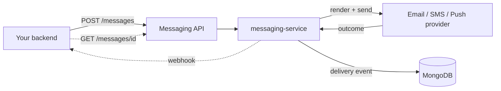
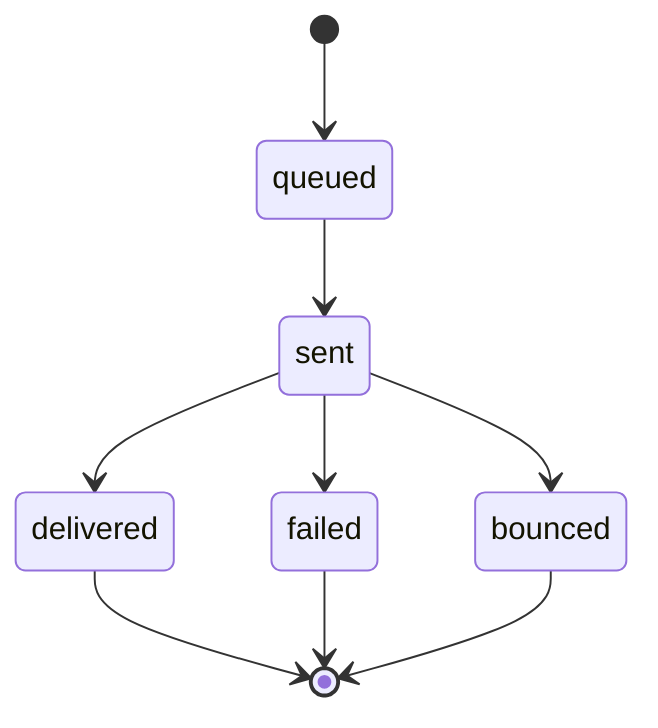

# Messaging API

> The public REST API for sending messages and checking their status. Your backend
> calls it to send transactional and campaign messages to your customers — a welcome
> email, a password reset, a billing receipt, a campaign blast — and to ask, later,
> what happened to each one. It's the same surface our own [SDKs](../sdks/python.md)
> are built on, so anything the Python client can do, you can do with a raw HTTP
> request.

This is the **send-and-track** half of Beacon. You hand us a recipient, a channel,
and a template; we render it, send it through the right provider, and record the
outcome as a [delivery event](../../models/delivery-event.md). You learn the result one
of two ways: poll `GET /messages/{id}`, or — better for anything at scale —
subscribe to [webhooks](../webhooks/index.md) and let us push delivery outcomes to
you. Most integrations do both: webhooks for the live signal, polling as a fallback
and for reconciliation.

A quick map of where this fits before you dive in:



The provider, the queueing, the retries, and the delivery log all live behind the
API in [messaging-service](../../services/messaging-service.md) — you never touch them
directly. You only ever see the two endpoints below and the webhooks.

## Quickstart

Send a message, then read it back. These two calls cover the great majority of real
usage.

```bash
# Send
curl -X POST https://api.beacon.example/messages \
  -H "Authorization: Bearer sk_live_..." \
  -H "Beacon-Version: 2026-05-01" \
  -H "Idempotency-Key: welcome-7a3f9c" \
  -H "Content-Type: application/json" \
  -d '{
    "to": "user@example.com",
    "channel": "email",
    "template": "welcome"
  }'
```

```json
{
  "id": "msg_4Qk2...",
  "to": "user@example.com",
  "channel": "email",
  "status": "queued",
  "created": "2026-06-14T18:03:11Z"
}
```

The `status` you get back is almost always `queued` — the send is accepted and
handed off, not yet delivered. To find out how it actually went, read it back by
`id`:

```bash
# Check status
curl https://api.beacon.example/messages/msg_4Qk2... \
  -H "Authorization: Bearer sk_live_..." \
  -H "Beacon-Version: 2026-05-01"
```

```json
{
  "id": "msg_4Qk2...",
  "to": "user@example.com",
  "channel": "email",
  "status": "delivered",
  "created": "2026-06-14T18:03:11Z"
}
```

Delivery is asynchronous and can take a while — a provider may confirm seconds or
minutes later, and some channels are slower than others. Don't busy-poll waiting for
`delivered`; subscribe to [webhooks](../webhooks/index.md) instead and treat polling
as a backstop.

## Basics

- **Base URL / environments** — `https://api.beacon.example` (prod),
  `https://api.sandbox.beacon.example` (sandbox). Sandbox accepts the same calls but
  doesn't send real messages — use it to wire up your integration and exercise
  webhooks without emailing real people. Keys are environment-scoped (`sk_live_…`
  vs `sk_test_…`), so a sandbox key against the prod URL simply fails auth.
- **Auth** — bearer API key in `Authorization: Bearer <key>`, scoped per
  environment. Sending needs the `messages:send` scope; reading status needs
  `messages:read`. Full details, scopes, and key handling on the
  [Auth](../auth.md) page.
- **Versioning** — date-pinned via the `Beacon-Version` header (e.g.
  `2026-05-01`). Breaking changes ship under a **new date**; old versions keep
  working for **12 months** after a newer one lands. Pin a version explicitly in
  production so a future breaking change can't surprise you — omitting the header
  falls back to your account's default, which can move.
- **Content type** — request and response bodies are JSON (`application/json`).
  Timestamps are ISO-8601 UTC (`created` is `date-time`, read-only).
- **Errors** — JSON `{code, message}`; `429` carries a `Retry-After`. See
  [Errors](#errors) below.

## Reference

The authoritative endpoint reference is rendered from the OpenAPI spec, compiled
from the TypeSpec contracts in `contracts/public-api/`. The spec — not this page —
is ground truth for exact field names, types, and required/optional status; the
prose here exists to give you the *why* and the gotchas around it.

<swagger-ui src="openapi.yaml"/>

### Endpoints at a glance

| Method & path | Scope | Does |
|---------------|-------|------|
| `POST /messages` | `messages:send` | Accept a message for delivery; returns it with a `queued` status |
| `GET /messages/{id}` | `messages:read` | Read one message's current status |

That's the whole public surface today — two endpoints. Everything else (templates,
scheduling internals, the delivery-event log) is owned and managed inside
[messaging-service](../../services/messaging-service.md) and isn't exposed here.

### Sending a message

`POST /messages` takes three required fields and one optional one:

| Field | Required | Notes |
|-------|----------|-------|
| `to` | yes | The recipient. For `email` this is an address; the shape depends on the channel. |
| `channel` | yes | `email` \| `sms` \| `push`. See the channel note below. |
| `template` | yes | The template name to render. Templates live in messaging-service. |
| `sendAt` | no | ISO-8601 time to schedule the send. **Omit to send now**; set it to send later. |

You always send a **template name**, never raw message bodies — Beacon renders the
template on its side. That's deliberate: it keeps content, localization, and
compliance (unsubscribe footers, etc.) in one place rather than scattered across
every caller.

!!! warning "Channel: `email` is the live path"
    The spec advertises `email`, `sms`, and `push`, but in practice **`email` is
    the channel that's actually exercised end-to-end.** `sms` is a retired
    feature — it appears only on legacy [delivery-event](../../models/delivery-event.md)
    records, and the internal SMS consumer is
    [suspected dead](../../services/messaging-service.md). Treat `sms` (and anything
    beyond `email`) as not currently supported in practice, regardless of what the
    enum permits. If you need a non-email channel, confirm support before building
    on it.

### Message status

A message moves through these states. The set is fixed by the spec
(`MessageStatus`):

| Status | Meaning | Terminal? |
|--------|---------|-----------|
| `queued` | Accepted, not yet handed to a provider | no |
| `sent` | Handed to the provider, not yet confirmed delivered | no |
| `delivered` | Provider confirmed delivery | yes |
| `failed` | Retries exhausted | yes |
| `bounced` | Hard bounce (email) | yes |



The three terminal states map exactly to the outcomes recorded on a
[delivery event](../../models/delivery-event.md) (`delivered` / `failed` / `bounced`)
and to the [webhook](../webhooks/index.md) events of the same names. `queued` and
`sent` are in-flight stages you'll see while polling but never as a final answer.

### Errors

Errors come back as JSON with a stable machine-readable `code` and a human
`message`:

```json
{ "code": "invalid_request", "message": "Field 'template' is required." }
```

Branch on `code`, not on `message` (the wording can change). The usual HTTP
conventions apply:

| Status | Meaning | What to do |
|--------|---------|------------|
| `400` | Malformed or invalid request | Fix the payload; don't retry as-is |
| `401` | Missing or bad API key | Check the key and environment |
| `403` | Key lacks the required scope | Grant `messages:send` / `messages:read` |
| `404` | No message with that `id` | Confirm the id (and the environment) |
| `429` | Rate limited | Back off; honor the `Retry-After` header |
| `5xx` | Something failed on our side | Retry with backoff; idempotency-safe |

!!! tip "Rate limits and `Retry-After`"
    On a `429`, the response carries a `Retry-After` header telling you how long to
    wait before retrying. Respect it rather than retrying immediately — tight retry
    loops just deepen the backlog. The [Python SDK](../sdks/python.md) handles this
    backoff for you.

## Guides

- [Authentication](../auth.md) — API keys, scopes, environments, key handling.
- [Webhooks](../webhooks/index.md) — get delivery outcomes **pushed** to you
  instead of polling. The recommended way to learn results at scale.
- [Python SDK](../sdks/python.md) — the official client, with retries and
  pagination built in.

### How the pieces fit together

This API is one of three customer-facing surfaces on the messaging domain, and they
solve different problems — reach for the right one:

| You want to… | Use |
|--------------|-----|
| Send a message / look up one message's status | This API |
| Be notified of delivery outcomes without polling | [Webhooks](../webhooks/index.md) |
| Authenticate and manage keys | [Auth](../auth.md) |
| Skip raw HTTP and use idiomatic Python | [Python SDK](../sdks/python.md) |

A typical lifecycle threads through all of them: authenticate with a key
([Auth](../auth.md)) → `POST /messages` here → receive a
[webhook](../webhooks/index.md) when the outcome lands → optionally `GET
/messages/{id}` to reconcile.

## Notes & nuances

??? info "Idempotency — make retries safe"
    `POST /messages` accepts an `Idempotency-Key` header so retries don't
    double-send. If your request times out or you're unsure it landed, **retry with
    the same key** and you'll get the original result back instead of a second
    message. Choose a key that's stable for the logical send (e.g. derived from your
    own record id, like `welcome-<user_id>`), not a fresh random value per attempt —
    a new key on each try defeats the whole purpose.

??? info "Polling vs webhooks — pick the right tool"
    Polling `GET /messages/{id}` is fine for a one-off or a quick check, but it
    doesn't scale: delivery can lag well behind the send, so you'd poll many times
    per message. For production, subscribe to [webhooks](../webhooks/index.md) and
    treat polling as a reconciliation backstop. Note the two surfaces use different
    reliability models — the API is a synchronous request/response, while webhooks
    are **at-least-once and unordered**, so a `delivered` webhook can arrive before
    you've finished processing `sent`. Reconcile against current message state, not
    event order.

??? note "Two endpoints, on purpose"
    There's no list-or-search-messages endpoint and no template-management endpoint
    in the public API today. Bulk reporting comes from the
    [delivery-event](../../models/delivery-event.md) log and the dashboard, not from
    this surface. If you find yourself wanting to enumerate messages over HTTP,
    you're probably reaching for webhooks (for the live stream) or dashboard exports
    (for history) instead.

??? info "Changelog"
    Breaking changes are introduced under new `Beacon-Version` dates and the prior
    version is supported for 12 months. The current stable version is `2026-05-01`
    (the floor for SDK 2.x — see [version compatibility](../sdks/python.md)). Pin a
    date in production.
