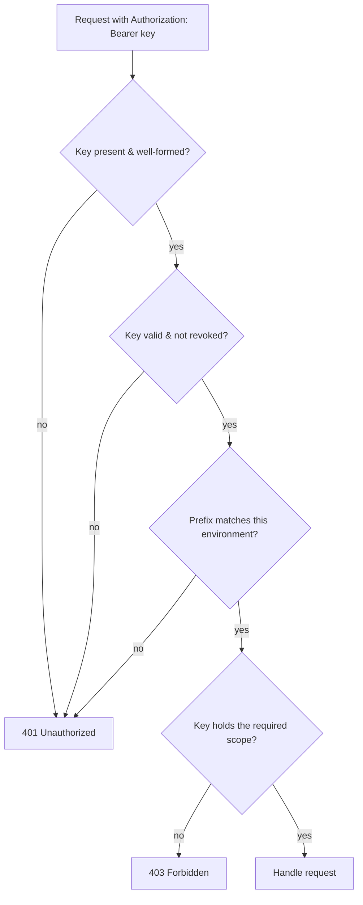

# API authentication

> How callers authenticate to the [Messaging API](api/index.md).

Every request to the [Messaging API](api/index.md) carries a single secret: an
**API key**. There are no OAuth dances, no per-user logins, and no session
cookies on the API — a key is the whole credential. You create one in the
[dashboard](../surfaces/dashboard.md), send it on each request, and Beacon decides
what you can do from the key's [environment](#environments) and
[scopes](#scopes). That's the entire model, and the rest of this page is about
using it well: where keys come from, what they can reach, and the handful of
gotchas that bite people in production.

If you just want to make your first authenticated call:

```bash
curl https://api.beacon.example/messages \
  -H "Authorization: Bearer sk_live_3f9a...Qk" \
  -H "Content-Type: application/json" \
  -d '{"to":"user@example.com","channel":"email","template":"welcome"}'
```

If that key is real, live, and carries `messages:send`, the message goes out. If
anything is off — wrong environment, missing scope, revoked key — you get a `401`
or `403` with a JSON `{code, message}` body explaining which, and **nothing is
sent**. A bad credential never half-works; it's rejected cleanly before any
message leaves Beacon.

## API keys

A Beacon API key is a **bearer token**: whoever holds it can act as that key, so
treat it exactly like a password. Keys are long, opaque, random strings with a
prefix that tells you (and us) what kind of key it is at a glance.

- `sk_live_…` — a **production** key. Calls hit real customers and real money:
  messages are actually delivered and count against your plan.
- `sk_test_…` — a **sandbox** key. Calls run against the
  [sandbox environment](#environments); nothing is delivered to real recipients.

Send the key on every request in the `Authorization` header, using the `Bearer`
scheme:

```http
Authorization: Bearer sk_live_3f9a...Qk
```

There is no query-parameter or request-body alternative, and that's deliberate —
keys in URLs leak into access logs, proxies, and browser history. The header is
the only supported channel.

### Who can create and rotate keys

Keys are minted, listed, and revoked in **Settings → Developers** of the
[dashboard](../surfaces/dashboard.md). Only an org **Owner** or **Admin** can do
this — a **Member** has no API-key controls at all (see
[Roles & permissions](../access/roles.md)). This is the one place the human role
model and the API meet: the role model gates *who hands out* API access, but once
a key exists it acts purely on its own scopes, with no human attached. An Admin
can issue a `messages:send` key that a backend cron job then uses forever, with
nobody "logged in."

!!! warning "Keys are shown once"
    The full key value is displayed **exactly once, at creation time.** Beacon
    stores only a hash, so we genuinely cannot show it to you again — copy it
    straight into your secret manager. Lost the value? You don't recover it; you
    create a new key and revoke the old one.

### Rotating keys safely

Because a key is shown once and can't be retrieved, rotation is "create new, cut
over, revoke old" rather than "change the password." The safe sequence:

1. **Create** a second key with the same scopes.
2. **Deploy** it to your callers (env var, secret manager — never the codebase).
3. **Verify** traffic is flowing on the new key.
4. **Revoke** the old key.

Revocation takes effect immediately: the next request on a revoked key gets a
`401`. There is no grace period and no soft-delete, so don't revoke the old key
until you've confirmed the new one is live everywhere — otherwise you'll create a
gap where in-flight callers start failing. Running two valid keys side by side
during the cutover is expected and fine.

!!! danger "Rotate on any suspected exposure"
    A key that lands in a git commit, a log line, a screenshot, a CI artifact, or
    a support ticket is **compromised** — treat it as if it's already in the
    wrong hands. Revoke and replace it; don't wait to confirm misuse. Since live
    keys send real messages on your bill, a leaked `sk_live_…` is both a security
    and a cost problem.

## Environments

Beacon runs two fully separate environments, and the key prefix is what picks
between them. There is no environment header or flag — the key *is* the
environment selector.

| Prefix | Environment | Base URL | Effect of a send |
|--------|-------------|----------|------------------|
| `sk_live_` | Production | `https://api.beacon.example` | Real delivery, billed |
| `sk_test_` | Sandbox | `https://api.sandbox.beacon.example` | Simulated, never delivered |

The two are isolated: data, keys, and configuration don't cross between them. A
`sk_test_` key is meaningless against the production base URL and vice versa, so
a mismatched key/host pair fails authentication rather than silently doing the
wrong thing. This pairing is also your safest blast-radius control — you can hand
a contractor or a flaky integration a sandbox key with zero risk of a real send.

??? info "Sandbox still exercises the real flow"
    Sandbox isn't a stub that returns canned `200`s. It runs the same send
    pipeline, renders the same templates, and emits the same
    [delivery events](../models/delivery-event.md) and
    [webhooks](webhooks/index.md) — it just stops short of handing the message to
    a real [provider](../integrations/email-provider.md). That makes it the right
    place to test idempotency, webhook signature verification, and error handling
    end to end before you point a `sk_live_` key at it.

## Scopes

A scope is a single capability a key is allowed to use. A key carries one or more
scopes, chosen at creation; a request that needs a scope the key doesn't hold is
rejected with `403`, regardless of role or environment. Scopes are about the
*key's* reach, not a person's — they're orthogonal to the customer
[roles](../access/roles.md) that govern the dashboard.

| Scope | Grants | Used by |
|-------|--------|---------|
| `messages:send` | Create and send messages (`POST /messages`) | Your backend's send path |
| `messages:read` | Read message and delivery status | Dashboards, reconciliation jobs |
| `webhooks:manage` | Create, update, and delete webhook endpoints | One-time setup / IaC |

Grant the **narrowest set that does the job.** Some patterns that fall out of
that principle:

- A **send-only service** (transactional email from your app) needs just
  `messages:send`. It can't read history and can't touch your webhook config — so
  a leak of that key can't quietly reroute your delivery notifications.
- A **reporting or reconciliation job** that polls delivery status needs only
  `messages:read`. Giving it `messages:send` would let a read-only task send
  messages if it (or its key) ever misbehaves.
- **Webhook setup** (`webhooks:manage`) is usually a one-time or
  infrastructure-as-code task. Many teams use a separate, tightly held key for it
  rather than bundling it into a long-lived send key.

??? info "How scopes relate to dashboard roles"
    The [permission matrix](../access/roles.md#permission-matrix) governs what a
    *human* can do in the dashboard. API scopes govern what a *key* can do over
    HTTP. They're checked in different places and don't inherit from each other:
    an Admin issues keys, but the key's own scopes — not the Admin's role —
    decide what each request may do. A Member who never receives a key has no API
    reach at all.

## Authentication flow

Authentication runs entirely inside the
[messaging-service](../services/messaging-service.md) (Elixir/Phoenix) on the way
into the [Messaging API](api/index.md) — there is no separate auth service to call
first. Each request is checked in order, and the first failing check ends it:



The distinction the table below draws is worth internalizing, because the two
failures call for different fixes:

| Status | Meaning | What it usually is |
|--------|---------|--------------------|
| `401` Unauthorized | We couldn't authenticate the key at all | Missing/garbled header, revoked key, wrong environment |
| `403` Forbidden | The key is valid but not allowed this action | Key lacks the required scope |

A `401` means *fix your credential* — check the header, the key value, and that a
`sk_live_` key is hitting the production host. A `403` means *the credential is
fine but underpowered* — mint a key (or add a scope) that covers the action.
Neither error sends anything or mutates state.

## In the SDKs

The [official SDKs](sdks/python.md) take the key once at construction and attach
the `Authorization` header for you, so you never hand-build it:

```python
from beacon import Beacon
client = Beacon(api_key="sk_live_...")   # header is set on every call for you
```

Pass the key from your environment or secret manager, not a literal in source.
Everything on this page — environments via prefix, scope-based `403`s, immediate
revocation — applies identically through an SDK; the client is a convenience over
the same bearer-token model, not a different auth scheme.

## Notes & nuances

??? warning "Key handling"
    Keys are shown once at creation. Treat them as secrets; rotate on exposure.
    Store them in a secret manager or environment variable — never in source
    control, logs, or URLs.

??? info "Rate limiting is per key"
    The API's rate limits and `429`/`Retry-After` behavior (see the
    [Messaging API](api/index.md#basics)) are tracked **per key**, not per org.
    Splitting workloads across separate keys — say, a high-volume campaign key and
    a low-latency transactional key — keeps a burst on one from starving the
    other. It also makes each key's traffic independently observable and
    independently revocable.

??? info "No user-level API auth today"
    There is no OAuth, no per-user token, and no session auth on the API — a key
    is the only credential, and it identifies an *org + scope set*, not a person.
    If you need to attribute API activity to a specific human, the lever you have
    is **one key per actor/service** plus the dashboard's key list, not a
    user-identity claim in the request. Treat finer-grained, per-user API auth as
    a product request rather than something configurable today.

!!! info "Where it's enforced"
    There is no standalone authentication service. Key validation, environment
    matching, and scope checks all happen in app code in the
    [messaging-service](../services/messaging-service.md) as requests enter the
    [Messaging API](api/index.md). This mirrors how Beacon enforces
    [roles](../access/roles.md#notes-nuances) generally — in the code that owns
    the action, not a central policy engine — so the tables on this page are the
    human-readable contract, not a single config you can point at.
