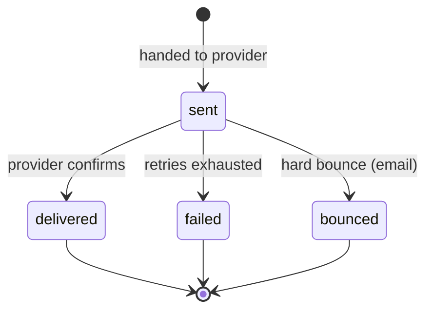
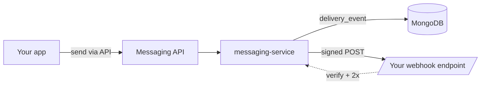

# Webhooks

> Delivery outcomes Beacon sends to *your* endpoint. (These are customer-facing
> webhooks — distinct from the internal RabbitMQ events between Beacon's services.)

When you send a message through Beacon, the send is just the start of the story.
The message gets handed to a provider, the provider tries to deliver it, and
minutes — sometimes hours — later you find out whether it arrived. Webhooks are how
Beacon tells you that outcome **without you having to poll**. You register one HTTPS
endpoint, pick the events you care about, and Beacon POSTs a small JSON payload to
you each time something happens to a message.

If you only ever needed "did it send?", the API response at send time would be
enough. Webhooks exist because the interesting part — *delivered*, *failed*,
*bounced* — happens asynchronously, outside any request you made. A receipt
confirmation flow, a "we couldn't reach you, update your email" nudge, a deliverability
dashboard: all of those are built on these events.

This page is the contract for consuming them reliably. It runs from the product
picture (what fires, when) down to the engineering details (signing, ordering,
retries, idempotency) you need to build a handler that doesn't lie to your users.

## When you'd reach for webhooks

- **React to outcomes, not sends.** Update your own records when a message is
  confirmed `delivered`, or open a support task when one `failed`.
- **Suppress bad addresses.** A `message.bounced` for email is your signal to stop
  sending to that address until the customer fixes it.
- **Build reporting without polling.** Stream events into your own store rather than
  asking the API for status on every message.

If you just need the status of one message right now, the synchronous
[Messaging API](../api/index.md) is the better tool — webhooks are for the *stream*
of outcomes over time.

## Event catalog

These are the four events Beacon emits today. Each payload is a JSON object; the
fields below are the ones you can rely on. Treat any field not listed here as
informational and subject to change.

| Event | When it fires | Payload | Notes |
|-------|---------------|---------|-------|
| `message.sent` | handed to the provider | `{message_id, channel}` | not yet delivered |
| `message.delivered` | provider confirmed delivery | `{message_id, channel, at}` | may arrive much later |
| `message.failed` | retries exhausted | `{message_id, reason}` | terminal |
| `message.bounced` | hard bounce (email) | `{message_id, reason}` | terminal |

The fields above are the contract for these public webhooks. Don't confuse them with
`contracts/messaging/asyncapi.yaml` — that AsyncAPI document describes the *internal*
RabbitMQ events between Beacon's services (it's served over `amqp` and covers
`subscription.upgraded` and the internal `message.delivered`), not the outbound
webhooks on this page. The two share names but not shapes; design against this table.

### Reading the lifecycle

Most messages walk a happy path: `sent` → `delivered`. The other two events are the
ways that path can end early. Here's the same information as a state diagram, which
makes the *terminal* outcomes obvious:

A few things worth internalizing before you write a handler:

- **`sent` is not a guarantee of anything.** It means Beacon handed the message off,
  not that anyone received it. Don't tell a customer "delivered" on `sent`.
- **`delivered` can lag a long way behind `sent`.** Providers confirm on their own
  schedule. Minutes is normal; longer is possible. See the ordering caveat below.
- **`failed` and `bounced` are terminal.** Once you see either, no further events
  will arrive for that `message_id`. The difference: `failed` means Beacon tried and
  gave up (the retry window closed without a confirmed delivery); `bounced` is the
  provider explicitly rejecting the address (a hard bounce on email).
- **Not every message produces every event.** A message that bounces never produces
  `delivered`. A message you subscribed to only `message.delivered` for will simply
  not call your endpoint on the other transitions.

??? note "Channels: email today, SMS is legacy"
    `channel` is `email` on everything Beacon sends now. You may see `sms` on
    *historical* delivery records, but the SMS feature is retired and no new SMS
    sends occur — so in practice a live webhook payload will carry `email`. This
    mirrors the [delivery-event](../../models/delivery-event.md) model, where `sms`
    survives only on legacy rows. Code for `email`, tolerate `sms`, and don't assume
    any other value.

??? info "The `reason` field on failures"
    `message.failed` and `message.bounced` carry a `reason` string meant for humans
    and triage, not for branching logic. It can change wording over time. If you need
    to act differently on different failure types, treat `reason` as a hint and
    confirm against message state via the API rather than pattern-matching the text.

## Delivery semantics

This is the part to read twice. Webhooks are a *best-effort, at-least-once* delivery
mechanism over the public internet, which means a naive handler will eventually
double-count, mis-order, or trust something it shouldn't. The four rules below are
the reliability contract you design against.

### At-least-once — be idempotent

Beacon guarantees it will deliver each event **at least once**, which is another way
of saying it may deliver the same event **more than once**. Network blips, your
endpoint timing out, a retry that races a slow-but-successful first attempt — any of
these can produce a duplicate POST that is, as far as your handler can tell, identical
to one you already processed.

The fix is to make your handler **idempotent**: processing the same event twice has
the same effect as processing it once.

- **Dedupe on `message_id`** for the stable identity of the *thing the event is
  about*. The `message_id` is the same across every event and every redelivery for a
  given message.
- **Distinguish a redelivery from a genuinely new event** using the per-attempt
  delivery ID in the `Beacon-Delivery` request header. That value changes on every
  delivery attempt, so two POSTs with the same `Beacon-Delivery` are the *same*
  attempt arriving twice; two with different values for the same `message_id` are
  separate events (e.g. `sent` then `delivered`).

A common, robust pattern: key your "have I seen this?" check on the combination of
`message_id` plus event type, record outcomes you've applied, and make the write a
no-op if it's already there.

### Order is not guaranteed

Events are **not** delivered in the order they occurred. Because `delivered` can lag
far behind `sent`, and retries can reorder things further, it is entirely normal for
`delivered` to land on your endpoint *before* you've processed `sent` for the same
message.

So: **reconcile against the current state of the message, not against the sequence of
events.** Don't build a state machine that requires `sent` before it will accept
`delivered`. If you receive `delivered` for a `message_id` you've never seen, that's
not an error — record it as delivered and move on. When in doubt about the true
current state, ask the [Messaging API](../api/index.md); it's authoritative, the event
stream is a notification of changes.

### Retries and the 24-hour window

If your endpoint doesn't return a fast `2xx`, Beacon retries with **exponential
backoff for up to 24 hours**. After that the delivery is **dropped** — Beacon stops
trying for that event.

- **Respond quickly with `2xx`.** Acknowledge receipt, then do slow work
  (rendering, downstream calls) asynchronously. A handler that does heavy work inline
  and times out looks like a failure and triggers retries.
- **A non-`2xx` (or a timeout) is treated as failure** and schedules the next retry.
- **Dropped events are visible in the dashboard's webhook log.** If your endpoint was
  down for longer than the window, those events won't come back on their own — use the
  log to see what you missed and backfill from the API if you need to.

??? tip "Why 24 hours and then drop?"
    The window is long enough to ride out a normal outage or deploy, but bounded so
    Beacon isn't holding undeliverable events forever. The webhook log is the safety
    net for anything that falls outside it — webhooks are for the common case, the log
    and the API are the recovery path.

### Signing and verification

Every webhook request is **signed** so you can prove it came from Beacon and wasn't
tampered with or replayed. Two headers carry the proof:

- `Beacon-Signature` — an HMAC computed over the **request body plus a timestamp**.
- `Beacon-Delivery` — the per-attempt delivery ID (also your duplicate-detection key,
  above).

To verify, before you trust a single byte of the payload:

1. **Recompute the HMAC** over the raw request body and timestamp using your endpoint's
   signing secret, and compare it (in constant time) to `Beacon-Signature`. Use the
   *raw* body bytes — re-serializing parsed JSON can change whitespace and break the
   match.
2. **Reject stale timestamps.** A request whose timestamp is too far from now is
   refused, which closes off replay attacks where someone captures a valid request and
   re-sends it later.

Only after both checks pass should you parse and act on the body. An unsigned or
mis-signed request should be dropped, not processed.

!!! warning "Internet-facing, so verify"
    Your webhook endpoint is a public URL. Anyone can POST to it. Signature
    verification is the only thing standing between "Beacon told me this" and "someone
    on the internet told me this" — it's not optional hardening, it's the
    authentication for this interface. (API *callers* authenticate with bearer keys;
    see [Auth](../auth.md). Webhooks flow the other direction, so signing replaces the
    bearer key.)

## Subscribing

You register and manage webhook endpoints in **Settings → Developers** in the
[dashboard](../../surfaces/dashboard.md). Managing endpoints requires the
`webhooks:manage` capability — see [Auth](../auth.md) for how scopes and keys work,
and [Roles & permissions](../../access/roles.md) for who in an org can do it.

A typical setup:

1. **Add your endpoint URL.** It must be HTTPS.
2. **Select the events** you want delivered. Subscribe only to what you'll act on —
   fewer events means less to verify and dedupe.
3. **Grab the signing secret** Beacon shows for the endpoint and store it as a secret
   in your app; you'll need it to verify `Beacon-Signature`.
4. **Send a sandbox test.** Sandbox sends exercise the full path so you can confirm
   your handler verifies the signature, returns `2xx` quickly, and is idempotent —
   before any real customer outcome depends on it.

??? tip "Test failure and bounce paths too, not just the happy one"
    It's easy to verify `delivered` works and ship. The events that matter most for
    correctness are the terminal ones — make sure your handler does the right thing on
    `message.failed` and `message.bounced`, since those are the ones that change what a
    customer experiences (suppression, re-prompts, alerts).

## How this fits the rest of Beacon

Webhooks are the **outbound, customer-facing edge** of the messaging domain. They sit
downstream of everything else:

- The [Messaging API](../api/index.md) is the inbound side — you *send* over the API and
  *hear back* over webhooks.
- [Auth](../auth.md) covers keys and scopes for the API and for managing webhook
  endpoints.
- The events you receive are the public projection of the
  [delivery-event](../../models/delivery-event.md) records that
  [messaging-service](../../services/messaging-service.md) writes to MongoDB as each
  send resolves. Same underlying facts (`delivered` / `failed` / `bounced`), exposed as
  an outbound notification instead of a stored row.

## Notes & nuances

??? info "Internal events vs webhooks"
    `message.delivered` exists twice: as an internal RabbitMQ event
    ([messaging-service](../../services/messaging-service.md)) and as this public
    webhook. They share a name and shape but are different surfaces. The internal
    event is part of how Beacon's services talk to each other; the webhook is what
    Beacon sends to *you*. Don't assume the internal event's guarantees (or its other
    fields) carry over to the webhook — design only against what's documented here.

??? info "Why we don't promise ordering or exactly-once"
    Both are expensive to guarantee across the public internet and across a provider
    you don't control, and neither is necessary if your handler is idempotent and
    reconciles against current state. The contract is deliberately the weaker,
    cheaper, more honest one — *at-least-once, unordered* — with the tools
    (`message_id`, `Beacon-Delivery`, the API, the webhook log) to build a correct
    consumer on top of it.
