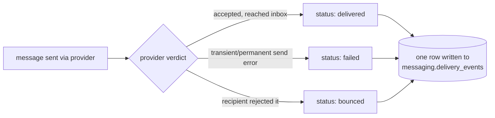
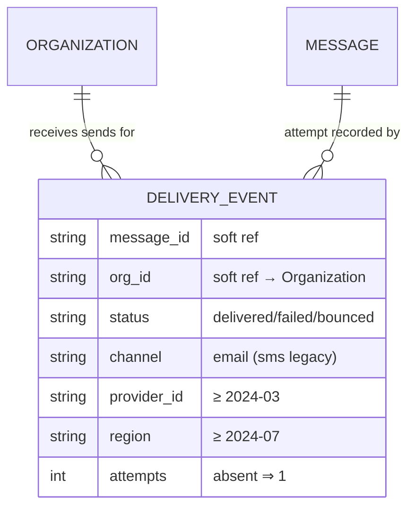

# Delivery event

> A write-once record of one message send attempt and its outcome. High volume,
> append-only, stored in MongoDB by
> [messaging-service](../services/messaging-service.md). See
> [ADR 0001](../decisions/0001-delivery-events-in-mongodb.md) for why it's in Mongo,
> and [ADR 0002](../decisions/0002-delivery-event-schema-validator.md) for the
> validator that now guards new writes.

This is the busiest data model in Beacon. Every transactional and campaign message
the product sends ends its life as exactly one delivery event: the small, permanent
note that says *"we tried to send message X to org Y, and here's what happened."* At
Beacon's volume that's millions of new records a day, and none of them is ever
changed once written. If you're building a delivery report, a bounce dashboard, or
anything that asks "did our customer's messages arrive?", this is the model you read.

The most important thing to internalize before you write a line of code against it:
**this collection has no single fixed shape.** It's schemaless, it has accumulated
fields over years, and older records genuinely lack fields that newer ones carry.
That's by design, not corruption — and it's the one fact that trips up everyone who
assumes a field is always there. We'll come back to it repeatedly, because coding
*defensively* is the whole job here.

## Business view

*Plain language — safe for non-engineers.*

| Attribute | What it means | Rules / behavior |
|-----------|---------------|------------------|
| Outcome | Whether the message arrived | Delivered, failed, or bounced |
| Channel | How it was sent | Email today; SMS only on old records (retired) |
| When | Time of the attempt | One record per attempt; never updated |
| Org | Which customer it belongs to | Used for per-customer delivery reporting |

Each row is a *fact about the past*. Unlike a [Subscription](subscription.md), which
moves through a lifecycle (`trialing → active → past_due → …`) and is edited in
place, a delivery event has no lifecycle of its own — it's born already final. There
is no "the message became delivered later." If the same message is retried and a
second attempt succeeds, that's a *second* event, not an edit to the first. Read the
log as a stream of immutable observations, not as the current state of a message.

A delivery event's life is short and one-directional: the message gets sent, the
provider hands back a verdict, and we write the event down.



What each outcome means in practice:

- **`delivered`** — the provider accepted the message and reports it reached the
  recipient. This is the happy path and the bulk of the volume.
- **`failed`** — the send attempt itself didn't succeed (provider error, send-time
  rejection, timeout). Distinct from a bounce: failure is *our side / the send*,
  a bounce is *the recipient's mailbox*.
- **`bounced`** — the recipient's mail system rejected the message after we handed it
  off (bad address, full mailbox, blocked). Useful for list-hygiene reporting.

These three outcomes also drive the events messaging-service emits downstream:
a `delivered` event corresponds to `message.delivered`, and `failed`/`bounced` map to
`message.failed` on RabbitMQ. So the delivery-event row and the published event are
two records of the same moment — the row is the durable log, the event is the
notification. (See [messaging-service](../services/messaging-service.md).)

## How it maps to storage

This is a **schemaless** MongoDB collection, so "the model" is really the *union of
shapes that have existed over time*. Newer fields simply don't exist on older
documents — that's expected, not corruption. The reference below describes the
**current** shape and flags where older documents differ. Because there's no schema
enforcement *on existing data*, every consumer must code defensively rather than
assume a field exists.

Two storage facts shape everything you do with this model:

- **Field presence depends on a record's age.** A document written in 2023 is a
  smaller object than one written today. Fields were added by simply having the
  writer start including them — no migration, no backfill — which is exactly the
  cheap-to-evolve property [ADR 0001](../decisions/0001-delivery-events-in-mongodb.md)
  wanted, and exactly the drift you have to handle on read.
- **New writes are now validated; old data is not.** As of
  [ADR 0002](../decisions/0002-delivery-event-schema-validator.md), a MongoDB
  JSON-schema validator (`validationLevel: "moderate"`, `validationAction: "error"`)
  guards the collection. It requires the core four fields with correct types and a
  valid `status`/`channel` on **new** writes, and rejects malformed ones at insert
  time. It is deliberately **not retroactive** — historical documents are
  grandfathered and never re-checked — so the drift caveat still holds for old data.
  Don't read "validator added" as "every field is guaranteed everywhere."

So there are effectively two populations in one collection: pre-validator documents
(trust nothing; check presence) and post-validator documents (you can lean on the
core four, but the age-dependent fields are still optional). When you read across a
date range that straddles the validator, you'll see both — design for the looser one.

---

*Everything below is engineer-facing reference.*

## Document shape

*For a schemaless store, "Present on" replaces nullability — it's the field that
matters most here.*

| Field | Type | Present on | Notes |
|-------|------|-----------|-------|
| `_id` | ObjectId | all | Mongo's PK; its timestamp is a rough write-time proxy |
| `message_id` | string | all | soft ref to the message; **in `required`** |
| `org_id` | string | all | soft ref to [Organization](organization.md); **in `required`** |
| `status` | string | all | `delivered` / `failed` / `bounced`; **enum-validated on new writes** |
| `channel` | string | all | `email`; `sms` only on legacy rows; **enum-validated on new writes** |
| `provider_id` | string | **≥ 2024-03** | missing on older documents; optional even now |
| `region` | string | **≥ 2024-07** | added later; older docs have none; optional even now |
| `attempts` | int | most | absent on oldest rows — treat absent as `1` |
| `debug_payload` | object | a few 2023 rows | see suspected dead |

The **core four** — `message_id`, `org_id`, `status`, `channel` — are the only fields
the validator marks `required`. They appear on every document, old and new, which is
what makes requiring them safe under `moderate` validation. Everything else is
age-dependent and optional by design, so a brand-new, perfectly valid document can
still omit `provider_id`, `region`, or `attempts`.

!!! warning "Field presence drifts by record age"
    The single most important fact about this collection: **older documents lack
    fields added later.** Known cutoffs — `provider_id` (before 2024-03), `region`
    (before 2024-07), `attempts` (oldest rows). Filter on existence or default in
    code; never assume universal presence. The
    [ADR 0002](../decisions/0002-delivery-event-schema-validator.md) validator stops
    *new* drift but does **not** fix this for historical data.

### Reading defensively

Because the shape varies by age, every read either checks for a field or supplies a
default. A few patterns you'll reach for constantly:

```javascript
// Treat a missing attempts as 1 (the documented default).
const attempts = doc.attempts ?? 1;

// "region is unknown" is a real, valid state for older rows — not an error.
const region = doc.region ?? "unknown";

// Aggregating only rows that actually carry a field: filter on existence first.
db.delivery_events.aggregate([
  { $match: { region: { $exists: true } } },
  { $group: { _id: "$region", n: { $sum: 1 } } }
]);
```

The trap is the aggregate report that spans a date range crossing a cutoff: half the
window has `region`, half doesn't, and a naïve `$group` silently buckets the older
half under `null`. Decide explicitly whether absent means "unknown" or "exclude."

### Query patterns it's shaped for

[ADR 0001](../decisions/0001-delivery-events-in-mongodb.md) chose this store for two
read patterns, and they're the ones to design around:

- **Recent-window, per-org lookups** — "what happened to this org's sends in the last
  few days?" Filter by `org_id` and a recent time bound (via `_id` or a write-time
  field).
- **Aggregate reporting** — delivery / bounce / failure rates over a period, often
  grouped by `status`, `channel`, or `region`.

Neither pattern joins across the log, and neither touches old rows often — which is
why a schemaless append-only store fits and why cross-store joins (below) stay in
application code.

## Defaults & derivations

| Field | DB default | App-level default / derivation |
|-------|------------|--------------------------------|
| any field | **none** (MongoDB applies no defaults) | the writer sets every field explicitly at insert |
| `attempts` (when reading old rows) | — | assume `1` if the field is absent |
| `region` / `provider_id` (when absent) | — | treat as "unknown"; never assume a value |

MongoDB never fills a field in for you, and the validator doesn't add defaults either
— it only accepts or rejects. So every value you see was written explicitly by the
producer, and every value you *don't* see is genuinely absent. "Default `attempts` to
1" is a **read-side** convention, not something stored; the row really has no
`attempts` field.

## Constraints & validation

| Rule | Enforced in | Detail |
|------|-------------|--------|
| Core four present + correct types | **DB (new writes)** | `required: [message_id, org_id, status, channel]` in the validator; not retroactive |
| `status` ∈ {delivered, failed, bounced} | **DB (new writes) + app** | `enum` in the validator; also set by the writer. Old rows never re-checked |
| `channel` ∈ {email, sms} | **DB (new writes)** | `enum` permits `sms` for legacy safety; no new SMS is written |
| Age-dependent fields present | **none** | `provider_id` / `region` / `attempts` stay optional even post-validator |
| Write-once (no updates) | **app** | convention only — nothing prevents an update |

This section changed with [ADR 0002](../decisions/0002-delivery-event-schema-validator.md):
the collection went from *zero* DB enforcement to a forward-only validator. The
nuance worth holding onto:

- **A bad new write fails loudly and locally.** A typo'd status like `"deliverd"` is
  refused with a `DocumentValidationFailure` at insert time, next to the code that
  caused it — not days later in a skewed report. Reassuringly, a rejected write
  corrupts nothing; it's simply not stored.
- **Old data is untouched.** `moderate` validation never re-checks documents that
  already exist, so a 2023 row missing `provider_id` (or even an old `sms` row) reads
  exactly as before.
- **Write-once is still only a convention.** Nothing in the store prevents an
  `update`; we rely on the writer never issuing one. Treat the log as immutable
  because the *code* does, not because Mongo enforces it.

## Relationships

*All logical — MongoDB, so there are no foreign keys.*

| Related model | Via | Cardinality | Enforcement |
|---------------|-----|-------------|-------------|
| Message | `message_id` | many events → one message | **cross-store (none)** |
| [Organization](organization.md) | `org_id` | many events → one org | **cross-store (none)** |



Both references are **soft**: `org_id` points at an [Organization](organization.md)
that lives in MySQL behind accounts-service, and `message_id` points at a message
owned by messaging-service itself (its templates and schedules live in PostgreSQL; the
event log lives here in MongoDB). Nothing keeps them honest. An org can be deleted
while its delivery events live on, so a join from an event to its org (or to that
org's [Subscription](subscription.md)) happens in application code and must tolerate a
missing target. There is no cascade, no FK, no referential check — by design, per
[ADR 0001](../decisions/0001-delivery-events-in-mongodb.md).

## Notes & nuances

??? note "Deprecated / historical"
    `channel: "sms"` rows exist from the retired SMS feature. No new SMS rows are
    written. They're kept for historical reporting, and the validator still *permits*
    `sms` so the legacy value never trips a check — see the
    [validator rationale](../decisions/0002-delivery-event-schema-validator.md). The
    matching dead consumer is flagged on
    [messaging-service](../services/messaging-service.md#notes-nuances).

??? info "Future / cleanup"
    A one-time best-effort backfill of `region` (derived from `provider_id`) has been
    discussed but not scheduled; it would *narrow* historical drift, not eliminate the
    pattern. Tightening the validator from `moderate` to `strict` only makes sense
    after such a backfill — and since events are write-once, it'd change little in
    practice. Both are noted in
    [ADR 0002 → Future / cleanup](../decisions/0002-delivery-event-schema-validator.md).

!!! danger "Suspected dead"
    `debug_payload` appears on a handful of 2023 rows only — looks like a temporary
    debugging field left in by accident. Not written by current code, and not part of
    the validator schema, so any new write carrying it would still be accepted (it's
    not in `required`, and extra fields aren't forbidden) — but nothing produces it.

## Sources & confidence

Derived from messaging-service's writer code plus sampling the collection across date
ranges, cross-checked against
[ADR 0001](../decisions/0001-delivery-events-in-mongodb.md) and
[ADR 0002](../decisions/0002-delivery-event-schema-validator.md) for the storage and
validation rationale. Confidence is moderate (62) precisely because historical shapes
are hard to fully enumerate from code alone — the exact cutoff for the oldest fields
(`attempts`) and the full set of one-off legacy fields like `debug_payload` come from
sampling, not an authoritative schema. The validator's existence is well-attested
(ADR 0002, `accepted`); its exact deployed definition should be re-verified against
messaging-service's storage setup on the next pass.
