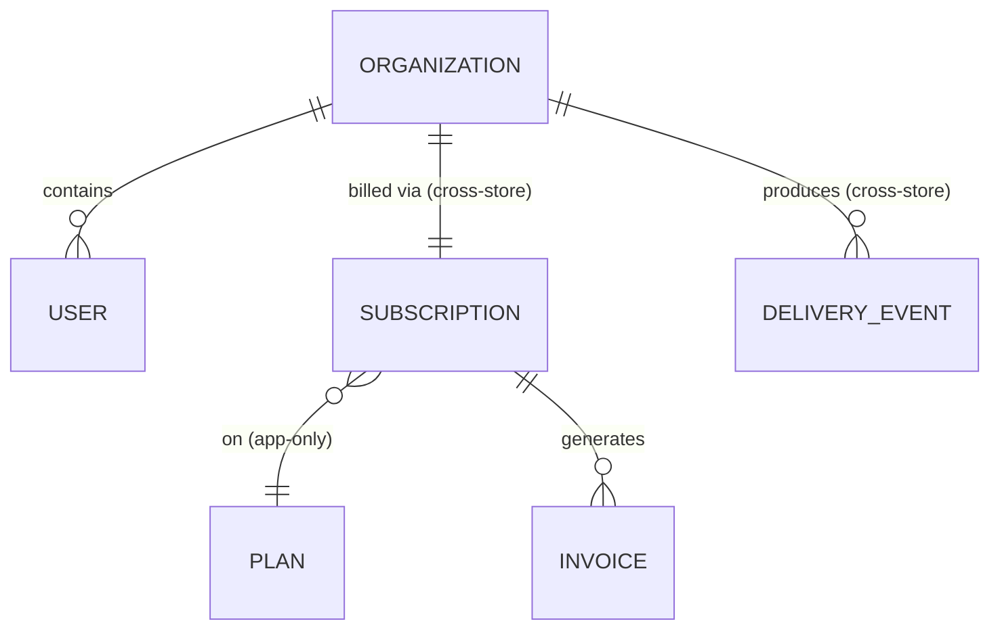

# Models

> The data and domain concepts Beacon is built around — and, just as important,
> *where each one physically lives* and *who is allowed to write it*. If you only
> read the service pages you'll know what each service does; read these to know
> what the data actually looks like, where the schema lies to you, and which rules
> are enforced by the database versus by application code.

Beacon has four core models. Each is owned by exactly one service and read by the
others across service (and database) boundaries. That ownership boundary is the
single most important idea on this page: a model has **one writer**, and everyone
else is a reader who must not treat their copy as long-term truth.

| Model | Owner | Primary store | One-line role |
|-------|-------|---------------|---------------|
| [Subscription](subscription.md) | [billing-service](../services/billing-service.md) | MySQL `billing.subscriptions` (+ view) | What an org is currently paying for |
| [Organization](organization.md) | [accounts-service](../services/accounts-service.md) | MySQL `accounts.organizations` | The customer tenant users belong to |
| [Plan](plan.md) | [billing-service](../services/billing-service.md) | MySQL (billing) | The package an org subscribes to |
| [Delivery event](delivery-event.md) | [messaging-service](../services/messaging-service.md) | MongoDB `messaging.delivery_events` | A write-once record of one send attempt |

## How they relate

The models form a short chain: an **Organization** is the tenant; it has one
active **Subscription**; that subscription is for one **Plan**; and once the org
starts sending, each message produces **Delivery events**. Almost every line that
crosses a service is a *soft* reference — an id stored as a plain value with no
foreign key behind it, because the two ends live in different databases owned by
different services.

Read that diagram with the enforcement in mind: the `Organization → User` and
`Subscription → Invoice` edges are real **DB foreign keys** inside a single
database. The `Subscription → Plan` edge is **app-only** — same MySQL instance,
but no FK is declared. And the two edges labelled *cross-store* (`Organization ↔
Subscription`, `Organization → Delivery event`) span service and database
boundaries, so nothing at the storage layer guarantees the other side exists. The
model pages spell out exactly which is which, and that distinction is the whole
reason these pages exist.

## Pick your model

Each page is written to teach one recurring lesson about Beacon's data, so they
double as worked examples of the model-page depth ladder (business at the top,
schema-level detail further down):

- **[Subscription](subscription.md)** — the rich, relational case, and the
  canonical *"model ≠ table"* example. Most attributes are plain columns on
  `billing.subscriptions`, but `seats_in_use` is **view-derived** (from
  `active_subscriptions_v`, which joins seat data owned by accounts-service) and
  the `status` lifecycle (`trialing → active → past_due ↔ active → canceled`) is
  enforced by `Billing::Subscription::StateMachine` in app code, not by the
  database. The table will happily store a status the application considers
  illegal. Start here if you want to understand how billing decides what a
  customer is entitled to.

- **[Organization](organization.md)** — the deliberately minimal case. Every
  attribute is a real column with **DB-level enforcement** (the `status` enum is a
  true `enum('active','suspended')`), so it skips the Defaults and Constraints
  sections that a more complex model needs. It also demonstrates the authority
  boundary in its purest form: accounts-service is the *only* writer of org data,
  and `seat_limit` is kept in sync *by billing-service* whenever the plan changes —
  a write that reaches across a service boundary by API, not by shared tables.

- **[Delivery event](delivery-event.md)** — the schemaless case, and the best
  illustration of **schema drift over time**. It's a high-volume, write-once
  MongoDB collection where "the model" is really the union of every shape that has
  ever existed. Newer fields simply don't exist on older documents — `provider_id`
  only from 2024-03, `region` only from 2024-07, `attempts` absent on the oldest
  rows (treat absent as `1`). There is no schema validator, so every consumer must
  code defensively. Read this one to understand why you can't assume a field is
  present just because the current writer sets it.

- **[Plan](plan.md)** — a **stub**. We know its role (price, billing interval,
  seat limit, feature set; a Subscription references exactly one via `plan_id`) but
  haven't yet documented the table. It's included so cross-references resolve to a
  real page; deepening it is tracked in the backlog.

## Reading across stores: the patterns that recur

A few facts show up again and again across these models. Internalize them once
here and the individual pages will read faster:

- **Soft references can dangle.** Because `org_id` on a subscription crosses a
  service boundary, a deleted org can briefly leave an orphaned subscription until
  cleanup runs. Reads should tolerate a missing org rather than assume it's there.
- **Don't cache another service's data as truth.** You may read
  [Organization](organization.md) over accounts-service's `GET /orgs/{id}`, but
  accounts-service is the authority; cache for performance, never as long-term
  record.
- **"Enforced where" is load-bearing.** When a rule is marked **app** or **none**,
  the database *will* accept data that violates it. The model pages always mark
  enforcement (`DB` · `app` · `none`, and for relationships `DB FK` · `app-only` ·
  `cross-store`) precisely because that's where the surprises live.
- **Old rows are a different shape.** This is most extreme in
  [Delivery event](delivery-event.md), but legacy columns appear elsewhere too
  (e.g. Subscription's `tier`). Code that reads history must handle the old shape,
  not just today's.

!!! note "Where these models surface elsewhere"
    A change to a field here usually ripples outward. Subscription and Organization
    both drive [Plan upgrade](../features/plan-upgrade.md); Subscription's contract
    is exposed by [billing-service](../services/billing-service.md); Delivery event
    is written by [messaging-service](../services/messaging-service.md) and its
    home in MongoDB is justified in
    [ADR 0001](../decisions/0001-delivery-events-in-mongodb.md). When you edit a
    model, follow those links and check the pages that depend on it.
