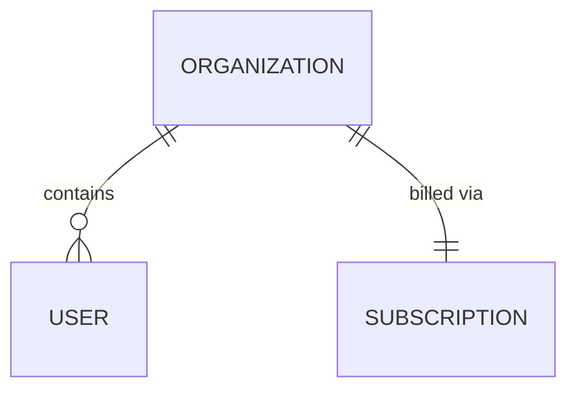

# Organization

> A customer account — the top-level tenant that users belong to and that holds a
> [Subscription](subscription.md). Owned by accounts-service (Java/Spring, MySQL).

## Business view

| Attribute | What it means | Rules / behavior |
|-----------|---------------|------------------|
| Name | Display name of the customer | Free text; shown across the app |
| Status | Whether the account is usable | Suspended accounts can't send |
| Seat limit | Max users the org may have | Raised/lowered via the billing plan |

## How it maps to storage

Straightforward — every attribute is a real column on `accounts.organizations`, with
DB-level enforcement. Included mainly so cross-service references from
[Subscription](subscription.md) and [Plan upgrade](../features/plan-upgrade.md)
resolve to a real page.

<!-- This model is simple enough that separate Defaults / Constraints sections would
     just be noise — folded into the Schema notes instead. Drop sections that don't
     earn their place. -->

---

*Engineer-facing reference.*

## Schema

*Primary store: `accounts.organizations` (MySQL).*

| Field | Type | Null | Backed by |
|-------|------|------|-----------|
| `id` | `bigint` | No | column (PK); referenced as `org_id` elsewhere |
| `name` | `varchar(255)` | No | column |
| `status` | `enum('active','suspended')` | No | column — **DB-enforced enum**, default `active` |
| `seat_limit` | `int` | No | column; kept in sync by billing-service on plan change |

## Relationships

| Related model | Via | Cardinality | Enforcement |
|---------------|-----|-------------|-------------|
| User | `org_id` (on user) | one org → many users | **DB FK** |
| [Subscription](subscription.md) | `org_id` (on subscription) | one org → one active sub | **cross-store (none)** |

## Notes & nuances

??? note "Authority boundary"
    accounts-service is the **only** writer. billing-service and others read org data
    over the API and must not cache it as truth for long.
