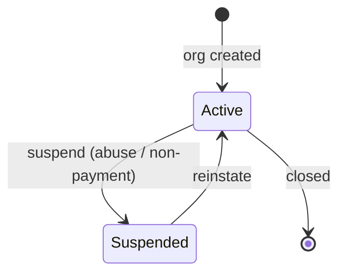
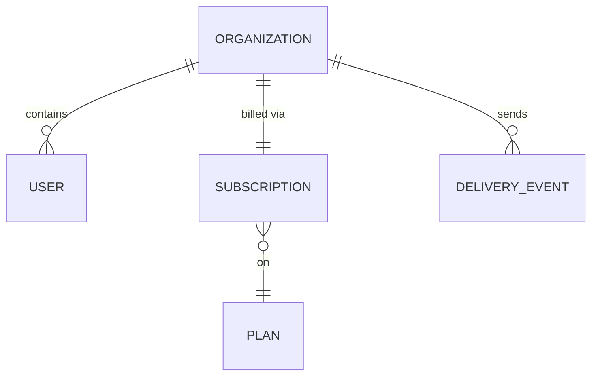

# Organization

> A customer account — the top-level [tenant](../glossary.md#tenant) that users
> belong to and that holds a [Subscription](subscription.md). Owned by
> [accounts-service](../services/accounts-service.md) (Java/Spring, MySQL), which is
> the single source of truth for who exists and whether they're allowed to send.

An organization is the unit a customer *is* in Beacon. When someone signs up, they
get an org; everyone they invite becomes a [user](../glossary.md#user) inside that
org; the org carries one [Subscription](subscription.md) that decides what they pay
for and are entitled to; and every message Beacon sends is sent *on behalf of* an
org. It's the spine the other two domains hang off — [billing](../services/billing-service.md)
attaches a subscription to an org, and [messaging](../services/messaging-service.md)
stamps every [delivery event](delivery-event.md) with the `org_id` it was sent for.

Despite sitting at the center of everything, the model itself is deliberately small.
accounts-service keeps the org record lean — name, status, seat limit — and lets the
other services own the richer state (what they pay, what they've sent) and merely
*reference* the org. That split is the most important thing to understand here, and
it's the reason the "Authority boundary" note matters as much as
the schema.

## Business view

*Plain language — safe for non-engineers. No table or column names here.*

| Attribute | What it means | Rules / behavior |
|-----------|---------------|------------------|
| Name | Display name of the customer | Free text; shown across the app and on invoices |
| Status | Whether the account is usable | An *active* account works normally; a *suspended* one can't send and most actions are blocked |
| Seat limit | The most users the org is allowed to have | Comes from the [plan](plan.md); raised on upgrade, lowered on downgrade |

A few product rules worth knowing before the table makes you think it's trivial:

- **Suspension is the big lever.** [Suspending](../glossary.md#suspended) an org is
  how Beacon stops a customer from sending without deleting anything — accounts,
  history, and the subscription all stay intact, and lifting the suspension restores
  normal service. It's used for things like abuse or non-payment escalation. See
  [Suspend an organization](../features/suspend-organization.md) for the full flow.
- **The seat limit isn't set here.** Admins don't edit it directly; it tracks the
  plan. When an admin runs a [Plan upgrade](../features/plan-upgrade.md), the new
  limit is what the plan allows, and billing-service pushes that number onto the org.
- **One org, one subscription, many users.** A subscription belongs to the whole org,
  not to any one person — so a single admin's plan change applies to everyone.

### Lifecycle

The org's *status* has only two states, and the transition is reversible — that's
the whole point of suspension as opposed to deletion:

Note what's *not* in that diagram: there's no `past_due` or `canceled` here. Those
are [Subscription](subscription.md) states, not org states. A customer can be
`past_due` on billing while their org is still `active` — billing handles
[dunning](../glossary.md#dunning) on the subscription, and only escalates to an org
*suspension* if recovery ultimately fails. Keeping the two lifecycles separate is
deliberate: the org answers "is this account allowed to operate?" and the
subscription answers "what have they paid for?".

## How it maps to storage

This one is refreshingly literal. Unlike [Subscription](subscription.md) — where
seats-in-use is view-derived and status lives in a state machine — every attribute
on Organization is a real, plainly-typed column on `accounts.organizations`, and the
rules that matter are enforced by the database itself rather than by application code.
That's unusual enough in this codebase to be worth saying out loud: if you read a
row, what you see is the truth, with no app-layer derivation sitting on top.

The one piece of "behavior" that isn't visible in the schema is *who writes it*.
`seat_limit` is a column on the accounts DB, but accounts-service is not the thing
that decides its value — billing-service is, and it writes the new number through the
accounts-service API whenever the plan changes. So the column is owned by accounts
but *driven* by billing. The "Synced, not authored" note covers
the consequences.

---

*Everything below is engineer-facing reference.*

## Schema

*Primary store: `accounts.organizations` (MySQL).*

| Field | Type | Null | Backed by |
|-------|------|------|-----------|
| `id` | `bigint` | No | column (PK); referenced as `org_id` everywhere else |
| `name` | `varchar(255)` | No | column |
| `status` | `enum('active','suspended')` | No | column — **DB-enforced enum**, default `active` |
| `seat_limit` | `int` | No | column; written by billing-service on plan change |

The PK deserves a callout: there is no `org_id` column *on this table* — the org's
own primary key is `id`. `org_id` is the name that same value goes by once it crosses
into another store: it's the foreign-ish key on [Subscription](subscription.md), the
tag on every [delivery event](delivery-event.md), and the parameter on
`GET /orgs/{id}`. None of those are real database foreign keys back to this table
(they're in different services and, for delivery events, a different database
entirely), which is exactly why the relationship enforcement below reads
"cross-store (none)".

## Defaults & derivations

| Field | DB default | App-level default / derivation |
|-------|------------|--------------------------------|
| `status` | `active` | none needed — the DB default does the work |
| `seat_limit` | none | set by billing-service to the plan's seat limit at create and on every plan change |

Compared to Subscription, there's almost nothing here, and that's the point: `status`
gets its default from the column definition, not from app code, so there's no way to
create an org in a weird half-initialized state. `seat_limit` has no DB default
because there's no sensible plan-independent value — it's always sourced from the
plan the org is on.

## Constraints & validation

| Rule | Enforced in | Detail |
|------|-------------|--------|
| `status` ∈ {active, suspended} | **DB** | real `enum` column — an invalid value is rejected at write time |
| `name` is present | **DB** | `NOT NULL` |
| `seat_limit` is present | **DB** | `NOT NULL` |
| `seat_limit` ≥ seats actually assigned | **none** | not checked here; the active-seat count lives in the seat-assignment data, and "are we over the limit" is computed by billing-service against the [Subscription](subscription.md) view, not enforced on this row |

The contrast with Subscription is the lesson. There, the high-value rows in this
table are the **app-only** and **none** ones — the DB will happily store a status it
shouldn't. Here, status is the one rule you *don't* have to worry about, because the
column enum enforces it. The single unenforced rule is the cross-store one: nothing
stops `seat_limit` from being set below the number of seats currently in use. In
practice billing-service avoids that because it only *raises* the limit on upgrade
and applies downgrades carefully at period end, but the org row itself offers no
guarantee — don't assume `seat_limit` is always ≥ assigned seats.

## Relationships

| Related model | Via | Cardinality | Enforcement |
|---------------|-----|-------------|-------------|
| User | `org_id` (on user) | one org → many users | **DB FK** |
| [Subscription](subscription.md) | `org_id` (on subscription) | one org → one active sub | **cross-store (none)** — different service / DB |
| [Plan](plan.md) | indirect — via the org's subscription | one org → one plan (at a time) | n/a — there's no direct link; the org reaches its plan *through* the subscription |
| [Delivery event](delivery-event.md) | `org_id` (on each event) | one org → many events | **cross-store (none)** — events live in MongoDB in messaging-service |

The split in enforcement tells the whole architecture story in one table. Users live
in the *same* database as the org, so that relationship is a real **DB foreign key** —
delete an org and the database itself has something to say about its users.
Everything else crosses a service boundary and is therefore **cross-store with no
enforcement**: the subscription is in billing's MySQL, delivery events are in
messaging's MongoDB, and the "link" is nothing more than an `org_id` value that
matches by convention. The database can't and won't stop those references from
dangling.

## Notes & nuances

??? note "Authority boundary"
    accounts-service is the **only** writer of org data. billing-service and others
    read it over the API (`GET /orgs/{id}`) and must **not** cache it as truth for
    long. The reason is correctness under change: an org's `status` can flip to
    `suspended` at any moment, and a stale cached "active" could let a suspended
    customer slip an action through. Read it fresh at decision time — for example,
    [Plan upgrade](../features/plan-upgrade.md) re-reads the org's status from
    accounts-service *before* applying the change, rather than trusting anything it
    saw earlier.

??? note "Synced, not authored — `seat_limit`"
    `seat_limit` is a column accounts-service *stores* but does not *decide*. The
    authority on the right value is the [plan](plan.md), and billing-service writes
    the number onto the org (through the accounts-service API) whenever the plan
    changes. So if you ever see `seat_limit` disagree with the plan the org is on,
    suspect a missed or failed sync from billing-service, not a bug in accounts —
    accounts is faithfully holding whatever it was last told.

??? note "Soft references can dangle"
    Because [Subscription](subscription.md) and [delivery events](delivery-event.md)
    reference the org only by a cross-store `org_id` with no foreign key, a deleted
    org can briefly leave orphaned subscriptions or events until cleanup runs. Reads
    on the other side should tolerate a missing org rather than assume every `org_id`
    resolves. (The same caution appears on the Subscription page, from its side of
    the boundary.)

??? info "Future / cleanup"
    Two things would make this page sturdier: a real `User` model page to make the
    DB-FK relationship resolve to its own reference (accounts-service is still a
    [stub](../services/accounts-service.md)), and confirmation of whether anything
    *reads* `seat_limit` off the org directly versus going through the subscription —
    if nothing does, the column is pure denormalized convenience and could be noted as
    such.

## Sources & confidence

Derived from `Organization.java` in beacon-accounts and the `accounts.organizations`
schema. Confidence is a solid 85 — the model is small and DB-enforced, so there's
little hidden app behavior to get wrong — held below 90 mainly because
accounts-service itself is still a stub: the `User` model, the suspend endpoint's
exact contract, and the precise mechanism by which billing-service writes
`seat_limit` are documented from the consuming side, not yet verified against the
accounts source directly.
