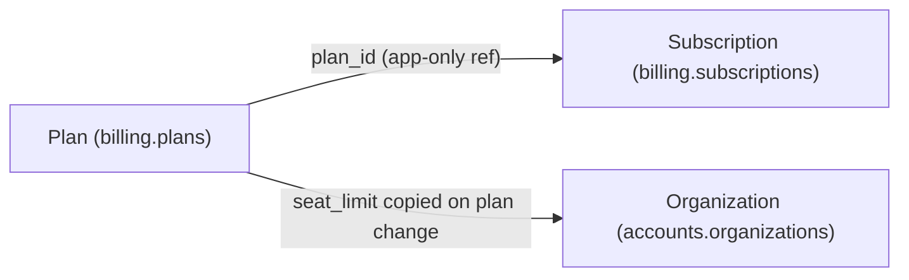
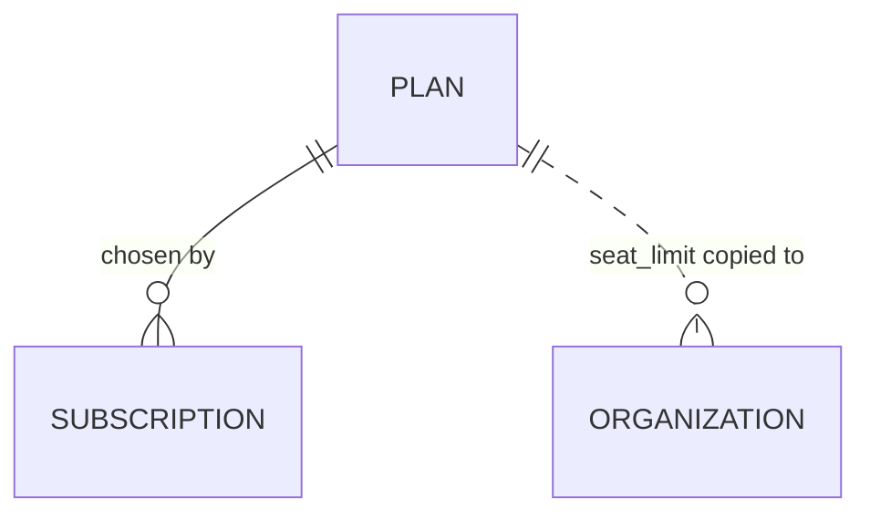

# Plan

> The package an organization pays for — its **price**, **billing interval**, **seat
> limit**, and **feature set**. A [Subscription](subscription.md) references exactly
> one plan via `plan_id`, and that plan's seat limit is what flows over to the org's
> `seat_limit` when the plan changes. Owned by
> [billing-service](../services/billing-service.md) (Ruby/Rails on MySQL).

!!! note "Still a stub"
    This page documents the **known shape** of a plan — what it is, the fields we're
    confident exist, and how it connects to the rest of billing — but it has **not**
    been verified field-by-field against the `billing.plans` schema. The
    [Schema](#schema) section is marked *unverified* and confidence is held low (20)
    until someone reads `db/schema.rb` and the `Plan` model directly. To deepen, see
    Sources & confidence. The `DOC-DEEPEN` backlog entry
    tracks this.

A plan is the *menu item* a customer chooses. Everything an org is entitled to —
how many people can use Beacon, which features are on, what they're charged and how
often — is decided by the plan its [Subscription](subscription.md) points at. The
plan itself is **static catalog data**: it describes the offer. The Subscription is
where the *running state* lives (which plan this org is on right now, whether they're
paying, when they renew). Keeping those two apart is the whole reason there are two
models: a Plan is shared by many orgs and rarely changes; a Subscription is per-org
and changes constantly.

## Business view

*Plain language — safe for non-engineers. No table or column names here.*

| Attribute | What it means | Rules / behavior |
|-----------|---------------|------------------|
| Name | What the plan is called | Shown on pricing and in the app (e.g. "Starter", "Growth") |
| Price | What the org pays per period | Charged each billing interval; mid-cycle changes are billed [prorated](../glossary.md#proration) |
| Billing interval | How often they're charged | Monthly or annual; sets the length of a billing period |
| Seat limit | Most users the plan allows | Becomes the org's seat limit when the plan is chosen or changed |
| Feature set | What's turned on | Gates which capabilities the org can use |

The everyday way to think about it: **an org picks a plan, and the plan's numbers
become the org's limits.** Move to a bigger plan and the seat limit goes up (and the
org is charged the prorated difference straight away); the plan's feature set decides
what's switched on. None of this state lives on the plan per org — the plan is the
template, the [Subscription](subscription.md) is the instance.

??? info "Where each number ends up living"
    The plan is the *source* of these values, but at runtime they're read through the
    subscription, and the seat limit is **copied** onto the organization:

    - **Price / interval** → drive invoicing on the [Subscription](subscription.md)
      (`current_period_end` is set to `now + plan.interval` at activation).
    - **Seat limit** → copied to [Organization](organization.md).`seat_limit` by
      billing-service whenever the plan changes (see below).
    - **Feature set** → read to decide what the org may do.

## How it maps to storage

A plan lives in MySQL alongside the rest of billing (`billing.plans`, same database
as `billing.subscriptions`). Unlike [Subscription](subscription.md) — whose most
interesting fields are view-derived or app-governed — a plan is expected to be
**plain catalog rows**: each column is a real stored value, set when the plan is
defined and seldom touched after. There's no view backing and no per-org state to
compute, because a plan is shared across every org that's on it.

Two connections are worth understanding before the field tables, because they're the
reason a plan matters to the rest of the system:

- **`plan_id` is an app-only reference, not a foreign key.** A
  [Subscription](subscription.md) points at a plan via `plan_id`. Both tables live in
  the same MySQL database, but **no foreign key is declared** — the relationship is
  enforced (or not) in application code. The DB will happily store a subscription
  whose `plan_id` matches no plan.
- **Seat limit flows out to the org on plan change.** A plan's seat limit isn't read
  live by accounts-service. Instead, when an org changes plan, billing-service
  **writes** the new limit onto [Organization](organization.md).`seat_limit` (a
  DB-enforced column over in accounts). So the plan is the source of truth for the
  *offer*, but the org carries its own *copy* of the current limit. If a plan's seat
  limit is edited later, existing orgs don't automatically pick up the change — only
  a plan change re-syncs it.

---

*Everything below is engineer-facing reference.*

## Schema

*Primary store: `billing.plans` (MySQL).*

!!! warning "Unverified — stub"
    The fields below are inferred from how a plan is **used** (the canon shape: price,
    billing interval, seat limit, feature set) and from the `plan_id` reference on
    [Subscription](subscription.md). They have **not** been confirmed against
    `db/schema.rb` or the `Plan` model. Types, nullability, and exact column names are
    placeholders — verify before relying on them.

| Field | Type | Null | Backed by |
|-------|------|------|-----------|
| `id` | `bigint` | No | column (PK) — referenced as `plan_id` on subscriptions |
| `name` | `varchar` *(unverified)* | No *(unverified)* | column |
| `price_cents` | `int` *(unverified)* | ? | column — *exact money representation unverified* |
| `interval` | `varchar` / `enum` *(unverified)* | ? | column — e.g. `month` / `year` |
| `seat_limit` | `int` *(unverified)* | ? | column — copied to org on plan change |
| feature set | ? *(unverified)* | ? | shape unknown — could be columns, a flags blob, or a join table |

??? question "Open: how is the feature set actually stored?"
    Canon says a plan has a *feature set*, but **how** it's stored isn't established.
    Plausible shapes to check for when deepening: a set of boolean columns, a JSON
    flags blob, a `plan_features` join table, or a named feature *tier* string. Until
    confirmed, treat "feature set" as a concept, not a column.

## Defaults & derivations

*Unverified — no defaults have been confirmed against the schema or model. Catalog
rows are typically authored explicitly (each field set when the plan is defined)
rather than relying on DB defaults, but confirm this when deepening.*

| Field | DB default | App-level default / derivation |
|-------|------------|--------------------------------|
| `interval` | *unverified* | *unverified — likely set explicitly per plan* |
| `seat_limit` | *unverified* | *unverified* |

## Constraints & validation

*Unverified — listed as expectations to confirm, not established facts. Given the
billing pattern elsewhere (see [Subscription](subscription.md), where status is
app-governed with no DB check), assume validation lives in the Rails model unless the
schema proves otherwise.*

| Rule | Enforced in | Detail |
|------|-------------|--------|
| `plan_id` on a subscription references a real plan | **app-only** *(expected)* | same DB, but no FK declared — confirm |
| `price` / `seat_limit` non-negative | *unverified* | check the `Plan` model validations |
| `interval` ∈ a known set | *unverified* | check whether it's an enum or free string |

## Relationships

| Related model | Via | Cardinality | Enforcement |
|---------------|-----|-------------|-------------|
| [Subscription](subscription.md) | `plan_id` (on subscription) | one plan → many subscriptions | **app-only** (same DB, no FK declared) |
| [Organization](organization.md) | `seat_limit` copied on plan change | one plan → many orgs (indirect) | **none** — value copied, not referenced |

## Notes & nuances

The point to carry away: a plan is **shared, static catalog data**, while everything
per-org and changing lives on the [Subscription](subscription.md). When you find a
number that an org is "on" — its seat limit, its price — trace it back here for the
*offer*, but read the runtime value from the subscription (or, for the seat limit,
the org's own copied column).

??? note "Plan vs. legacy `tier`"
    [Subscription](subscription.md) carries a legacy `tier` column (`bronze` /
    `silver` / `gold`) that predates `plan_id`. `tier` is **not** a Plan — it's an
    old, coarser grouping kept only for subscriptions created before 2023-04. New code
    keys off `plan_id`; the eventual cleanup is to backfill `plan_id` from `tier` and
    drop `tier`. Don't confuse the two.

??? info "Future / cleanup"
    The deepen pass should: (1) read `billing.plans` from `db/schema.rb` and the
    `Plan` model to confirm every field, type, and validation; (2) establish how the
    feature set is stored; (3) confirm the `plan_id` relationship really has no FK;
    and (4) trace the seat-limit sync to [Organization](organization.md) in code to
    verify it's a copy-on-change, not a live read.

!!! danger "Suspected dead"
    [Subscription](subscription.md) carries a `promo_ref` column that no current code
    path appears to write — likely a remnant of an old promotions feature that may
    once have tied into plans/pricing. Flagged on the Subscription page; noted here in
    case the promotions concept resurfaces while deepening plan pricing. Confirm
    before assuming any plan-side promo logic exists.

## Sources & confidence

This page is derived from **canon and usage**, not yet from the plan's own schema:
the role of a plan (price, interval, seat limit, feature set) and the `plan_id`
reference on [Subscription](subscription.md), plus the seat-limit sync to
[Organization](organization.md) described in billing-service's behavior. Confidence
is intentionally low (**20**) because no field-level detail has been verified against
`billing.plans` in `beacon-billing` — the [Schema](#schema), defaults, and
constraints sections are explicitly marked unverified. To promote this page out of
stub: read `db/schema.rb` and the `Plan` model on `main`, confirm the field tables,
resolve the feature-set question, stamp `sources:` with the verified sha, and raise
the confidence and `status` accordingly.
