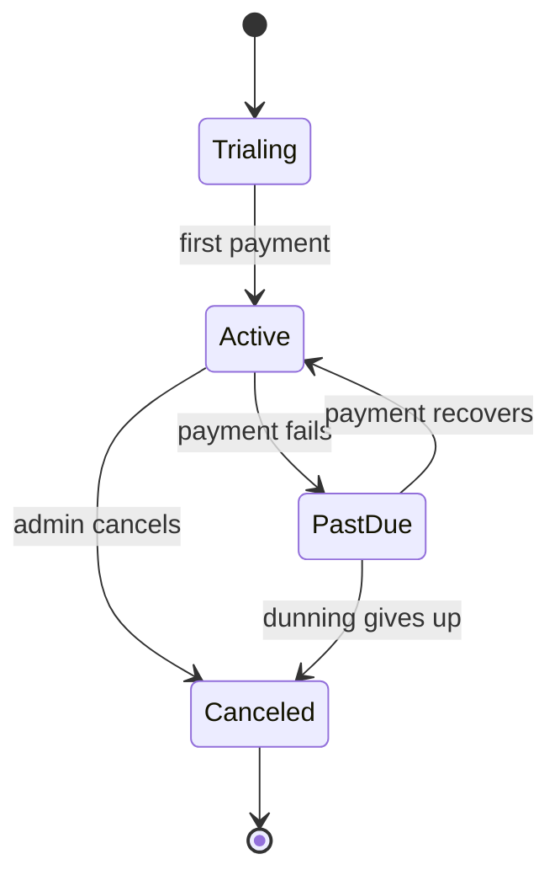
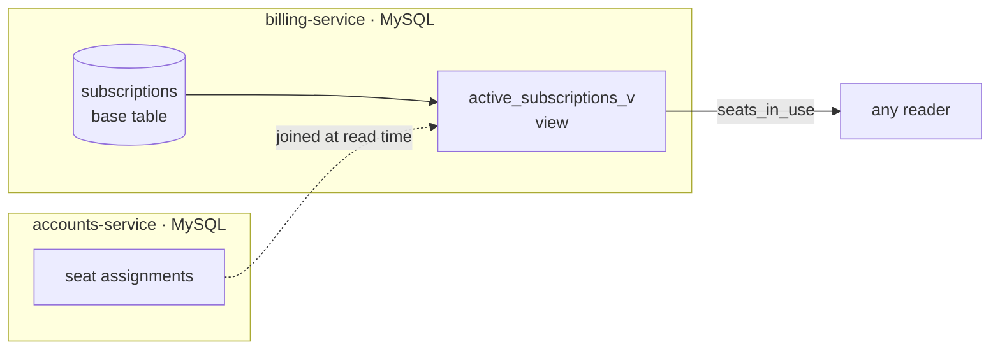
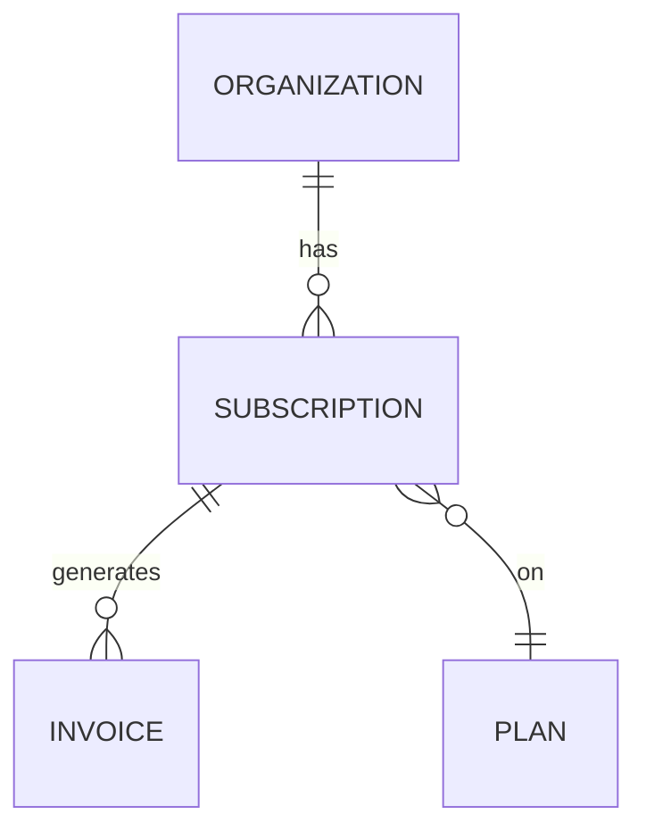

# Subscription

> What an organization is currently paying for: a plan, a billing cycle, and a
> lifecycle status. Owned by [billing-service](../services/billing-service.md); read
> by several others as the authority on what a customer is entitled to.

A subscription is the contract between an [organization](organization.md) and Beacon.
It answers three questions at once: *which [plan](plan.md)* the org is on (and so what
it can do and how much it costs), *how many [seats](../glossary.md#seat)* it has paid
for, and *whether it's in good standing* right now. Almost every entitlement decision
elsewhere in the product traces back to a subscription — whether an org can send,
whether it's near its seat limit, what it gets invoiced.

Because it's the authority on entitlement, this model is *read* far more widely than
it's written. Only [billing-service](../services/billing-service.md) writes it; other
services read it (or read facts derived from it) and must treat it as the source of
truth rather than keeping their own copy. That ownership boundary is the single most
important thing to keep in mind when you work with this data — see
[How it maps to storage](#how-it-maps-to-storage) for where the seams are.

This page runs business → technical. The first two sections are enough if you only
need the product behaviour; keep scrolling for the schema, the app-only rules, and the
gotchas worth knowing before you touch this data.

## Business view

*Plain language — safe for non-engineers.*

| Attribute | What it means | Rules / behavior |
|-----------|---------------|------------------|
| Plan | The package the org pays for | Upgrades take effect immediately; downgrades at period end |
| Status | Whether the subscription is live | Trial → active once paid; lapses to *past due* on failed payment |
| Seats | How many people they've paid for | Set at purchase; changes are billed prorated |
| Seats in use | How many are actually assigned | Used to warn admins when they're near the limit |
| Renewal date | When they'll next be charged | Drives invoicing and reminder messages |

A subscription starts life as a **trial**, becomes **active** on the first successful
payment, and from there stays active as long as payments keep clearing. A failed
payment doesn't cancel anything outright — it moves the subscription to **past due**
and starts [dunning](../glossary.md#dunning), Beacon's automated grace period that
keeps retrying and notifying. Dunning has two ways out: payment recovers and the
subscription returns to active, or dunning gives up and the subscription is canceled.
An admin can also cancel directly from an active subscription.

Lifecycle, in business terms:



A few product rules are worth pulling out, because they trip people up:

- **Upgrades and downgrades are not symmetric.** An upgrade (to a pricier plan)
  applies *immediately* with a [prorated](../glossary.md#proration) charge for the rest
  of the cycle. A downgrade applies at *period end*, so the customer keeps what they
  paid for through the current cycle. The full path is documented on
  [Plan upgrade](../features/plan-upgrade.md).
- **"Seats" and "seats in use" are different numbers.** Seats is what the org *paid
  for*; seats in use is what's *actually assigned* to people. The gap between them is
  what drives "you're almost out of seats" warnings — and the rule that you can't
  assign more people than you've paid for.
- **A subscription belongs to the whole org, not a person.** There's one active
  subscription per [organization](organization.md); any admin's change applies to
  everyone.

## How it maps to storage

Most attributes are plain columns on `billing.subscriptions`
([MySQL](../datastores/mysql.md)), but two are not — which is the reason to read this
page rather than the schema:

- **Seats in use is view-derived.** It comes from `active_subscriptions_v`, which
  joins seat assignments owned by accounts-service. It is not a stored column, so
  querying the base table alone won't show it. This is also why it's always *current*:
  it reflects accounts truth at read time rather than a number billing-service has to
  keep in sync.
- **Status is governed by application code.** The column is a free-form string; the
  legal values and transitions live in `Billing::Subscription::StateMachine`. The
  database will store an invalid status without complaint.

The second point is the one that surprises people, so it's worth dwelling on: the
`status` column is just a `varchar`. The database has *no* idea that
`trialing → canceled → active` is illegal, or that `frobnicate` isn't a real status.
Everything that makes status trustworthy lives in Ruby. If a row is ever written
outside the state machine — a manual `UPDATE`, a bad migration, a future service that
doesn't go through the model — nothing at the storage layer will stop it. Treat the
state machine, not the schema, as the contract.

The same "enforced in app, not in the DB" pattern shows up again in
Constraints & validation below: one-active-subscription-per-org
and `seats ≥ seats_in_use` are both app rules with no database backstop. Surfacing
exactly where each rule lives is the highest-value thing this page does.



---

*Everything below is engineer-facing reference.*

## Schema

*Primary store: `billing.subscriptions` ([MySQL](../datastores/mysql.md)).*

| Field | Type | Null | Backed by |
|-------|------|------|-----------|
| `id` | `bigint` | No | column (PK) |
| `org_id` | `bigint` | No | column |
| `plan_id` | `bigint` | No | column |
| `status` | `varchar(32)` | No | column (values governed in app) |
| `seats` | `int` | No | column |
| `seats_in_use` | `int` | — | **view** `active_subscriptions_v` (computed) |
| `current_period_end` | `datetime` | No | column |
| `tier` | `varchar(16)` | Yes | column (legacy — see historical) |
| `promo_ref` | `varchar(64)` | Yes | column (see suspected dead) |

A typical active row, read through the view, looks like this:

```json
{
  "id": 4821,
  "org_id": 173,
  "plan_id": 7,
  "status": "active",
  "seats": 25,
  "seats_in_use": 19,
  "current_period_end": "2026-07-01T00:00:00Z",
  "tier": null,
  "promo_ref": null
}
```

Note `seats_in_use` (19) is not stored on the base row — it's computed by the view at
read time. Read the base table directly and you simply won't see that field. `tier`
and `promo_ref` are `null` on any subscription created by current code; they only
carry values on old rows (see the notes at the bottom).

## Defaults & derivations

| Field | DB default | App-level default / derivation |
|-------|------------|--------------------------------|
| `status` | none | `trialing` on create (`Subscription.new`) |
| `seats` | `1` | overridden by the purchase flow |
| `seats_in_use` | — | computed in the view from accounts seat assignments |
| `current_period_end` | none | set to `now + plan.interval` at activation |

`current_period_end` is worth a word: it's not set at *create* time but at
*activation* — when the trial converts to active on first payment — using the chosen
[plan's](plan.md) billing interval. It's the field that drives renewal invoicing and
the reminder messages that go out before a charge, so a wrong value here ripples into
both billing and [messaging](../services/messaging-service.md).

## Constraints & validation

| Rule | Enforced in | Detail |
|------|-------------|--------|
| `status` ∈ {trialing, active, past_due, canceled} | **app** | `StateMachine`; no DB check constraint |
| Legal status transitions | **app** | e.g. can't go `canceled → active` |
| One active subscription per org | **app** | enforced in service, not a DB unique index |
| `seats` ≥ `seats_in_use` | **app** | checked on seat assignment, not in DB |
| `org_id` references a real org | **none** | cross-store; not validated at write time |

Read this table as a map of where things can go wrong. Every rule marked **app** is
one the database will happily let you violate with a direct write; the only true
storage-level guarantees on this model are the primary key and the foreign key to
invoices. In particular:

- **One active subscription per org** is a service invariant, not a unique index. The
  schema would let two `active` rows share an `org_id`. Don't rely on the DB to keep
  this true — go through billing-service.
- **`seats ≥ seats_in_use`** is checked by accounts-service at *seat assignment* time,
  not when the subscription is written. Lowering `seats` below the number of people
  already assigned is therefore a downgrade-time concern, handled in the assignment
  path rather than enforced here.
- **`org_id` is validated nowhere at write time** — it crosses a service boundary. See
  the soft-reference note below for what that means in practice.

## Relationships

| Related model | Via | Cardinality | Enforcement |
|---------------|-----|-------------|-------------|
| [Organization](organization.md) | `org_id` | many subs → one org | **cross-store (none)** — different service/DB |
| [Plan](plan.md) | `plan_id` | many subs → one plan | **app-only** (same DB, no FK declared) |
| Invoice | `subscription_id` (on invoice) | one sub → many invoices | **DB FK** |



Three relationships, three *different* levels of enforcement — a useful illustration
of Beacon's data boundaries:

- **Organization (`org_id`) is cross-store.** The org lives in a different service and
  a different database ([accounts-service](../services/accounts-service.md)), so there's no foreign key
  and nothing stops a subscription from pointing at an org that no longer exists. Reads
  must tolerate a missing org (see the dangling-reference note).
- **Plan (`plan_id`) is app-only.** Plans live in the *same* MySQL database as
  subscriptions, but no foreign key is declared — the relationship is maintained by
  application code. The integrity is real in practice, but the database isn't the thing
  guaranteeing it.
- **Invoice is a real DB foreign key.** This is the one relationship the database
  itself enforces: invoices carry `subscription_id` and the FK guarantees they point at
  a real subscription. A subscription accumulates many invoices over its life — one per
  billing period, plus prorated adjustments from mid-cycle plan changes.

## Notes & nuances

??? note "Soft references can dangle"
    Because `org_id` crosses a service boundary, a deleted org can briefly leave an
    orphaned subscription until the cleanup job runs. Reads should tolerate a missing
    org.

??? note "Reading state safely: status vs. the view"
    Two practical habits when you read this model. First, if you care about
    `seats_in_use`, read through `active_subscriptions_v`, not the base table —
    otherwise the field isn't there at all. Second, never infer status from anything
    other than the `status` column as set by the state machine; don't, for example,
    treat "has a future `current_period_end`" as a proxy for "active." Past-due
    subscriptions still have a period end.

??? note "Deprecated / historical"
    `tier` (`bronze`/`silver`/`gold`) predates `plan_id` and is retained only for
    subscriptions created before 2023-04. New code ignores it; reporting still reads
    it for old rows. On any modern subscription it's `null`, which is the tell that the
    [Plan](plan.md) relationship (`plan_id`) is now the single source of "what package
    is this."

??? info "Future / cleanup"
    Backfill `plan_id` for pre-2023 rows from `tier`, then drop `tier`. Once `status`
    values are known-clean, add a real DB check constraint to promote that rule from
    app-only to DB-enforced. (The same "promote an app rule to the DB once the data is
    clean" idea applies to the one-active-subscription-per-org invariant, which could
    become a partial unique index.)

!!! danger "Suspected dead"
    `promo_ref` is never written by any current code path we can find — likely a
    remnant of an old promotions feature. Confirm before removing.

## Where this fits

- **Service:** owned and written by [billing-service](../services/billing-service.md);
  exposed over its OpenAPI contract (`GET /subscriptions/{id}`,
  `POST /subscriptions/{id}/upgrade`).
- **Feature:** the [Plan upgrade](../features/plan-upgrade.md) flow is the main path
  that mutates a subscription — read it for the read-validate-update-emit sequence and
  the proration timing.
- **Related models:** an [Organization](organization.md) has exactly one active
  subscription; each subscription is on exactly one [Plan](plan.md). When billing
  changes the plan, it also syncs the org's `seat_limit` over in accounts-service.
- **Downstream:** an upgrade emits `subscription.upgraded`, which
  [messaging-service](../services/messaging-service.md) turns into a confirmation
  message and a [delivery event](delivery-event.md).

## Sources & confidence

Derived from the Rails models in billing-service, the `active_subscriptions_v`
definition, and observed rows. Confidence held below 90 because the pre-2023 `tier`
path and `promo_ref` are not fully traced.
