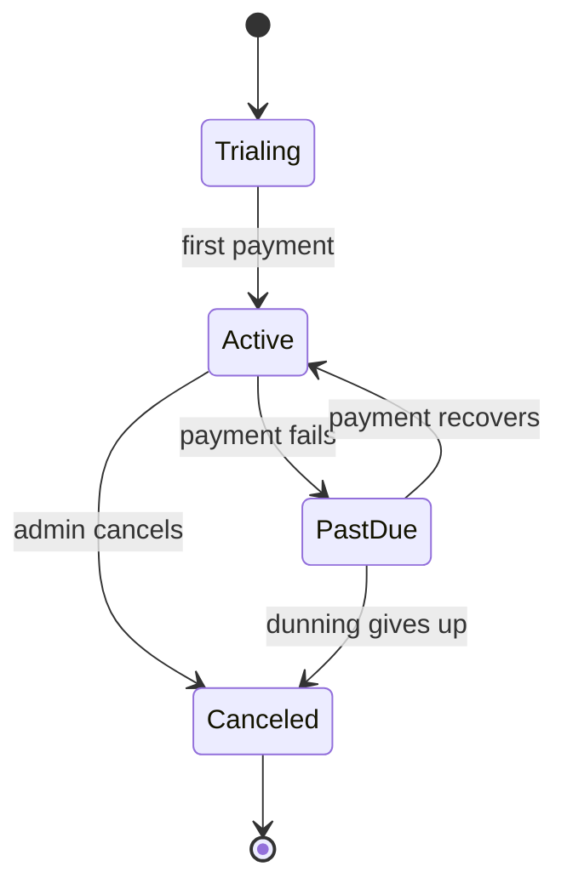
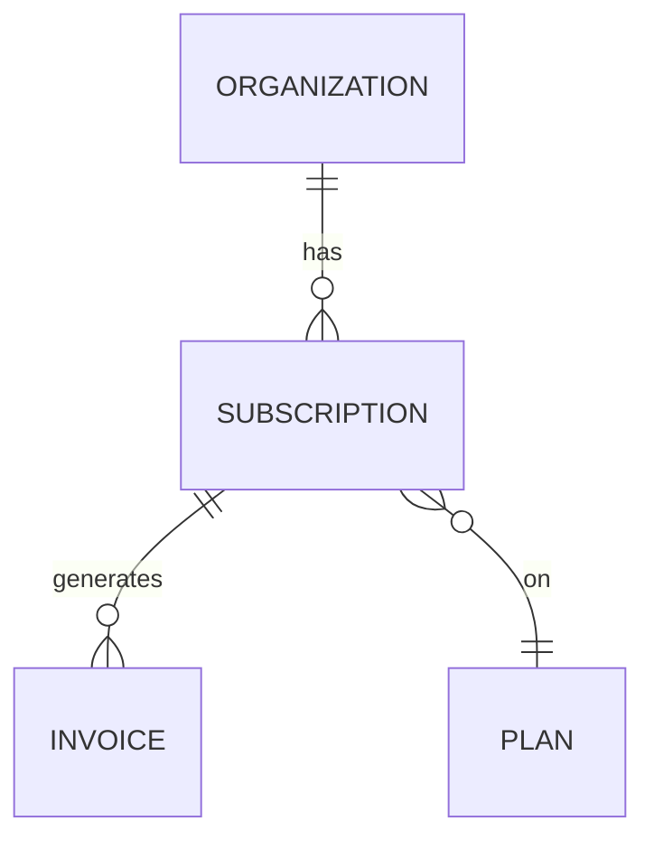

# Subscription

> What an organization is currently paying for: a plan, a billing cycle, and a
> lifecycle status. Owned by [billing-service](../services/billing-service.md); read
> by several others as the authority on what a customer is entitled to.

## Business view

*Plain language — safe for non-engineers.*

| Attribute | What it means | Rules / behavior |
|-----------|---------------|------------------|
| Plan | The package the org pays for | Upgrades take effect immediately; downgrades at period end |
| Status | Whether the subscription is live | Trial → active once paid; lapses to *past due* on failed payment |
| Seats | How many people they've paid for | Set at purchase; changes are billed prorated |
| Seats in use | How many are actually assigned | Used to warn admins when they're near the limit |
| Renewal date | When they'll next be charged | Drives invoicing and reminder messages |

Lifecycle, in business terms:

## How it maps to storage

Most attributes are plain columns on `billing.subscriptions`, but two are not —
which is the reason to read this page rather than the schema:

- **Seats in use is view-derived.** It comes from `active_subscriptions_v`, which
  joins seat assignments owned by accounts-service. It is not a stored column, so
  querying the base table alone won't show it.
- **Status is governed by application code.** The column is a free-form string; the
  legal values and transitions live in `Billing::Subscription::StateMachine`. The
  database will store an invalid status without complaint.

---

*Everything below is engineer-facing reference.*

## Schema

*Primary store: `billing.subscriptions` (MySQL).*

| Field | Type | Null | Backed by |
|-------|------|------|-----------|
| `id` | `bigint` | No | column (PK) |
| `org_id` | `bigint` | No | column |
| `plan_id` | `bigint` | No | column |
| `status` | `varchar(32)` | No | column (values governed in app) |
| `seats` | `int` | No | column |
| `seats_in_use` | `int` | — | **view** `active_subscriptions_v` (computed) |
| `current_period_end` | `datetime` | No | column |
| `tier` | `varchar(16)` | Yes | column (legacy — see historical) |
| `promo_ref` | `varchar(64)` | Yes | column (see suspected dead) |

## Defaults & derivations

| Field | DB default | App-level default / derivation |
|-------|------------|--------------------------------|
| `status` | none | `trialing` on create (`Subscription.new`) |
| `seats` | `1` | overridden by the purchase flow |
| `seats_in_use` | — | computed in the view from accounts seat assignments |
| `current_period_end` | none | set to `now + plan.interval` at activation |

## Constraints & validation

| Rule | Enforced in | Detail |
|------|-------------|--------|
| `status` ∈ {trialing, active, past_due, canceled} | **app** | `StateMachine`; no DB check constraint |
| Legal status transitions | **app** | e.g. can't go `canceled → active` |
| One active subscription per org | **app** | enforced in service, not a DB unique index |
| `seats` ≥ `seats_in_use` | **app** | checked on seat assignment, not in DB |
| `org_id` references a real org | **none** | cross-store; not validated at write time |

## Relationships

| Related model | Via | Cardinality | Enforcement |
|---------------|-----|-------------|-------------|
| [Organization](organization.md) | `org_id` | many subs → one org | **cross-store (none)** — different service/DB |
| Plan | `plan_id` | many subs → one plan | **app-only** (same DB, no FK declared) |
| Invoice | `subscription_id` (on invoice) | one sub → many invoices | **DB FK** |

## Notes & nuances

??? note "Soft references can dangle"
    Because `org_id` crosses a service boundary, a deleted org can briefly leave an
    orphaned subscription until the cleanup job runs. Reads should tolerate a missing
    org.

??? note "Deprecated / historical"
    `tier` (`bronze`/`silver`/`gold`) predates `plan_id` and is retained only for
    subscriptions created before 2023-04. New code ignores it; reporting still reads
    it for old rows.

??? info "Future / cleanup"
    Backfill `plan_id` for pre-2023 rows from `tier`, then drop `tier`. Once `status`
    values are known-clean, add a real DB check constraint to promote that rule from
    app-only to DB-enforced.

!!! danger "Suspected dead"
    `promo_ref` is never written by any current code path we can find — likely a
    remnant of an old promotions feature. Confirm before removing.

## Sources & confidence

Derived from the Rails models in billing-service, the `active_subscriptions_v`
definition, and observed rows. Confidence held below 90 because the pre-2023 `tier`
path and `promo_ref` are not fully traced.
