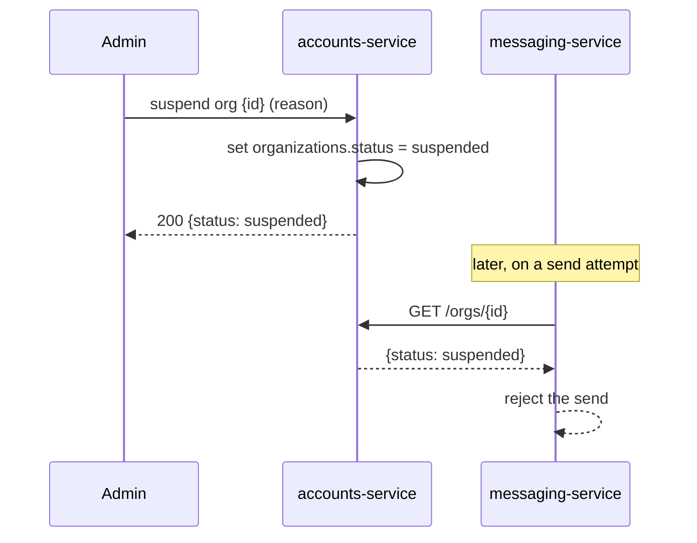
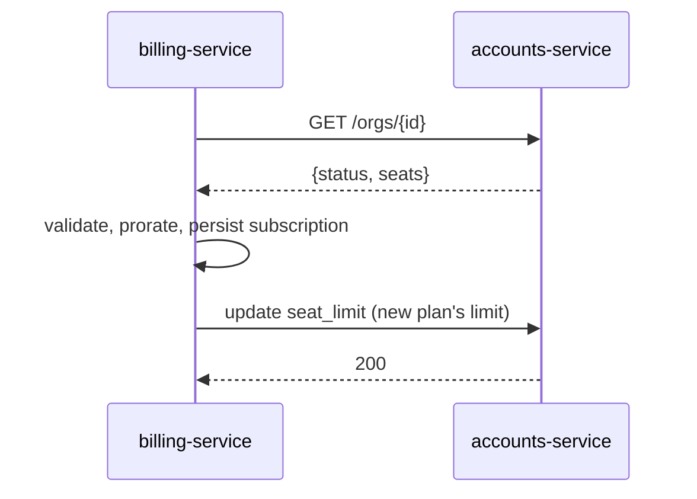

# accounts-service

> **Stub.** Owns organizations and users — the tenant and identity layer. Billing and
> messaging read it as the authority on who exists, org status, and seat counts.
> Java/Spring on MySQL.

!!! note "This page is still a stub"
    Most of what follows is the *known shape* of the service — what it owns, the two
    endpoints other services actually call, and the boundary rules everyone relies on —
    rather than a verified walk of the source. The HTTP surface, the `User` model, and
    the exact request/response shapes still need confirming against `beacon-accounts`,
    and that's why this page's confidence sits at 20. See the `DOC-DEEPEN` entry in the
    backlog. Where something is inferred rather than read from code, it's called out
    inline.

## Why this service exists

Every other domain in Beacon needs to know two things before it can do its job: **which
organization is this, and is it allowed to operate?** billing-service needs the org to
attach a subscription to and a seat count to price against; messaging-service needs to
know an org isn't [suspended](../glossary.md#suspended) before it sends. accounts-service
is the single place those questions get answered.

It's the **tenant and identity layer** — the bottom of the stack that the
[business map](../index.md) draws everything else on top of. Two ideas live here and
nowhere else:

- **Organizations** — the customer accounts that are Beacon's unit of tenancy. An org
  is what subscribes, what gets billed, and what sends messages. See the
  [Organization](../models/organization.md) model.
- **Users** — the people inside an organization. Each user belongs to exactly one org;
  an org has many users. (No model page exists for `User` yet — see *Data it owns*.)

The defining rule of the whole service is **authority**: accounts-service is the *only*
writer of org and user data. Everyone else reads it over the API and treats those reads
as a fresh fact, not a cached truth. That single constraint shapes most of the design
below, and it's why suspension, seat limits, and org status behave the way they do.

## Responsibilities & boundaries

- **Owns:** [organizations](../models/organization.md) and the users inside them —
  their identity, status, and seat limits. accounts-service is the **sole writer** of
  this data.
- **Provides the authoritative read** of org status and seat counts to the rest of the
  product, over HTTP.
- **Does not own:** anything billing- or messaging-related. It doesn't know what a plan
  costs, what an org is paying for, or whether a message was delivered. It stores a
  `seat_limit` *number*, but it doesn't decide that number — billing-service does, and
  writes it in (see below).
- **Does not** make plan, pricing, or proration decisions (that's
  [billing-service](billing-service.md)), and **does not** send or schedule anything
  (that's [messaging-service](messaging-service.md)).

??? note "The one wrinkle: seat_limit is written from outside"
    `accounts.organizations.seat_limit` lives in accounts-service's schema, but
    **billing-service writes it** — over the accounts API — whenever an org's plan
    changes, because the plan is what decides how many seats an org gets. So the column
    is owned here but *driven* by billing. accounts-service still mediates the write
    (nobody reaches into its schema directly); it's just acting on billing's instruction.
    This is the one place the "sole writer" framing needs an asterisk, and it's enforced
    by the API boundary, not by a foreign key. See
    [MySQL → One engine, two worlds](../datastores/mysql.md#one-engine-two-worlds).

## Interface (contracts)

accounts-service exposes a small HTTP surface. Two endpoints are confirmed by their
callers; the broader CRUD surface for managing orgs and users is assumed to exist but
hasn't been traced.

| Endpoint | Purpose | Confirmed by |
|----------|---------|--------------|
| `GET /orgs/{id}` | Return an org's `status` and seat count. The workhorse read. | Called by [billing-service](billing-service.md) (seat counts on plan change) and [messaging-service](messaging-service.md) (status check before each send) |
| suspend endpoint (shape TBC) | Flip an org's `status` to `suspended` (and back). | Used by [Suspend an organization](../features/suspend-organization.md) |

- **Provides (HTTP):** `GET /orgs/{id}`; a suspend/unsuspend endpoint.
- **Consumes:** nothing from other services. accounts-service sits at the bottom of the
  dependency graph — it reads from MySQL and answers questions, but it doesn't call
  billing or messaging. (That one-directional shape is what lets everyone safely treat
  it as the root of truth.)

!!! info "No formal contract yet"
    Unlike [billing-service](billing-service.md) (OpenAPI, authored in TypeSpec) and
    [messaging-service](messaging-service.md) (AsyncAPI), accounts-service has **no
    contract in `contracts/`** yet. Authoring one — start from `templates/contract/`,
    see `example/contracts/README.md` — is a key step to deepening this page, because
    two services already depend on `GET /orgs/{id}` without a validatable spec to hold
    it stable. The suspend endpoint's exact path, body, and response are the first
    things to pin down; the [Suspend feature](../features/suspend-organization.md) draws
    it as `POST /orgs/{id}/suspend {reason}`, but that's the feature page's sketch, not
    a verified contract.

### `GET /orgs/{id}` — the contract everyone leans on

This one endpoint carries most of accounts-service's value, so it's worth being precise
about what it returns and why each consumer wants it:

- **`status`** — `active` or `suspended` (the DB-enforced enum on
  [Organization](../models/organization.md)). messaging-service reads this *before every
  send* and refuses the send when it's `suspended`. That check-on-read is the entire
  enforcement mechanism behind [suspension](../features/suspend-organization.md) —
  there's no event, no cached flag, just a fresh read at the last moment.
- **seat count** — how many seats the org has and (where relevant) how many are in use.
  billing-service reads this when a plan changes so it can reconcile against
  `seat_limit`. Note the [Seat](../glossary.md#seat) vocabulary: a *seat* is one paid
  user slot, and "seats in use" is how many are actually assigned — the distinction that
  billing prices against.

Consumers must read this **fresh** rather than caching it as long-term truth; that rule
is the authority boundary in action, and it's what makes suspension take effect
immediately across the product.

## Data it owns

- [Organization](../models/organization.md) — the tenant root: `name`, `status`
  (DB-enforced enum `active`/`suspended`, default `active`), and `seat_limit`. Backed by
  `accounts.organizations` in [MySQL](../datastores/mysql.md). This is the model to read
  first.
- **User** — the people inside an org. One org → many users, enforced by a real **DB
  foreign key** (`users.org_id → organizations.id`) within the `accounts` schema. There
  is **no model page for `User` yet** — `accounts.users` is listed on the
  [MySQL datastore page](../datastores/mysql.md) as owned here, but its fields haven't
  been documented. Writing that page is on the deepen list.

Both live in the `accounts` schema in MySQL. Crucially, relationships *out* of this
schema — an org to its [Subscription](../models/subscription.md), for instance — are
**cross-store with no foreign key**: the subscription's `org_id` points back at an org
row, but nothing in the database guarantees it, and billing learns about the org only by
calling `GET /orgs/{id}`. The trust boundary, not the storage boundary, is what's load-
bearing. See [MySQL → One engine, two worlds](../datastores/mysql.md#one-engine-two-worlds)
for the three flavours of relationship and why we mark this one `cross-store`.

## Key flows

accounts-service is mostly *read*: it answers `GET /orgs/{id}` for the two services that
depend on it. The two flows below are the ones that actually exercise it in production.

**Suspension — the write path, then the read that enforces it.** An admin suspends an
org through accounts-service; messaging-service then refuses sends by reading status back
on each attempt. accounts-service owns the write half; the enforcement happens entirely
in the read half, somewhere else.

The full story — including why Beacon checks at send time rather than broadcasting a
suspension event, and the open question about what failure mode the send path takes when
accounts-service is unreachable — lives on [Suspend an organization](../features/suspend-organization.md).

**Plan change — billing reads seats, then writes the new limit back.** When an org
upgrades, billing-service reads the org (seat count + status), prices the change, and —
because the plan decides the seat ceiling — writes the new `seat_limit` back through
accounts-service. accounts-service is a participant on both ends without owning the
decision.

The billing-side detail (proration, the state machine, the `subscription.upgraded` event
that kicks off a confirmation message) is on [billing-service](billing-service.md) and
the [Plan upgrade](../features/plan-upgrade.md) feature. From accounts-service's seat,
it's two ordinary API calls.

## How it connects to the rest of Beacon

A quick map of who touches accounts-service and how — useful when you're tracing a bug
back to its source:

- **[billing-service](billing-service.md)** reads `GET /orgs/{id}` for seat counts and
  status, and writes `seat_limit` back on plan changes. It never writes any other org
  field.
- **[messaging-service](messaging-service.md)** reads `GET /orgs/{id}` for status before
  every send. It holds no org state of its own.
- **The admin console** drives suspension and reinstatement through the suspend endpoint
  (the [Suspend feature](../features/suspend-organization.md)).
- **[MySQL](../datastores/mysql.md)** is the system of record — the `accounts` schema,
  which only this service writes.

Nothing flows the other way: accounts-service doesn't read subscriptions, doesn't read
the delivery log, and doesn't react to events. That deliberate one-directionality is
what lets the whole product treat it as the root of identity truth.

## A note on the stack

The frontmatter records `language: java`, and the canonical descriptions agree:
accounts-service is **Java/Spring on MySQL** (confirmed by the
[services map](../index.md) and the org chart). That's worth stating plainly because the
two MySQL-backed services are written in different languages —
[billing-service](billing-service.md) is Ruby/Rails — and they share one engine while
treating their schemas as if they were on separate machines. If you're moving between
the two codebases, expect a different toolchain on each side
([MySQL → Migrations](../datastores/mysql.md#notes-operations)).

## Notes & nuances

??? note "Authority boundary — the rule that defines this service"
    accounts-service is the **sole writer** of org and user data. billing-service and
    messaging-service read it over the API and must **not** cache it as long-term truth.
    This is why suspension works by a fresh read on every send (no stale flag to flush)
    and why no one joins across the `accounts` and `billing` schemas even though they
    share a MySQL instance. See [Organization → Authority
    boundary](../models/organization.md) and [MySQL → Don't join across schemas](../datastores/mysql.md).

??? info "Operational notes / debt"
    - **Stack:** Java/Spring on [MySQL](../datastores/mysql.md) (the `accounts` schema).
    - **No formal contract** yet for the HTTP surface — see *Interface* above. Two
      services already depend on `GET /orgs/{id}` without a spec to hold it stable.
    - **`User` model is undocumented** — `accounts.users` is owned here but has no model
      page. Documenting it (fields, how identity/auth works) is part of deepening.
    - **Cross-schema seat sync:** `seat_limit` is written by billing-service over the
      API; it's the one column owned here but driven from outside.

!!! question "Open: the HTTP surface beyond the two known endpoints"
    Only `GET /orgs/{id}` and a suspend endpoint are confirmed, both by their callers.
    The rest of the surface — creating orgs, managing users, reading/updating org
    details — almost certainly exists but hasn't been traced against `beacon-accounts`.
    The suspend endpoint's exact path, request body (the [Suspend
    feature](../features/suspend-organization.md) shows `POST /orgs/{id}/suspend {reason}`),
    and unsuspend counterpart need confirming. Pinning these down, authoring a contract,
    and writing the `User` model page are the three things that move this page off
    *stub*.
