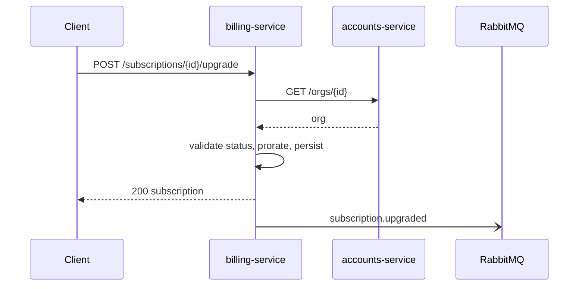

# billing-service

> Owns money-adjacent state: plans, **subscriptions**, and invoices. Other services
> treat it as the authority on what an org is paying for. Ruby/Rails on MySQL.

## Responsibilities & boundaries

- **Owns:** plans, subscriptions, invoices, proration logic.
- **Does not own:** who the users are or seat counts — those belong to
  accounts-service, which billing-service reads but never writes.
- **Does not** send messages — it emits events and lets messaging-service do that.

## Interface (contracts)

Authored in TypeSpec (`contracts/billing/main.tsp`), compiled to OpenAPI
(`contracts/billing/openapi.yaml`). See `example/contracts/README.md` for how the
contract is validated (oasdiff / Schemathesis / Prism).

- **Provides (HTTP):** `GET /subscriptions/{id}`,
  `POST /subscriptions/{id}/upgrade`.
- **Provides (events):** `subscription.upgraded` (see
  [messaging-service](messaging-service.md) for the AsyncAPI side).
- **Consumes:** accounts-service `GET /orgs/{id}`.

## Data it owns

- [Subscription](../models/subscription.md) — the core entity, including its
  view-backed and app-enforced fields.

## Key flows

Plan upgrade (the read-validate-update-emit path):

## Notes & nuances

??? info "Subscription status is enforced here, not in the DB"
    `subscriptions.status` has no DB constraint; valid transitions live in
    `Billing::Subscription::StateMachine`. See the [Subscription model](../models/subscription.md).

!!! danger "Suspected dead"
    `POST /subscriptions/{id}/downgrade` exists in the routes but every caller we can
    find goes through `upgrade` with a lower plan. Possibly dead; confirm before
    relying on it.
