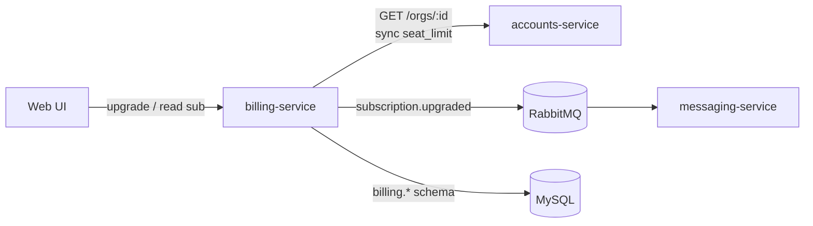
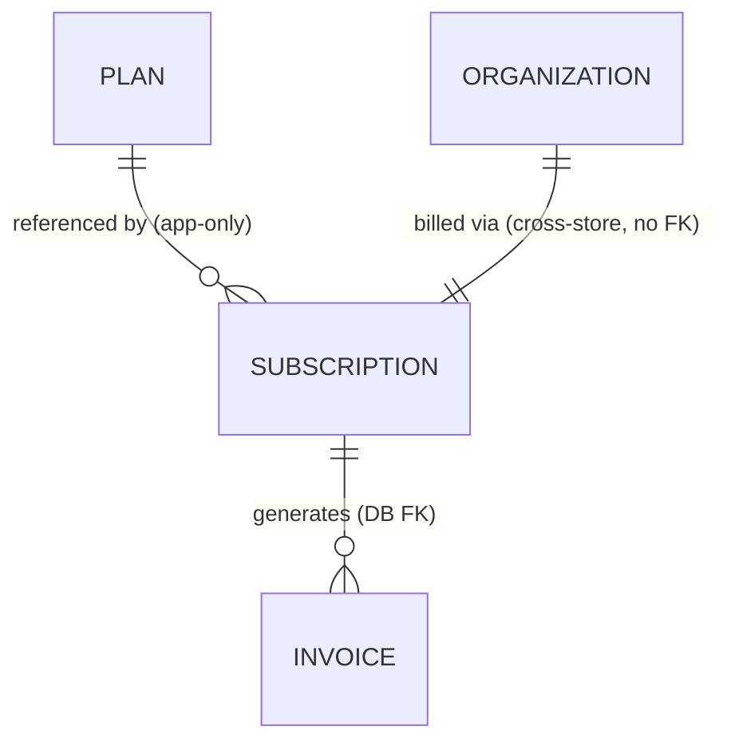
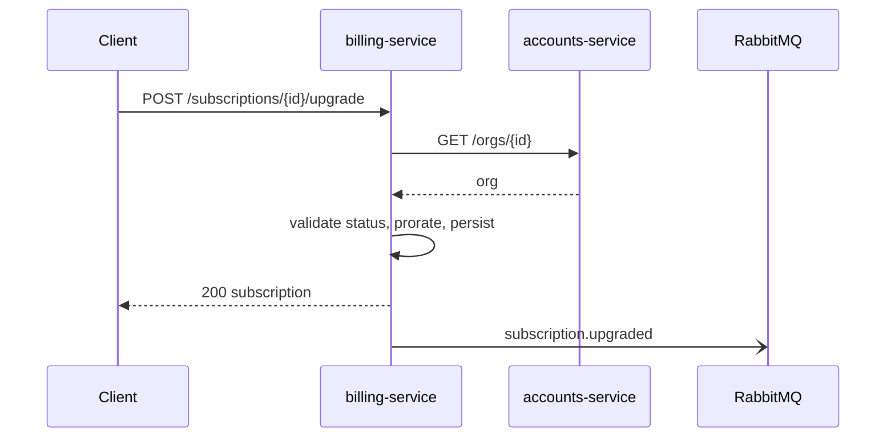
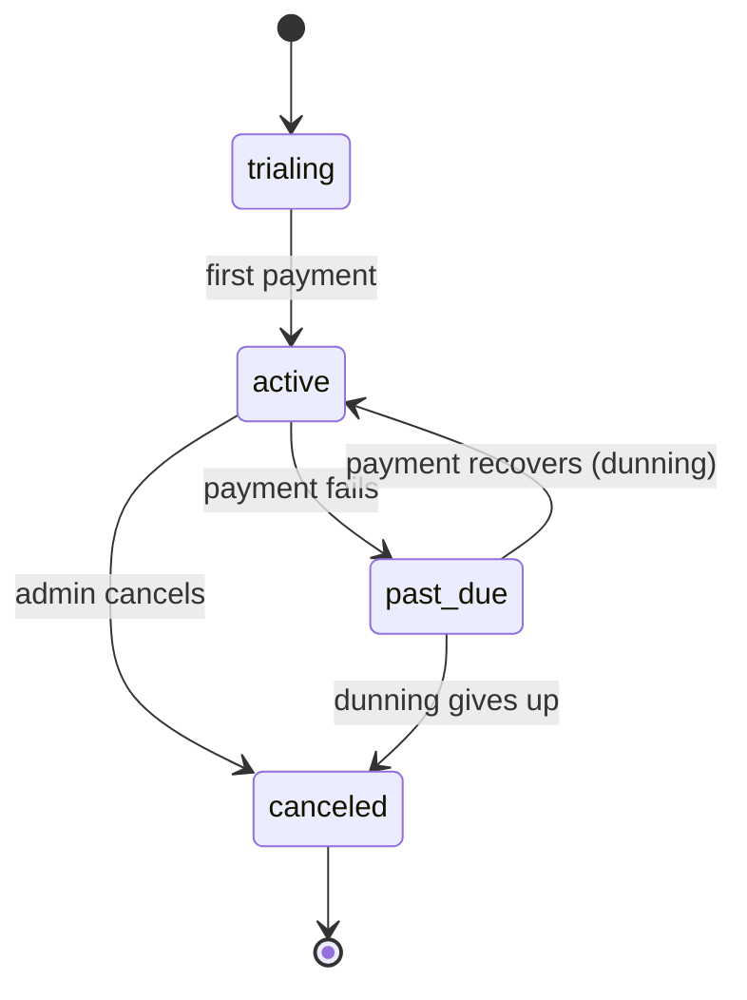

# billing-service

> Owns money-adjacent state: plans, **subscriptions**, and invoices. Other services
> treat it as the authority on what an org is paying for. Ruby/Rails on MySQL.

billing-service is the part of Beacon that knows what every organization pays for and
what it's entitled to. When an admin upgrades a plan, when a payment fails, when an
invoice is cut — that's all here. It's a small, focused Rails app: an HTTP API in
front, a MySQL schema (`billing.*`) behind, and one event it publishes to the rest
of the system when a subscription changes. If you're trying to answer "is this org
allowed to do X, and what will it be charged?", this is the service that decides.

This page is the service-level black box: what billing-service is responsible for,
the contract it exposes, the data it owns, and the handful of behaviours that will
bite you if you assume it works like a typical CRUD service. It runs from the
product picture down to the wire. For the *user-facing* story of the most common
write — an admin moving to a bigger plan — see [Plan upgrade](../features/plan-upgrade.md);
for the field-level data model, see [Subscription](../models/subscription.md).

## Responsibilities & boundaries

billing-service is deliberately narrow. It is the authority on the commercial
relationship — plan, price, cycle, entitlements — and nothing else.

- **Owns:** plans, [subscriptions](../models/subscription.md), invoices, and the
  [proration](../glossary.md#proration) logic that prices a mid-cycle plan change.
  It is the single writer of everything under the `billing.*` schema and the only
  place subscription state legally transitions.
- **Does not own:** who the users are or how many [seats](../glossary.md#seat) are
  actually assigned. That's accounts-service's data. billing-service *reads* an org
  over the API and *writes back* only the one field it's allowed to drive
  (`seat_limit`, on a plan change) — it never owns or caches org data as long-term
  truth. See the [authority boundary](../models/organization.md) on the Organization
  model.
- **Does not send messages.** It records that a billing-relevant thing happened by
  emitting an event; [messaging-service](messaging-service.md) decides whether that
  turns into an email and actually sends it. billing-service has no templates, no
  provider integration, and no delivery log.

The reason for drawing the line here is trust and blast radius. Money and
entitlements need to be correct, consistent, and durable, so they live in one
service on one relational store. Sending — high-volume, best-effort, provider-flaky
— is kept on the far side of a queue so a bad email provider can never fail a
payment or a plan change.



## Interface (contracts)

Authored in TypeSpec (`contracts/billing/main.tsp`), compiled to OpenAPI
(`contracts/billing/openapi.yaml`). See `example/contracts/README.md` for how the
contract is validated (oasdiff / Schemathesis / Prism).

- **Provides (HTTP):** `GET /subscriptions/{id}`,
  `POST /subscriptions/{id}/upgrade`.
- **Provides (events):** `subscription.upgraded` (see
  [messaging-service](messaging-service.md) for the AsyncAPI side).
- **Consumes:** accounts-service `GET /orgs/{id}`.

The HTTP surface is intentionally tiny — read a subscription, and apply the one
write that matters commercially. Here's the shape of each call so you don't have to
open the spec for the common cases.

### `GET /subscriptions/{id}` — read the current state

The read every other surface uses to answer "what is this org entitled to?" It
returns the subscription including the view-derived `seats_in_use`, so callers get
the live seat picture without joining anything themselves.

```http
GET /subscriptions/sub_8842 HTTP/1.1
```

```json
{
  "id": "sub_8842",
  "org_id": "org_217",
  "plan_id": "plan_pro",
  "status": "active",
  "seats": 25,
  "seats_in_use": 19,
  "current_period_end": "2026-07-01T00:00:00Z"
}
```

`seats_in_use` is read through the `active_subscriptions_v` view, not the base
table — it reflects seat assignments owned by accounts-service. Treat `status` as
the source of truth for entitlement: an `active` sub is fully usable, `past_due` is
in [dunning](../glossary.md#dunning) but not yet cut off, and `canceled` is done.
See the [Subscription model](../models/subscription.md) for every field.

### `POST /subscriptions/{id}/upgrade` — change the plan

The one meaningful write. The request carries the target plan; the response is the
updated subscription. The change is **immediate and prorated**, and it has the side
effect of emitting `subscription.upgraded`.

```http
POST /subscriptions/sub_8842/upgrade HTTP/1.1
Content-Type: application/json

{ "plan_id": "plan_enterprise" }
```

A `200` means the org is *already* on the new plan — new seat limit, new feature
set, new price — and the prorated charge for the rest of the cycle has been applied.
Despite the name, this endpoint also carries what the product calls a *downgrade*:
current callers move to a cheaper plan by posting a lower `plan_id` here rather than
using the dedicated downgrade route (see Suspected dead). The
full request/response flow is walked below in [Key flows](#key-flows).

### `subscription.upgraded` — the one event it emits

After a successful upgrade, billing-service publishes `subscription.upgraded` to
RabbitMQ and returns. It does not wait for anything downstream. messaging-service
consumes it to send the confirmation; the formal event shape lives on the
[messaging-service](messaging-service.md) AsyncAPI contract, because the consumer
owns the schema it depends on.

### `GET /orgs/{id}` — the one thing it consumes

Before applying any change, billing-service reads the org from
[accounts-service](accounts-service.md) to get its `status` and seat count. This is
a synchronous, read-only HTTP call across a service boundary. accounts-service is
the authority on org data; billing-service must not treat a copy as durable truth.

## Data it owns

- [Subscription](../models/subscription.md) — the core entity, including its
  view-backed and app-enforced fields. This is where the genuinely surprising
  details live (status is app-governed, `seats_in_use` is view-derived,
  cross-store `org_id` can dangle), so read that page before writing code against
  billing data.

billing-service also owns **plans** (see the [Plan](../models/plan.md) stub — the
package a subscription references via `plan_id`) and **invoices** (one subscription
→ many invoices, a real DB foreign key inside the `billing` schema). All three —
subscriptions, plans, invoices — live in the `billing.*` schema on
[MySQL](../datastores/mysql.md). billing-service is the **only** writer of that
schema; nothing reaches across the line into `accounts.*`, and nothing reads
`billing.*` by joining from another service. Cross-service reads go over the API.



The three relationships sit at three different levels of guarantee, and it's worth
internalizing which is which before you rely on a join:

- **Invoice → Subscription** is a real **DB foreign key** within the `billing`
  schema — referential integrity is enforced.
- **Subscription → Plan** is **app-only**: same schema, but no FK is declared, so a
  bad `plan_id` can physically be written. billing-service is what keeps it honest.
- **Subscription → Organization** is **cross-store**: `org_id` points at a row in
  `accounts.organizations` that MySQL knows nothing about. No FK, no write-time
  check, and a deleted org can briefly leave an orphaned subscription. Reads must
  tolerate a missing org. (See the [MySQL](../datastores/mysql.md) page for why
  "same engine" still means "different worlds.")

## Key flows

Plan upgrade (the read-validate-update-emit path):



Reading that flow the way the data actually moves:

1. **Resolve the org.** The request is keyed on the *subscription* id; billing-service
   reads the subscription, then calls `GET /orgs/{id}` on accounts-service for the
   org's current `status` and seat count. This is the step that lets a *suspended*
   org's upgrade be rejected — billing-service won't take a stale local view's word
   for it.
2. **Validate the transition.** The change has to be legal: the org must be usable,
   and the subscription must be in a state that can be upgraded. Legal status
   transitions live in `Billing::Subscription::StateMachine` (application code, not a
   DB constraint).
3. **Prorate and persist.** It computes the [proration](../glossary.md#proration)
   for the remainder of the cycle in `Billing::Proration`, then updates the
   subscription row — `plan_id`, `seats`/limit, price. It also propagates the new
   seat limit back to accounts-service so `accounts.organizations.seat_limit` stays
   in sync with what the plan now allows. This write-back is the *only* time
   billing-service touches accounts data, and it goes over the API, never the DB.
4. **Respond, then notify.** It returns `200` with the updated subscription — at
   which point the change is durable and the customer is on the new plan — and
   *afterwards* emits `subscription.upgraded` to RabbitMQ. The ordering is
   deliberate: the commit is synchronous so the admin sees an immediate, trustworthy
   result; the notify is async so a slow or failing message provider can never block
   an upgrade. A dropped event means a missing confirmation email, not a missing
   upgrade.

For the end-to-end feature, including the UI dialog, the prorated-amount preview,
and what messaging-service does with the event, see
[Plan upgrade](../features/plan-upgrade.md).

### Subscription lifecycle, in billing-service's terms

The status field that `GET /subscriptions/{id}` returns is governed here, and the
legal moves matter for every caller deciding whether an org can do something:



The values are `{trialing, active, past_due, canceled}`. `past_due` is the dunning
window — the latest payment failed, automated retry-and-notify is running, and the
sub is *not yet* cut off. It either recovers back to `active` or, if dunning gives
up, lands in `canceled`. None of this is enforced by the database; it's all
`Billing::Subscription::StateMachine` (see the next section).

## Notes & nuances

??? info "Subscription status is enforced here, not in the DB"
    `subscriptions.status` has no DB constraint; valid transitions live in
    `Billing::Subscription::StateMachine`. The column is a free-form `varchar`, so
    MySQL will happily store `status = 'banana'` — every legal value and transition
    is application code. This is a deliberate trade-off (the rules change more often
    than we'd want to manage in migrations), but it means: never write subscription
    status by reaching into the DB, and never assume the column is constrained. See
    the [Subscription model](../models/subscription.md) and the
    [MySQL](../datastores/mysql.md) gotchas page, which contrasts this with
    `accounts.organizations.status` — an identical-looking column that *is* a real
    DB-enforced enum.

??? info "Proration is computed here, not by the DB or the payment provider"
    The prorated charge for a mid-cycle plan change is calculated in
    `Billing::Proration` and exposed through the API (the UI reads it to show "you'll
    be charged $X today"). The contract returns the *result*, not the formula. If
    proration looks wrong, this service is where to look — not the provider, not a DB
    trigger.

??? info "seats vs. seats in use — two different sources"
    `seats` is what the org *paid for* (a plain column billing-service owns).
    `seats_in_use` is what's *actually assigned* and is **view-derived** from
    accounts-service's seat assignments via `active_subscriptions_v`. An upgrade that
    raises the seat limit is always safe; the constraint (`seats ≥ seats_in_use`)
    only bites in the downgrade direction, and even that is checked in app code, not
    the DB. Detail on the [Subscription model](../models/subscription.md).

??? info "Operational notes / debt"
    - **Stack:** Ruby on Rails; store is `billing.*` on
      [MySQL](../datastores/mysql.md) (shared engine with accounts-service, separate
      schema, no cross-schema joins).
    - **Sync dependency on accounts-service.** Every upgrade makes a blocking
      `GET /orgs/{id}` call. If accounts-service is slow or down, upgrades degrade
      with it — worth knowing when reading latency graphs.
    - **Legacy `tier`.** `subscriptions.tier` (`bronze`/`silver`/`gold`) predates
      `plan_id` and survives only for pre-2023-04 rows; reporting still reads it. The
      planned cleanup (backfill from `tier`, then drop) is tracked on the
      [Subscription model](../models/subscription.md).
    - **Contract verification.** The OpenAPI is compiled from TypeSpec and checked
      with oasdiff / Schemathesis / Prism — see `example/contracts/README.md`.

!!! warning "Discrepancy"
    The customer [help center](https://help.beacon.example/upgrading) says an upgrade
    is free until the next billing cycle; the code charges the prorated difference
    **immediately** (`Billing::Proration`). Code wins — the help article is stale
    (BILL-1423). Full context is on [Plan upgrade](../features/plan-upgrade.md).

!!! danger "Suspected dead"
    `POST /subscriptions/{id}/downgrade` exists in the routes but every caller we can
    find goes through `upgrade` with a lower plan. Possibly dead; confirm before
    relying on it.

!!! danger "Suspected dead"
    `subscriptions.promo_ref` is never written by any current code path we can
    find — likely a remnant of an old promotions feature. Flagged here because it's a
    column on a model this service owns; full context and the "confirm before
    removing" note are on the [Subscription model](../models/subscription.md).
