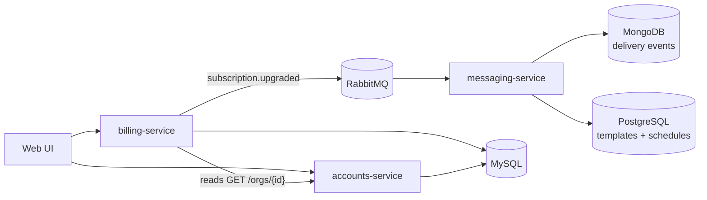
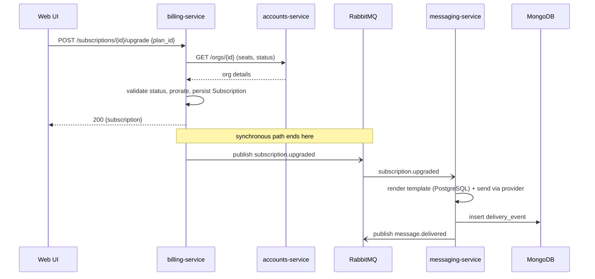
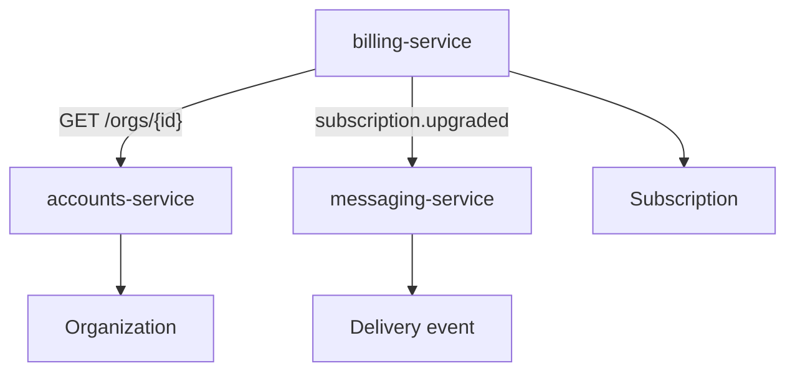

# Services

> **Services are the black boxes.** Each page here describes one running service by
> its *responsibilities* and its *contract* — what it owns, what it promises to
> callers, and what it refuses to do — without leaking its internals. If a
> [feature](../features/index.md) is the story of something Beacon does, a service is
> one of the actors that makes it happen.

This is the middle rung of the depth ladder: above you are
the [features](../features/index.md) that read like user journeys; below you are the
[models](../models/index.md) that pin down the exact data shapes. Start here when you
already know *which* part of the system you care about and you want its boundaries
and its API. If you want the system map instead, start at the
[Overview](../index.md); if you want a capability told as a journey, start at
[Features](../features/index.md).

## The services, at a glance

Three services, one per [domain](../index.md). The split is deliberate: each service
is the **sole writer** of its own data and the **authority** other services defer to,
so there's exactly one place that decides org state, one place that decides billing
state, and one place that decides what got sent.

| Service | Domain | Stack | Talks via | Owns |
|---------|--------|-------|-----------|------|
| [accounts-service](accounts-service.md) | Accounts | Java/Spring · MySQL | HTTP | [Organization](../models/organization.md), users |
| [billing-service](billing-service.md) | Billing | Ruby/Rails · MySQL | HTTP (OpenAPI) · emits events | [Subscription](../models/subscription.md), plans, invoices |
| [messaging-service](messaging-service.md) | Messaging | Elixir/Phoenix · PostgreSQL + MongoDB + RabbitMQ | Events (AsyncAPI) | [Delivery event](../models/delivery-event.md), templates, schedules |

Read those three pages and you've seen the whole runtime. Everything else on the
site — features, models, decisions — is either a journey *through* these services or
the data *inside* them.

## How they fit together

The shape to hold in your head is a short pipeline with one fan-out. The web UI
drives the two synchronous, HTTP-fronted services; one of them publishes an event;
the third service lives entirely downstream of that event and does the actual
sending.

Two things in that diagram are worth saying out loud, because they explain most of
how the services behave:

- **billing-service reads accounts-service; never the reverse, and never a shared
  table.** accounts-service is the tenant/identity layer that everyone else depends
  on, and it depends on no one. The arrow into it is always a read over HTTP
  (`GET /orgs/{id}`), and callers must treat the answer as fresh-at-read-time, not
  cache it as long-term truth — accounts-service is the only writer of org data.
- **The handoff to messaging-service is an event, not a call.** billing-service
  emits `subscription.upgraded` onto [RabbitMQ](../datastores/rabbitmq.md) and moves
  on; messaging-service picks it up on its own schedule. That seam is what makes the
  send path *eventual and decoupled* — see the gotcha below.

## Synchronous vs. eventual: the seam that matters

The single most important distinction across these three services is **which calls
are blocking and which are fire-and-forget.** Get this wrong and you'll misread every
failure mode.

- **HTTP between accounts-service and billing-service is synchronous and blocking.**
  When billing-service processes a [plan upgrade](../features/plan-upgrade.md) it
  *waits* on `GET /orgs/{id}` before it commits. If accounts-service is down, the
  upgrade fails then and there — which is the correct behaviour, because billing
  must not change a subscription it can't validate against current org state.
- **The event hop into messaging-service is asynchronous and decoupled.**
  billing-service's job is finished the moment it has persisted the subscription and
  published `subscription.upgraded`. Whether the confirmation message goes out in
  fifty milliseconds or five minutes — or after a RabbitMQ backlog clears — is
  messaging-service's concern, not billing's.

!!! info "What this buys you (and what it costs)"
    Because the send path is decoupled, an outage in messaging-service or RabbitMQ
    **doesn't** break upgrades — the admin's plan change still succeeds, they just get
    their confirmation email late. The flip side is that "the upgrade worked" and "the
    email arrived" are two separate truths with two separate failure modes. When you
    debug a missing confirmation, start by confirming the `subscription.upgraded`
    event was actually published, then follow it into messaging-service; don't assume
    a successful upgrade implies a sent message.

## The services in depth

### accounts-service — the tenant & identity layer *(stub)*

[accounts-service](accounts-service.md) owns **organizations and the users inside
them** — the layer every other domain reads from to answer "who is this, and are they
allowed?" It's Java/Spring on MySQL, and it's the **sole writer** of
[Organization](../models/organization.md) state. Other services read it over HTTP and
must not treat what they read as durable truth.

Its known HTTP surface is small but load-bearing:

- `GET /orgs/{id}` returns an org's seat count and status; this is what
  [billing-service](billing-service.md) calls before it touches a subscription.
- A **suspend endpoint** flips an org to `suspended`, the engine behind
  [Suspend an organization](../features/suspend-organization.md).

!!! note "This page is a stub"
    accounts-service is documented at low confidence — known shape only, not yet
    verified against `beacon-accounts`. Treat `GET /orgs/{id}` and the suspend
    endpoint as *confirmed by the features that call them* rather than fully
    catalogued. Deepening it (full HTTP surface, a contract, the `User` model) is on
    the backlog.

### billing-service — the authority on what an org pays for

[billing-service](billing-service.md) owns **plans, subscriptions, invoices, and
proration logic** — all the money-adjacent state. Ruby/Rails on MySQL, with an
HTTP/OpenAPI contract authored in TypeSpec. It is the authority every other service
defers to on what an org is entitled to.

Its contract has both an HTTP side and an event side:

- **Provides (HTTP):** `GET /subscriptions/{id}` and
  `POST /subscriptions/{id}/upgrade`.
- **Provides (events):** `subscription.upgraded`, which messaging-service consumes.
- **Consumes (HTTP):** accounts-service `GET /orgs/{id}` — it reads org state, never
  writes it.

The boundary is as important as the surface: billing-service **does not own users or
seats** (that's accounts-service, which it reads but never writes) and **does not send
messages** (it emits an event and lets messaging-service do the sending). Status
transitions on a subscription — `trialing → active → past_due ↔ active → canceled` —
are enforced in application code (`Billing::Subscription::StateMachine`), not by the
database; the [Subscription model](../models/subscription.md) is where that nuance
lives.

!!! danger "Suspected dead"
    `POST /subscriptions/{id}/downgrade` exists in the routes, but every caller we can
    find downgrades by calling `upgrade` with a lower plan instead. Likely dead;
    confirm before relying on it. (Recorded on the
    [service page](billing-service.md) too.)

### messaging-service — render, send, and record

[messaging-service](messaging-service.md) owns **message templates, send scheduling,
and the delivery-event log** — the "send" half of the product, from "send" to
"delivered/failed." It's Elixir/Phoenix and, unusually, spans three stores plus a
queue: relational data (templates, schedules) in
[PostgreSQL](../datastores/postgresql.md), the high-volume write-once
[delivery-event](../models/delivery-event.md) log in
[MongoDB](../datastores/mongodb.md), and all inter-service traffic over
[RabbitMQ](../datastores/rabbitmq.md).

It is purely **reactive** — it owns no subscription or org state and drives no
feature on its own:

- **Consumes:** `subscription.upgraded` (from billing-service) → renders and sends a
  confirmation message.
- **Produces:** `message.delivered` and `message.failed`.

??? note "Why two databases"
    Templates and schedules are relational and belong in PostgreSQL; the delivery log
    is high-volume, write-once, and schemaless, which is exactly what MongoDB is good
    at. The rationale is captured in
    [ADR 0001](../decisions/0001-delivery-events-in-mongodb.md), and the schema-drift
    caveats (fields that only appear on newer records) live on the
    [delivery-event model](../models/delivery-event.md).

!!! danger "Suspected dead"
    A `legacy.sms_gateway` consumer is still wired up, but the queue it binds to has
    had no producers since the SMS feature was retired. Likely dead — the `sms`
    channel survives only on old delivery events.

## The end-to-end path

To see all three services cooperate, follow a [plan upgrade](../features/plan-upgrade.md)
from click to confirmation email. This is the canonical Beacon flow because it
crosses every domain and exercises *both* kinds of inter-service communication — the
blocking HTTP read and the decoupled event hop.

Everything to the left of the *"synchronous path ends here"* note must succeed before
the admin sees a result; everything to the right happens afterwards, independently. If
you only remember one thing about how Beacon's services relate, make it that line.

## How a service page is shaped

Every service page on this site follows the same business → technical arc, so you can
skim the top and stop when you have what you need:

1. **A one-line summary** (the blockquote) — what the service owns, and its stack.
2. **Responsibilities & boundaries** — what it owns *and what it deliberately does
   not*, which is often the more useful half.
3. **Interface (contracts)** — the formal HTTP/OpenAPI or event/AsyncAPI surface,
   linking out to the contracts that tooling verifies.
4. **Data it owns** — links down into the [models](../models/index.md).
5. **Key flows** — a `sequenceDiagram` of the path that matters most.
6. **Notes & nuances** — collapsible detail, and "suspected dead" flags for paths
   that look unreachable.

If you're adding a service, copy an existing page and keep that arc: lead with what it
owns in plain terms, then earn trust further down with the exact endpoints, event
names, and storage details.

## How services connect to the rest of Beacon

Services sit between features and models and link in both directions: a
[feature](../features/index.md) links *down* into the services it touches; each
service links *down* into the [models](../models/index.md) it owns and *across* to the
services it calls or the events it exchanges.

- **[accounts-service](accounts-service.md)** — Java/Spring on MySQL. The
  tenant/identity layer and sole writer of [Organization](../models/organization.md)
  state. Everyone reads it; only it writes org data. *(Stub — low confidence.)*
- **[billing-service](billing-service.md)** — Ruby/Rails on MySQL. The authority on
  plans, [subscriptions](../models/subscription.md), invoices, and proration. Reads
  accounts-service, emits `subscription.upgraded`.
- **[messaging-service](messaging-service.md)** — Elixir/Phoenix on PostgreSQL +
  MongoDB + RabbitMQ. Renders, sends, and records [delivery
  events](../models/delivery-event.md). Reacts to events; drives nothing itself.

Reading order, if you're new: skim this page, read
[billing-service](billing-service.md) (the richest of the three) top to bottom, then
follow its links into [Subscription](../models/subscription.md) and across to
[messaging-service](messaging-service.md).

??? info "What's not here yet"
    These three are the services we've documented so far. accounts-service in
    particular is a [stub](accounts-service.md) — its full HTTP surface, a contract,
    and its `User` model are still to come. When the product grows new services, they
    belong here with the same shape.

!!! warning "Discrepancy — accounts-service language"
    The canon and the [Overview](../index.md) diagram describe accounts-service as
    **Java/Spring**, and its page prose agrees. Its frontmatter, however, carries
    `language: java` — consistent on the *language* but not capturing the *framework*
    the prose and diagrams name. Recorded as written; worth normalising in a
    convergence pass rather than guessing. By contrast, billing-service is uniformly
    described as Ruby/Rails + MySQL across the index, its page, and
    [organization.md's](../models/organization.md) neighbours — no conflict there.
