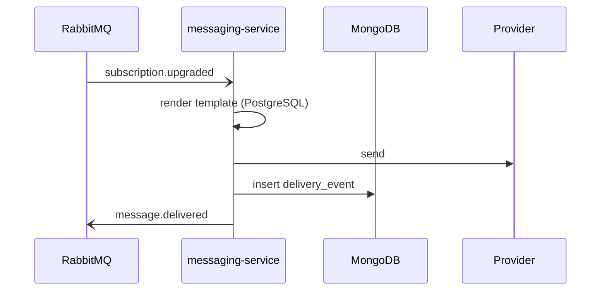

# messaging-service

> Sends transactional and campaign messages, and records what happened. Elixir/Phoenix.
> Templates and schedules live in PostgreSQL; per-send **delivery events** are logged
> to MongoDB; it talks to the rest of the system over RabbitMQ.

## Responsibilities & boundaries

- **Owns:** message templates, send scheduling, and the
  [delivery-event](../models/delivery-event.md) log.
- **Does not own:** subscriptions or org state — it reacts to events from
  billing-service and accounts-service.

## Interface (contracts)

Event-driven; described with AsyncAPI (`contracts/messaging/asyncapi.yaml`).

- **Consumes:** `subscription.upgraded` (from
  [billing-service](billing-service.md)) → sends the confirmation message.
- **Produces:** `message.delivered`, `message.failed`.

## Data it owns

- [Delivery event](../models/delivery-event.md) — MongoDB log, with the schema-drift
  caveats documented there.

## Key flows

## Notes & nuances

??? note "Two stores, on purpose"
    Templates/schedules are relational (PostgreSQL); the high-volume, write-once
    delivery log is in MongoDB. The rationale is captured in
    [ADR 0001](../decisions/0001-delivery-events-in-mongodb.md).

!!! danger "Suspected dead"
    A `legacy.sms_gateway` consumer is wired up but the queue it binds to has had no
    producers since the SMS feature was retired. Likely dead.
