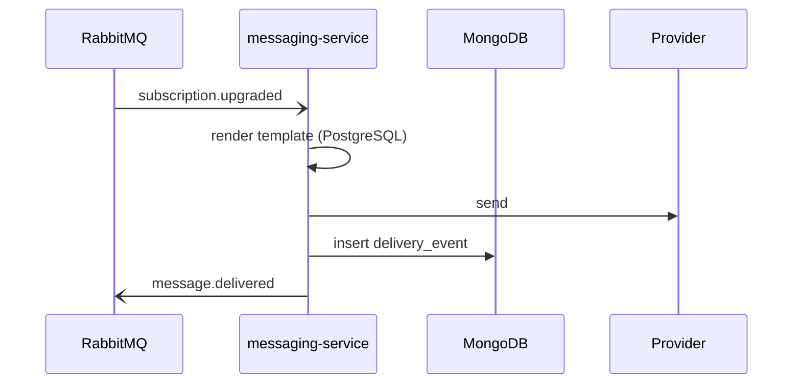
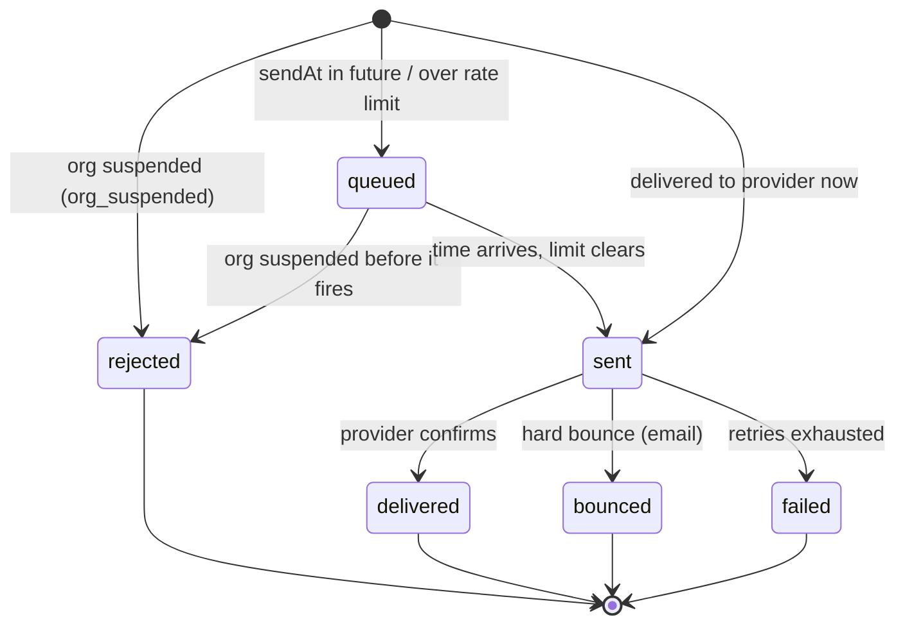

# messaging-service

> Sends transactional and campaign messages, and records what happened. Elixir/Phoenix.
> Templates and schedules live in PostgreSQL; per-send **delivery events** are logged
> to MongoDB; it talks to the rest of the system over RabbitMQ.

This is the service that does the thing Beacon's customers actually pay for. Give it
a recipient, a channel, and a template name and it renders the content, hands it to
the right provider, and writes down what happened — `delivered`, `failed`, or
`bounced`. Everything in the [Messaging domain](../domains/messaging.md) runs here:
the [send flow](../flows/send-message.md), the public
[Messaging API](../interfaces/api/index.md), and the delivery
[webhooks](../interfaces/webhooks/index.md) are all faces of this one service.

It is the unusual service in Beacon for spanning **three datastores plus a message
bus** ([PostgreSQL](../datastores/postgresql.md),
[MongoDB](../datastores/mongodb.md), [RabbitMQ](../datastores/rabbitmq.md)), and
that's not accidental complexity — the job genuinely has three differently-shaped
kinds of data, and we keep each where it belongs (see Two stores, on
purpose and [ADR 0001](../decisions/0001-delivery-events-in-mongodb.md)).

The single most important thing to understand about its *role* is that it
**reacts** — it owns templates, schedules, and the delivery log, and nothing else.
It does not decide who an org's users are (that's
[accounts-service](accounts-service.md)) or what an org is entitled to send (that's
[billing-service](billing-service.md)). It reads those answers and acts on them. A
useful one-liner: *Accounts and Billing describe the world; Messaging acts in it and
writes down the consequences.*

## Responsibilities & boundaries

- **Owns:** message templates and send schedules (in
  [PostgreSQL](../datastores/postgresql.md)), and the
  [delivery-event](../models/delivery-event.md) log (in
  [MongoDB](../datastores/mongodb.md)).
- **Owns the act of sending** — rendering a template, applying per-org
  [message settings](../options/message-settings.md) (rate limit, quiet hours, retry
  policy, fallback channel), handing the message to a provider, and recording the
  outcome.
- **Does not own** subscriptions or org/user state. It *reads* org status live from
  [accounts-service](accounts-service.md) (`GET /orgs/{id}`) and *reacts to* billing
  events; it never writes either, and it must not cache org status as long-term
  truth.
- **Does not decide entitlement.** Whether an org *may* send, and at what volume, is
  a Billing/Accounts concern. Messaging enforces the one gate it's handed — the org's
  `active` / `suspended` status — and otherwise just does what it's asked.

A quick orientation diagram of who it leans on and who leans on it:

```mermaid
flowchart LR
  ui[Web UI / API caller] -->|POST /messages| MS[messaging-service]
  bill[billing-service] -. subscription.upgraded .-> mq[(RabbitMQ)]
  mq -. consume .-> MS
  acc[accounts-service] -->|GET /orgs/id status| MS
  pg[(PostgreSQL: templates / schedules)] --> MS
  MS -->|render + deliver| prov[(Email / SMS / Push provider)]
  MS -->|write event| mongo[(MongoDB: delivery_events)]
  MS -- message.delivered / message.failed --> mq
  MS -- message.* --> hook[Customer webhook endpoint]
```

## Interface (contracts)

messaging-service has **two faces**: an inbound/outbound **event** surface over
RabbitMQ (how it talks to the rest of Beacon), and a customer-facing **HTTP +
webhook** surface (how *your* systems talk to it). Keep them straight — they share
some event names but are entirely different audiences and guarantees.

### Internal events (RabbitMQ, AsyncAPI)

Event-driven, described with AsyncAPI (`contracts/messaging/asyncapi.yaml`, AsyncAPI
3.0). The broker is declared there as `rabbitmq:5672` over AMQP. Change what an event
carries in that contract first — pages link to it and the `asyncapi diff`
compatibility check consumes it.

- **Consumes:** `subscription.upgraded` (from
  [billing-service](billing-service.md)) → renders and sends the confirmation
  message. Payload carries `subscriptionId`, `orgId`, `planId`.
- **Produces:** `message.delivered` (and, per canon, `message.failed`) after a send
  resolves. The `MessageDelivered` payload carries `messageId`, `orgId`, and a
  `status` of `delivered` / `failed` / `bounced`.

!!! warning "Discrepancy: is `message.failed` its own event?"
    Canon describes `message.failed` as a distinct produced event, and this page (and
    [RabbitMQ](../datastores/rabbitmq.md)) say so. But the current AsyncAPI contract
    declares only `subscription.upgraded` and `message.delivered`, and the
    `MessageDelivered` payload's `status` enum *already* includes `failed` and
    `bounced`. So a failed outcome may actually travel as a `message.delivered` event
    with `status: failed` rather than on a separate channel. Code/contract wins —
    either the contract should add a `message.failed` channel or the prose should stop
    promising one. Flagged for confirmation.

### Customer-facing surfaces (HTTP + webhooks)

Customers never touch RabbitMQ. They reach messaging-service through:

- **[Messaging API](../interfaces/api/index.md)** — the public REST surface (compiled
  from TypeSpec in `contracts/public-api/`). Two endpoints today:
  `POST /messages` (accept a send; returns `queued`) and `GET /messages/{id}` (read
  current status). Auth is a bearer key scoped per environment; see
  [Auth](../interfaces/auth.md).
- **[Webhooks](../interfaces/webhooks/index.md)** — outcomes Beacon `POST`s to *your*
  endpoint (`message.sent` / `message.delivered` / `message.failed` /
  `message.bounced`). Signed, **at-least-once, and unordered** — a different
  reliability model from the synchronous API.

These two are the inbound and outbound sides of the same loop: you *send* over the
API and *hear back* over webhooks.

??? info "Two events called `message.delivered` — don't conflate them"
    The name `message.delivered` exists twice: as an **internal** RabbitMQ event
    between Beacon's own services, and as a **public webhook** Beacon sends to you.
    They share a name and rough shape but are different surfaces with different
    guarantees and fields. The internal event is an implementation detail; the webhook
    is a promise to customers. When someone says "the delivered event," confirm which
    side of the line they mean. See [Webhooks → internal events vs
    webhooks](../interfaces/webhooks/index.md#notes-nuances).

## Data it owns

Three stores, each holding a different shape of data — the asymmetry *is* the design.

| Store | Holds | Shape | Why it fits |
|-------|-------|-------|-------------|
| [PostgreSQL](../datastores/postgresql.md) | message templates, send schedules | relational, mutable, modest, edited by humans | wants a schema, constraints, and joins |
| [MongoDB](../datastores/mongodb.md) | [delivery-event](../models/delivery-event.md) log | schemaless, append-only, very high volume | cheap high-volume inserts; the field set evolves freely |
| [RabbitMQ](../datastores/rabbitmq.md) | events in flight | transport, not storage | decouples Messaging from Billing/Accounts |

- **[Delivery event](../models/delivery-event.md)** — the MongoDB log, one write-once
  record per send attempt. This is the model worth reading in full, because its
  schemaless nature has a long shadow: **older documents lack fields added later.**
  `provider_id` only exists on records from 2024-03 onward, `region` from 2024-07, and
  `attempts` is absent on the oldest rows (treat absent as `1`). Any code reading the
  log — including the emitters in this very service — must default defensively rather
  than assume a field is present. [ADR 0002](../decisions/0002-delivery-event-schema-validator.md)
  added a MongoDB JSON-schema validator that stops *new* drift, but it is
  deliberately not retroactive, so the historical caveat still holds.

Templates and schedules don't have their own model pages yet; the
[PostgreSQL page](../datastores/postgresql.md) describes what each half holds.
Tenant isolation for them is by `org_id` and **enforced in app code, not the
database** — an ad-hoc query that forgets the `org_id` filter will happily cross
tenants.

## Key flows

The headline flow is the **reactive upgrade confirmation**: nobody in Messaging
triggers it directly — it falls out of a Billing event. This is the canonical path
that ties Billing → Messaging together.



In words, with the gotchas surfaced where you'd hit them:

1. **Consume.** A `subscription.upgraded` event arrives from
   [billing-service](billing-service.md) over RabbitMQ (the upstream half of the
   [Plan upgrade](../features/plan-upgrade.md) feature). Because the broker is
   **at-least-once**, this event can be redelivered — the consumer must be
   **idempotent** so one upgrade never produces two confirmations.
2. **Pick + render.** The matching confirmation template is loaded from PostgreSQL and
   rendered. A template that fails to render is a *send-time error*, not a provider
   error — it never reaches the provider and produces no delivery event.
3. **Gate on org status.** Messaging checks the org's status against
   [accounts-service](accounts-service.md) (`GET /orgs/{id}`). A `suspended` org's
   message is dropped here (`org_suspended`) before anything reaches a provider —
   *even this system-initiated message*; the gate makes no exception for internal
   triggers.
4. **Deliver.** The rendered message goes to the channel's provider. "Accepted" means
   *the provider took it*, not that the customer received it — final delivery is
   asynchronous and arrives later via the provider's own callback.
5. **Record.** A [delivery-event](../models/delivery-event.md) is appended to MongoDB,
   write-once. This is the audit trail and the source for per-org delivery reporting.
6. **Announce.** On the provider's confirmation, Messaging emits the internal outcome
   event and fires the public [webhook](../interfaces/webhooks/index.md).

### Explicit sends and the send matrix

The reactive confirmation above is one of *two* send origins. The other —
**explicit sends** from the [API](../interfaces/api/index.md) or
[dashboard](../surfaces/dashboard.md) — is the common case. Both funnel into the same
machinery once a template is chosen, but the explicit path has more options: it can
be immediate, scheduled (`sendAt`), or throttled by the per-org rate limit, and it
branches by channel.

The full picture — channel × timing × org-status, with worked edge cases — lives on
[Send a message](../flows/send-message.md). The essentials to carry away here:

- **Org status is the first, cheapest gate.** A `suspended` org is rejected before
  anything renders, queues, or reaches a provider.
- **The gate is re-checked at fire time, not cached.** A message scheduled while an
  org is `active` is still dropped if the org is suspended before `sendAt` arrives. A
  queued message is a *promise to re-evaluate*, not a committed send.
- **Push is exempt from rate limiting**; email and SMS are throttled (queue and drain
  at the configured rate). That asymmetry is mirrored in
  [Message settings](../options/message-settings.md).
- **`quiet_hours` defers; suspension rejects.** Two gates that look similar have
  opposite outcomes — a message inside quiet hours is *held until the window ends*,
  using the **org's** timezone, not the recipient's.

### The send lifecycle (states)

A message walks a small set of states. Knowing them makes the webhooks and the
delivery log read clearly — and makes the "accepted ≠ delivered" trap obvious.



The three **terminal** outcomes — `delivered` / `failed` / `bounced` — are exactly
the `status` values recorded on a [delivery-event](../models/delivery-event.md) and
the [webhook](../interfaces/webhooks/index.md) event names. `queued` and `sent` are
in-flight stages you'll see while polling but never as a final answer.

!!! note "A naming gap worth knowing: `message.sent` vs `message.delivered`"
    The current `send.ex` source writes a delivery event in a `sent` sense and the
    [send flow](../flows/send-message.md) diagrams show a `message.sent` step, while
    canon and the AsyncAPI contract name the produced/terminal events
    `message.delivered` / `message.failed`. Read `sent` as "handed to provider,
    accepted"; the terminal outcome (`delivered` / `failed` / `bounced`) is surfaced
    later. The naming inconsistency is real and tracked on the
    [send flow](../flows/send-message.md) — worth confirming, not inventing a
    resolution for here.

## Why it reacts to events instead of being called

Beacon could have had billing-service call messaging-service directly over HTTP when
an org upgrades. It doesn't, and the reason explains the service's whole shape:

- **Decoupling.** billing-service's job ends at "the subscription is updated and the
  fact announced." It shouldn't fail or slow down because a confirmation email is the
  downstream result, or because messaging-service is briefly down.
- **Fan-out.** One `subscription.upgraded` can grow more consumers over time (today
  just the confirmation; tomorrow maybe analytics) without billing-service changing.
- **Buffering.** If messaging-service is restarting or backed up, events queue and are
  processed on recovery rather than erroring back to the caller.

The trade-off is *eventual* consistency — a small, usually sub-second gap between the
upgrade completing and the confirmation going out. For a confirmation message that's
exactly the right trade. The full rationale lives on
[RabbitMQ](../datastores/rabbitmq.md) and [Plan upgrade](../features/plan-upgrade.md).

## How this connects

- **Upstream triggers:** explicit sends from the
  [Messaging API](../interfaces/api/index.md) and the
  [dashboard](../surfaces/dashboard.md); reactive sends from billing's
  `subscription.upgraded` (see [Plan upgrade](../features/plan-upgrade.md)).
- **Reads:** org status live from [accounts-service](accounts-service.md) — see
  [Suspend an organization](../features/suspend-organization.md) for how that status
  is set.
- **Controls:** rate limit, quiet hours, retry policy, and fallback channel in
  [Message settings](../options/message-settings.md).
- **Outcome:** every attempt becomes a [delivery-event](../models/delivery-event.md)
  in MongoDB (write-once; schema drifts by record age — code defensively) and a
  [webhook](../interfaces/webhooks/index.md).
- **Domain home:** [Messaging](../domains/messaging.md) ties the whole picture
  together; the [send flow](../flows/send-message.md) is the deep dive on the matrix.

## Notes & nuances

??? note "Two stores, on purpose"
    Templates/schedules are relational (PostgreSQL); the high-volume, write-once
    delivery log is in MongoDB. The rationale is captured in
    [ADR 0001](../decisions/0001-delivery-events-in-mongodb.md), with the follow-up
    schema-validator decision in
    [ADR 0002](../decisions/0002-delivery-event-schema-validator.md).

??? info "Consumers must be idempotent (both directions)"
    RabbitMQ is **at-least-once**: a consumer acks only after it finishes handling an
    event, so a crash mid-handle (after sending, before ack) means the event is
    redelivered on restart. The failure to design against is *sending the same
    confirmation twice for one upgrade*. The same discipline applies on the public
    edge — [webhooks](../interfaces/webhooks/index.md) are at-least-once too, so the
    consumer you build on the other side must dedupe as well.

??? info "Don't cache org status as truth"
    Org status is read live from [accounts-service](accounts-service.md) at the moment
    a message fires — never cached as long-term truth. That live read is what keeps a
    long-scheduled message honest: a suspended org can't sneak out a message it
    scheduled while still active. The cost is an extra status read per fire; the payoff
    is that entitlement is always current.

??? note "SMS is effectively retired"
    `channel: "sms"` still appears in the data model, on historical
    [delivery-event](../models/delivery-event.md) rows, and in the API's channel enum,
    but the SMS feature is retired — no new SMS rows are written and the live channels
    are email (first-class) and push. Treat SMS as read-only history. The
    [send flow](../flows/send-message.md) and [RabbitMQ](../datastores/rabbitmq.md)
    pages carry matching suspected-dead flags for the leftover SMS code paths.

!!! danger "Suspected dead"
    A `legacy.sms_gateway` consumer is wired up but the queue it binds to has had no
    producers since the SMS feature was retired. Likely dead. This is a dead queue with
    a live-but-idle consumer attached — a cleanup candidate on both ends (also flagged
    on [RabbitMQ](../datastores/rabbitmq.md), and matching the legacy `sms` branch
    noted on the [send flow](../flows/send-message.md)).
