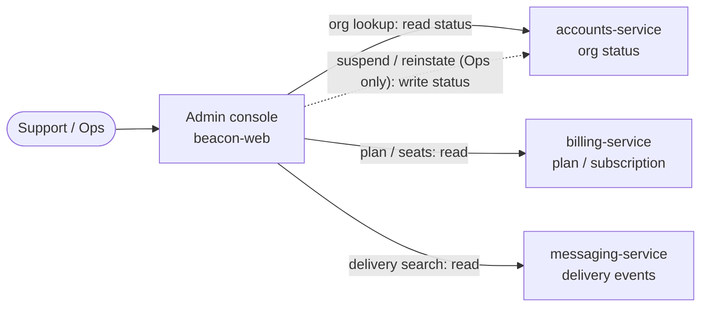

# Admin console

> The internal app Beacon staff use to support customers — look up orgs, inspect
> deliveries, and suspend abusive accounts. Not customer-facing.

The admin console is the window Beacon's own people use to look *into* a customer's
account without being a user inside it. When a customer emails "did my receipts go
out this morning?" or finance flags an org that stopped paying, this is where a
support or ops person goes to find the answer and, in one case, to act on it. It is
the staff-facing counterpart to the customer-facing
[dashboard](../surfaces/dashboard.md): same product, opposite side of the glass.

Two things define this surface, and both are deliberate constraints rather than
missing features:

- **It is cross-org by nature.** A staff user isn't a member of any single
  [organization](../models/organization.md); they can pull up *any* of them. That
  reach is exactly why the console is kept narrow and read-leaning — see
  [Roles](#roles).
- **It is overwhelmingly read-only.** The console is built to *see* customer state,
  not change it. There is precisely one mutating action a human can take here —
  [suspend / reinstate](../features/suspend-organization.md) — and everything else is
  lookup. If you come to the console expecting to "fix" a customer's billing or
  resend their messages, you've come to the wrong place: those live in the customer
  [dashboard](../surfaces/dashboard.md) or in the owning service, by design.

That posture is the whole story of this page. A tool that can reach every customer is
a tool you want to be unable to do much damage. So the console reads broadly and
writes almost nothing.

## What it offers

The capabilities a staff member actually reaches for, in the order they come up day
to day:

- **Org lookup** — find and inspect any [Organization](../models/organization.md):
  its `status` (active or suspended), the [plan](../models/plan.md) and
  [Subscription](../models/subscription.md) it's on, seat usage, and recent activity.
  This is the bread-and-butter "what's going on with this account?" view and the
  starting point for almost every support conversation.
- **Delivery inspection** — search [delivery events](../models/delivery-event.md)
  *across* orgs to answer the single most common support question in a messaging
  product: "did my message actually send?" You can scope by org and a recent time
  window and read each attempt's outcome (`delivered` / `failed` / `bounced`).
- **Suspend / reinstate** — the one lever. An ops user can flip an org to
  `suspended` (blocking all sends) or back to `active`. This is the only place in
  Beacon a human can take a customer offline. See
  [Suspend an organization](../features/suspend-organization.md) for the full flow,
  failure modes, and why the block is checked at send time rather than pushed.

Notice what's deliberately **absent**. The console can't send a message as a
customer, can't edit their billing or change their plan, can't rotate their
[API keys](../interfaces/auth.md), and can't manage their members. Those are all
customer-owned actions that live on the [dashboard](../surfaces/dashboard.md) under
the org's own [roles](../access/roles.md). Keeping them out of the console isn't an
oversight — it's the blast-radius boundary that makes a cross-org tool safe to hand
to support.

### How a capability maps to who can use it

The same surface behaves differently depending on the staff member's
[internal role](../access/roles.md#internal-roles-beacon-staff). The two read
capabilities are open to everyone; the one write capability is gated to Ops.

| Capability | Support | Ops |
|------------|---------|-----|
| Org lookup | ✅ | ✅ |
| Delivery inspection (cross-org) | ✅ | ✅ |
| Suspend / reinstate an org | — | ✅ |

That single ✅ in the Ops column is the entire mutating surface of the console. A
routine lookup by a Support user can never accidentally take a customer offline,
because the action simply isn't available to them.

## Key screens

The console is small — two screens carry almost all the work.

### Org detail

The hub. Open an org and you see its current `status`, the
[plan](../models/plan.md) / [Subscription](../models/subscription.md) it carries,
seat usage, recent activity, and — for an Ops user — the **Suspend** (or
**Unsuspend**) action.

A subtlety worth internalizing: the values on this screen are *read fresh*, not
cached. The org's `status` comes straight from
[accounts-service](../services/accounts-service.md), which is the
[sole writer of org state](../models/organization.md#notes-nuances); the
subscription, plan, and seat figures come from
[billing-service](../services/billing-service.md). The console is a *viewer* stitched
from those services' APIs, so what you see is what they currently hold — there's no
console-owned copy to go stale. This matters in practice: if you suspend an org and
refresh, the new `suspended` status is real the instant accounts-service accepts the
write, and the [next send is blocked immediately](../features/suspend-organization.md#why-check-at-send-time-not-at-suspend-time)
because messaging-service re-reads status on every send rather than trusting a cache.

The suspend action itself requires a reason — there is no "suspend without saying
why." The reason is an operator-to-operator audit note (think "non-payment, dunning
exhausted (BILL-…)" or "T&S: phishing report #…"), and it matters because *anyone*
on the team can reinstate, so the next person needs to know why the account is in
this state and whether it's safe to lift. The mechanics, the reason trail, and the
open questions about exactly where the reason and actor are persisted all live on
[Suspend an organization](../features/suspend-organization.md).

### Delivery search

The cross-org delivery-event lookup. Search [delivery events](../models/delivery-event.md)
by org and a recent time window and read each send attempt's outcome.

Two things to keep in mind when you read this screen, both inherited from how the
[delivery-event model](../models/delivery-event.md) is stored:

- **The log is immutable and per-attempt.** Each row is a *fact about one send
  attempt* — it never updates. If a message was retried, you'll see two rows, not one
  row that "became delivered." Read it as a stream of observations, not the current
  state of a message.
- **Older rows carry fewer fields.** The collection is schemaless and has accreted
  fields over the years, so `region` (records on or after 2024-07), `provider_id`
  (on or after 2024-03), and `attempts` (oldest rows) can simply be absent on older
  events. Don't read a missing field as an error — it's expected drift. The
  [delivery-event page](../models/delivery-event.md#reading-defensively)
  has the cutoffs if a report looks lopsided across a date range.

The screen is shaped for the same two read patterns the store is optimized for:
recent-window, per-org lookups ("what happened to this org's sends lately?") and
the occasional aggregate ("what's their bounce rate this week?").

## Roles

Internal roles only; see [Roles & permissions](../access/roles.md). The console is
the home of Beacon's two **staff** roles, which are entirely separate from the
customer Owner/Admin/Member roles on the [dashboard](../surfaces/dashboard.md) — a
customer is never staff, and staff never appear in a customer's member list.

- **Support** — read-only. Look up any org and search deliveries across orgs to
  answer "did it send?" questions. Support can *see* customer state but never change
  it.
- **Ops** — everything Support can do, **plus** suspend / reinstate. This is the only
  mutating action any internal role can take through the console, and it's
  deliberately Ops-only so a routine lookup can't take a customer offline.

It's a simple ladder — Ops is Support plus the one lever — mirroring the customer-side
ladder on the dashboard.

!!! info "Where this is enforced"
    There is no central authorization service. Internal-role checks are enforced
    **in the admin console's own app code** (`beacon-web`), not by a shared policy
    engine — the same app-only pattern the rest of Beacon uses (customer roles are
    enforced by the dashboard and [accounts-service](../services/accounts-service.md);
    API calls by [key scopes](../interfaces/auth.md)). The
    [permission matrix](../access/roles.md#permission-matrix) is the human-readable
    contract, not a single config you can point at. The exact roles allowed to
    suspend/reinstate, and where the actor and reason are persisted, are worth
    confirming against `beacon-accounts` and `beacon-web` on the next deepening pass —
    part of why this page's confidence sits at 55.

## How it fits together

The console doesn't own any data of its own. It's a thin staff-facing UI over the
same services the customer dashboard talks to — it just reads across every org
instead of one, and exposes a single write. The read paths fan out to the owning
services; the one write goes to accounts-service and takes effect on the next send.

The dotted line is the only write on the whole diagram. Everything else is the
console reading the truth from whichever service owns it — never holding its own
copy. That's the same "read it fresh at decision time" discipline the
[Organization authority boundary](../models/organization.md#notes-nuances) calls
for, applied to a UI: because the console caches nothing, it can never show a
suspended org as active, and a suspend it issues is true the moment accounts-service
accepts it.

For the deeper detail on each side: the owning services are
[accounts-service](../services/accounts-service.md),
[billing-service](../services/billing-service.md), and
[messaging-service](../services/messaging-service.md); the data behind the screens is
[Organization](../models/organization.md), [Subscription](../models/subscription.md),
and [Delivery event](../models/delivery-event.md); the one feature with real teeth is
[Suspend an organization](../features/suspend-organization.md).

## Notes & nuances

??? note "Read-only by design, with exactly one exception"
    The console's near-total read-only posture is the safety model for a tool that can
    reach every customer. The only human-driven write is suspend / reinstate, and it's
    gated to Ops. If a support workflow seems to call for changing customer state
    (re-pricing, resending, key rotation), that's a signal it belongs in the customer
    [dashboard](../surfaces/dashboard.md) or the owning service — not a gap to fill in
    the console.

??? note "It mirrors, it doesn't own"
    Nothing the console shows is stored by the console. Org status is owned by
    accounts-service, plan/subscription by billing-service, delivery events by
    messaging-service. The console is a viewer; treat anomalies as questions for the
    owning service, not bugs in the console's data.

!!! danger "Suspected dead"
    A "bulk message replay" tool exists in the console but its endpoint returns 501;
    likely never finished. This squares with the broader picture — the console isn't
    meant to *send*, and replaying messages would be a mutating, customer-impacting
    action well outside its read-only remit. Confirm against `beacon-web` whether the
    UI entry point should simply be removed.

!!! danger "Suspected dead"
    The suspend dialog still offers a "suspend for N days" auto-reinstate option, but
    the backend ignores the duration — the same unfinished timed-suspension path
    flagged on [Suspend an organization](../features/suspend-organization.md). Confirm
    whether timed suspension was ever wired before relying on it.

!!! question "Open: console internals not yet verified from source"
    This page is written largely from the consuming side and the cross-org product
    behavior; a few things should be pinned against `beacon-web` on the next pass and
    are why confidence sits at 55:

    - **Auth & role enforcement** — how staff sign in to the console and where the
      Support/Ops check is actually made in `beacon-web`.
    - **The read APIs it calls** — whether delivery search hits messaging-service
      directly or via an aggregation endpoint, and how org detail composes
      accounts-service + billing-service responses.
    - **Audit trail** — whether console reads (not just suspends) are logged, given
      the cross-org reach.
