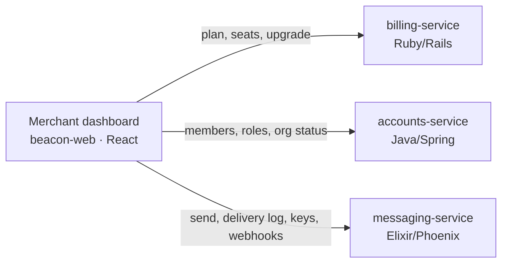

# Merchant dashboard

> The self-serve web app where an organization manages its account, billing, and
> messaging. The primary B2B surface. (Features that declare `surfaces: [dashboard]`
> are listed under "Surfaced here".)

The dashboard is where your customers actually live in Beacon. It's the
browser-based control panel an [organization](../models/organization.md) signs into
to send messages, watch them land, manage the plan they pay for, and wire up the
[Messaging API](../interfaces/api/index.md) for their own systems. Everything a
customer can do without talking to Beacon support happens here — which makes this
the surface most people mean when they say "Beacon."

It is deliberately **not** the only surface. Beacon's own support and operations
staff work in a separate [admin console](admin-console.md) that reaches across
every org; the dashboard only ever shows *your* org. The two never overlap: a
customer never sees the admin console, and Beacon staff never appear in your member
list. If you're looking for cross-org tooling, you're on the wrong page — see the
[admin console](admin-console.md).

This page runs from "what can I do here" down to "how is it actually wired,"
following the depth ladder. Skim the first two sections for the product picture;
keep reading for how the dashboard talks to the services behind it and the gotchas
worth knowing before you debug something.

## What it offers

The dashboard groups everything into three jobs a customer comes here to do. Each
capability links down to the flow or option page where the real detail lives — the
dashboard is the *door*, not the authority on the behaviour behind it.

- **Messaging** — compose and send a message, watch it land in the delivery log,
  and tune how sends behave through
  [message settings](../options/message-settings.md) (rate limits, quiet hours,
  retry policy, default and fallback channels). This is the day-to-day work the
  product exists for; the underlying path is [Send a message](../flows/send-message.md).
- **Billing** — see the current plan and seats, and move up a tier through
  [Plan upgrade](../features/plan-upgrade.md). What a plan *entitles* you to lives
  on the [Subscription](../models/subscription.md) model; the dashboard renders it
  and hands the change off to [billing-service](../services/billing-service.md).
- **Developers** — mint and rotate [API keys](../interfaces/auth.md) and register
  [webhook endpoints](../interfaces/webhooks/index.md). This is the bridge from the
  human, click-driven surface to the programmatic [Messaging API](../interfaces/api/index.md):
  a key created here is the credential a customer's backend then uses on its own.

A capability can behave differently here than elsewhere. Sending a message from the
dashboard's composer and sending it via `POST /messages` with an API key run the
*same* pipeline underneath, but the dashboard adds a human in the loop — a role
check, a visible delivery log, a confirmation screen — that the raw API doesn't.
Keep that distinction in mind when a customer reports "it works in the dashboard
but not from my code" (or vice versa): the surface differs, the engine doesn't.

## Key screens

The dashboard is a handful of screens. Most of the depth lives one level down, so
each entry below links to the flow or options page that owns the detail.

| Screen | What it's for | Who can open it | Where the detail lives |
|--------|---------------|-----------------|------------------------|
| **Messages** | Compose + send, and the delivery log | Member and up | [Send a message](../flows/send-message.md), [delivery event](../models/delivery-event.md) |
| **Settings → Messaging** | Sending controls for the whole org | Admin and up to edit | [Message settings](../options/message-settings.md) |
| **Settings → Developers** | API keys and webhook endpoints | Admin and up | [API auth](../interfaces/auth.md), [Webhooks](../interfaces/webhooks/index.md) |
| **Settings → Billing** | Plan, seats, the upgrade dialog | Owner only | [Plan upgrade](../features/plan-upgrade.md), [Subscription](../models/subscription.md) |
| **Settings → Members** | Invite people and assign roles | Admin and up | [Roles & permissions](../access/roles.md) |

A few screens are worth a closer look:

- **Messages** is the home screen for most users. The composer sends; the delivery
  log below it is a per-org view of [delivery events](../models/delivery-event.md) —
  the `delivered` / `failed` / `bounced` outcomes Beacon recorded for each send.
  Because delivery is recorded asynchronously after the provider responds, a freshly
  sent message can sit in flight briefly before its outcome shows; that lag is
  normal, not a bug.
- **Settings → Billing** is the only screen gated to a single role. Plan and seat
  changes cost money, so they sit behind the org's sole **Owner** — an Admin runs
  the integration but can't touch the invoice. The upgrade flow itself, including
  the prorated charge shown before you commit, is [Plan upgrade](../features/plan-upgrade.md).
- **Settings → Developers** is where the human surface meets the API. Keys are shown
  exactly once at creation, so the screen's "copy now, you won't see it again"
  warning is load-bearing — see [API auth](../interfaces/auth.md) for rotation done
  safely.

## How it's wired

The dashboard is a single-page app (TypeScript / React, repo `beacon-web`) with no
backend of its own. It is a *client* of Beacon's services, talking to each over
HTTP and rendering what they return. There is no dashboard database and no
dashboard business logic that the services don't also enforce — which matters for
trust: the dashboard hides controls a role can't use, but the **service** owning
each action is the real gate.

Which service answers depends on the screen:

- **Settings → Billing** talks to [billing-service](../services/billing-service.md),
  the authority on plans, [subscriptions](../models/subscription.md), and proration.
  The upgrade dialog asks it for the prorated amount before you confirm, then posts
  the change.
- **Settings → Members** and the role each user holds come from
  [accounts-service](../services/accounts-service.md) (Java/Spring), the sole writer of
  [organization](../models/organization.md) and user data. The dashboard reads
  membership and roles from it and must not treat a cached copy as long-term truth.
- **Messages, message settings, API keys, and webhooks** are served by
  [messaging-service](../services/messaging-service.md), which owns templates,
  scheduling, the [delivery-event](../models/delivery-event.md) log, and the
  [Messaging API](../interfaces/api/index.md) the Developers screen configures.

So a single "page" in the UI can fan out to more than one service, and the
dashboard stitches the responses together. That's why a billing hiccup leaves
messaging untouched, and why the delivery log can be healthy while the billing
screen errors — they're different services behind one app.

## Roles

Who sees what is governed by [Roles & permissions](../access/roles.md). The
dashboard is the customer-facing surface, so only the three **customer roles**
apply here — the internal Support/Ops roles exist solely in the
[admin console](admin-console.md) and never appear in the dashboard.

The roles form a ladder, **Member ⊂ Admin ⊂ Owner**, so each level can do
everything below it plus more:

| Role | What the dashboard shows them |
|------|-------------------------------|
| **Member** | Messages screen only — compose, send, and read the delivery log. No settings. |
| **Admin** | Everything a Member sees, plus message settings, API keys, webhooks, and member management. Cannot change the plan or end the account. |
| **Owner** | Everything, including **Settings → Billing** and the account-ending actions (delete org, transfer ownership). Exactly one per org. |

The dashboard enforces this by *hiding* controls a role can't use — a Member never
sees a Settings nav, so there's nothing to click. But hiding is a UX nicety, not
the security boundary: the real check lives in the service that owns each action
([accounts-service](../services/accounts-service.md) for membership and roles, the relevant
service for everything else). Treat the dashboard's chrome as a convenience and the
[permission matrix](../access/roles.md#permission-matrix) as the contract.

??? info "Roles vs. API key scopes"
    The role model governs the *dashboard*. The [Messaging API](../interfaces/api/index.md)
    is governed separately by [API key scopes](../interfaces/auth.md) — a key
    carries `messages:send`, `messages:read`, or `webhooks:manage` and acts on
    those alone, with no human role attached. The two meet at exactly one point: only
    an **Owner** or **Admin** can mint or rotate keys in **Settings → Developers**, so
    the role model gates *who hands out* API access even though the key, once issued,
    runs on its own scopes. A Member who never receives a key has no API reach at all.

## Notes & nuances

??? info "The dashboard hides controls; the services enforce them"
    Because permission checks are app-only and spread across services (there's no
    central authorization service in Beacon), the dashboard can only do half the job:
    it hides what your role can't use. The authoritative check happens server-side in
    whichever service owns the action. The practical upshot: don't rely on a hidden
    button as a guarantee, and if you're debugging a "why can't I do X" report, check
    the owning service's response, not just the UI.

??? info "Suspended orgs can still sign in"
    Suspension acts on the [organization](../models/organization.md), not on roles.
    When an org's `status` is `suspended` (set by Ops via
    [Suspend an organization](../features/suspend-organization.md)), every user can
    still sign in and see the dashboard — they just can't *send*, regardless of role,
    Owner included. Expect a customer who's been suspended to report "I can log in but
    nothing sends"; that's the suspension, working as designed, and only an Ops user
    can reinstate the org.

??? info "Cross-zone scheduling uses the org's timezone"
    A scheduled send held by `quiet_hours` uses the **org's** timezone, not the
    recipient's — a known limitation for orgs with customers across zones. The
    dashboard surfaces the setting but inherits the limitation; see
    [message settings](../options/message-settings.md).

!!! danger "Suspected dead"
    The upgrade dialog still sends a `coupon_code` field, but
    [billing-service](../services/billing-service.md) ignores it — coupon handling
    appears to have moved to the checkout flow. Flagged while tracing
    [Plan upgrade](../features/plan-upgrade.md); needs confirmation. If dead, remove
    it from the UI.
