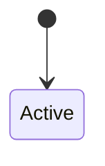

---
# ─────────────────────────────────────────────────────────────────────────
# Frontmatter is ORGANIC. Only a few fields are required; the rest are
# suggested candidates. Add, drop, or rename fields when a better shape
# emerges — we converge on a standard in a later pass. Don't force fields
# that don't fit this page; it's fine to fill metadata in AFTER the content.
#
# REQUIRED:
#   title   – human name of the model / domain concept
#   type    – model
#   status  – active | deprecated | partial | unknown
#
# SUGGESTED (use when meaningful, omit when not):
#   reviewed_confidence – 1–100: this pass's gut-feel of how accurate &
#                         complete the page is right now (use the full range)
#   last_reviewed       – YYYY-MM-DD of the most recent accuracy pass
#   backing_stores      – where this model physically lives (often several)
#   owned_by            – service that owns / writes this model
#   related_models      – other model pages worth linking
#   related_features    – feature pages that use this model
#   tags                – cross-cutting discovery
# ─────────────────────────────────────────────────────────────────────────
title: <Model name>
type: model
status: unknown
reviewed_confidence:
last_reviewed:
backing_stores:
  # - mysql: billing.subscriptions
  # - mysql_view: billing.active_subscriptions_v
  # - mongo: events.subscription_changes
owned_by:
related_models: []
related_features: []
tags: []
---

# <Model name>

<!-- DEPTH LADDER: this page goes business → technical from top to bottom.
     A product reader should get value from the first screen without being
     intimidated; engineers keep scrolling for schema-level detail. Keep each
     table narrow (≤ ~4 columns); split concerns into separate sections rather
     than one wide mega-table. Drop any section that doesn't apply to this
     model's store (e.g. a schemaless collection won't have DB constraints —
     see the delivery-event example for how that adapts). -->

> One or two sentences in product language: what this concept *is* and why it
> exists. Lead with what matters now.

## Business view

*Plain language — safe for non-engineers. No table or column names here.*

| Attribute | What it means | Rules / behavior |
|-----------|---------------|------------------|
|  |  |  |

<!-- Optional: a small lifecycle diagram in business terms, if the model has
     meaningful states.


-->

## How it maps to storage

The bridge between the business concept and the physical store(s): which
attributes are real columns, which come from views, which live only in
application code. Narrative, not a table.

---

*Everything below is engineer-facing reference.*

## Schema

*Field-level detail of the primary store.*

| Field | Type | Null | Backed by |
|-------|------|------|-----------|
|  |  |  |  |

<!-- "Backed by": column · view <name> · computed (app) · app logic -->

## Defaults & derivations

| Field | DB default | App-level default / derivation |
|-------|------------|--------------------------------|
|  |  |  |

## Constraints & validation

| Rule | Enforced in | Detail |
|------|-------------|--------|
|  |  |  |

<!-- "Enforced in": DB · app · none. Calling out app-only rules is the whole
     point — the DB will happily store data that violates them. -->

## Relationships

| Related model | Via | Cardinality | Enforcement |
|---------------|-----|-------------|-------------|
|  |  |  |  |

<!-- "Enforcement": DB FK · app-only · cross-store (none). -->

```mermaid
erDiagram
  %% sketch the key relationships
```

## Notes & nuances

??? note "Deprecated / historical"
    Old fields and why they still exist — e.g. legacy columns kept only for
    old rows.

??? info "Future / cleanup"
    Planned changes and known debt. Link tickets here once that becomes useful.

!!! danger "Suspected dead"
    Fields or paths that appear non-exercisable, found while tracing flows.
    Flag for confirmation — record the finding, don't discard it.

## Sources & confidence

What this page was derived from (code paths, schemas, observed data) and
anything that lowered confidence.
